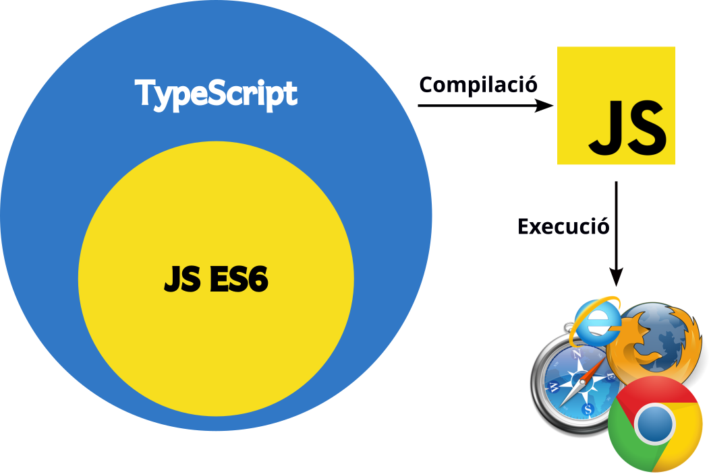

# Què és Angular?

[Angular](https://angular.dev/) és un *framework web* de [TypeScript](https://www.typescriptlang.org/) creat per Google que permet crear *Single Page Applications (SPA)* utilitzant la programació orientada a objectes (POO) i el patró de disseny *Model-View-Controller (MVC)* (lleugerament modificat i adaptat a la programació en entorn client). A més a més, proporciona un conjunt d'eines, APIs i llibreries que simplifiquen i agilitzen el desenvolupament d'aplicacions web.

## Què és TypeScript?
[TypeScript](https://www.typescriptlang.org/) és un llenguatge creat per Microsoft i que, podríem dir, amplia JavaScript per oferir tipatge estricte de variables i funcions. Gràcies a aquesta caraterística, es poden detectar, i solucionar, molts errors en temps de desenvolupament.

Per tal que el codi TypeScript es pugui executar en un navegador necessita un pas previ de compilació a codi JavaScript.

## Què és una *Single Page Application (SPA)*?
Tal com el seu nom indica, una *single page application* és una aplicació web que només té una única pàgina, l'`index.html`. A partir d'aquí, mitjançant totes les capacitats de modificació del DOM que ofereix JavaScript, els elements de la vista van canviant segons la interacció que genera l'usuari.

Angular no obliga a què tots els projectes fets amb aquest *framework* siguin una *SPA*, però sí que ho facilita per assegurar que aquells desenvolupadors que ho desitgin es puguin beneficiar dels punts forts d'aquesta metodologia:
1. Fàcil de desplegar (posar en producció)
2. Necessita pocs recursos del servidor
3. Fàcil de versionar i de tornar a versions anteriors
4. Només necessita una connexió inicial amb el servidor per descarregar tots els fitxers; a partir d'aquest moment, el codi JavaScript s'encarregarà d'anar modificant les diverses vistes

Ara però, les *SPA* tenen un desavantatge important: els cercadors no són capaços d'indexar-les bé i, per tant, les propietats SEO queden diluïdes. Per aquest motiu, Angular també ofereix possibilitats de *pre-render*.

## Origen i evolució de les versions d'Angular
La primera versió d'Anguar era, en realitat, un *framework* de JavasScript i s'anomenava AngularJS. Ara però, la següent versió, anomenada *Angular 2* va ser completament refactoritzada per transformar-la al *framework* de TypeScript que és ara. Des d'aleshores, l'equip de desenvolupament treu dues versions cada any, les quals són extremadament estables i retocompatibles per evitar que projectes ja existens quedin desfasats i per facilitar l'actualització de codi ja existent.

* AngularJS: octubre de 2010 (suport finalitzat el gener de 2022)
* Angular 2: setembre de 2016
* Angular 4: març de 2017
* Angular 5: novembre de 2017
* Angular 6: maig de 2018
* Angular 7: octubre de 2018
* Angular 8: maig de 2019
* Angular 9: febrer de 2020
* Angular 10: juny de 2020
* Angular 11: novembre de 2020
* Angular 12: maig de 2021
* Angular 13: novembre de 2021
* Angular 14: juny de 2022 (*standalone components*)
* Angular 15: novembre de 2022
* Angular 16: maig de 2023 (*signals*)
* Angular 17: novembre de 2023
* Angular 18: maig de 2024 (*zoneless*)
* Angular 19: novembre de 2024
* Angular 20: maig de 2025

## Webgrafia del capítol
* Google (2025). [Angular](https://angular.dev/). Consultat el 12 de maig de 2025.
* Angular (2025). [GitHub Angular](https://github.com/angular/angular). Consultat de 12 de maig de 2025.
* Microsoft (2025). [TypeScript](https://www.typescriptlang.org/). Consultat el 12 de maig de 2025.
* Udemy (2025). [Curs *Angular - The Complete Guide (2025 Edition)*](https://www.udemy.com/course/the-complete-guide-to-angular-2/). Consultat el 12 de maig de 2025.