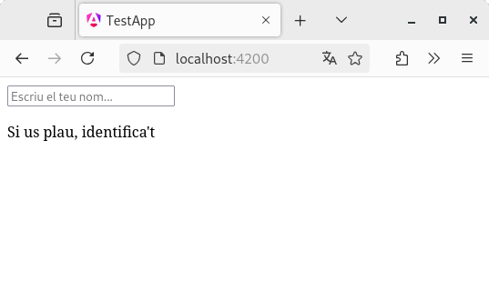
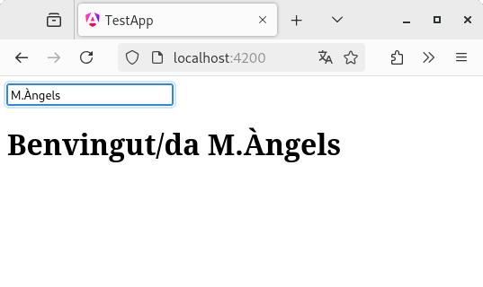

# Capítol 5. Modificació del DOM
El *framework* Angular ofereix eines que permeten modificar el DOM (*Document Object Model*) d'HTML de manera automàtica. Aquesta modificació es pot fer de manera
* iterativa, creant múltiples elements iguals, o
* condicional, creant elements depenent de si una condició s'avalua certa o no.

## Control de flux iteratiu `@for`
El bloc de codi iteratiu `@for` permet crear i *renderitzar* codi `HTML` per cadascun dels elements d'una estructura de dades iterable. A més a més, quan detecta qualsevol modificació de l'estructura de dades (eliminació, actualització o inserció d'un element) adapta els elements *renderitzats* de manera automàtica.

Per fer aquesta adaptació de la manera més eficient possible necessita utilitzar l'expressió `track`, la qual permet fer un seguiment dels elements de la col·lecció de dades a través dels seus identificadors, que han de ser únics. Això permet que, donada qualsevol alteració de les dades, el *framework* Angular no hagi de repintar (*renderitzar*) de nou tots els elements `HTML`, sinó que pot aplicar canvis quirúrgics i concrets per fer el mínim d'operacions sobre el DOM possibles.

### Ús del control de flux iteratiu `@for`
Tal com es pot interpretar en l'apartat anterior, la sentència `@for` s'utilitza enmig del codi `HTML` d'un *component* i, com que el seu objectiu és el de recórrer una estructura de dades, no equival a un `for` clàssic, sinó a un `foreach`. La seva sintaxi és la següent:
```html
<!-- HTML code -->
@for(iterable_data_structure) {
  <!-- HTML elements to be repeated for every item in the data structure -->
}
<!-- HTML code -->
```

Per poder utiltizar la instrucció `@for` cal que el codi del *component* compleixi un conjunt de requeriments:
1. El codi `TS` ha de definir una estructura de dades, la qual pot ser `public` o `private`; en cas que sigui `private` també farà falta definir l'`accessor` *getter* 
```typescript
import { Component } from '@angular/core';
import { RouterOutlet } from '@angular/router';

@Component({
  selector: 'app-root',
  imports: [RouterOutlet],
  templateUrl: './app.html',
  styleUrl: './app.css'
})
export class App {
  private _fruitsList: string[] = ['pomes', 'peres', 'plàtans'];

  get fruitsList(): string[] {
    return this._fruitsList;
  }
}
```
2. Cal escollir un identificador únic per cada element de l'estructura de dades. En el cas de l'exemple anterior, com que la col·lecció és un *array* clàssic, l'identificador serà el propi element que ocupa cada posició.
3. Configurar l'`HTML` del *component* per tal que mostri una llista amb tots els elements de l'estructura de dades
```html
<ul>
    @for(fruit of fruitsList; track fruit) {
        <li>{{ fruit }}</li>
    }
</ul>
<router-outlet />
```
En aquest exemple, per cara element de la col·lecció de dades es crea un *list item* (`<li>`), de tal manera que el resultat final és el que mostra la Figura 5.1

<figure>
    
    <figcaption>Figura 5.1: resultat d'utilitzar la sentència `@for` sobre una col·lecció de dades</figcaption>
</figure>

#### *Tracking* de dades complexes
En cas que les dades emmagatzemades dins de l'estructura siguin més complexes, com per exemple, un JSON (vegeu el capítol següent), la definició d'un identificador agafa molt més pes. Per exemple, imaginem una estructura on cada element està format per l'objecte JSON següent:
```json
{
  id: ...
  name: ...
}
```
El codi del `TS` ja no definirà un *array d'strings*, sinó un *array* de tipus *any*
```typescript
import { Component } from '@angular/core';
import { RouterOutlet } from '@angular/router';

@Component({
  selector: 'app-root',
  imports: [RouterOutlet],
  templateUrl: './app.html',
  styleUrl: './app.css'
})
export class App {
  private _fruitsList: any[] = [
    { id: 'i1', name: 'pomes' },
    { id: 'i2', name: 'peres' },
    { id: 'i3', name: 'plàtans' }
  ];

  get fruitsList(): any[] {
    return this._fruitsList;
  }
}
```
A més a més, dins del codi `HTML` podrem utilitzar el camp `id` de cada objecte per tal de poder fer el *tracking* (resseguiment) de cada element
```html
<ul>
    @for(fruit of fruitsList; track fruit.id) {
        <li>{{ fruit.name }} ({{ fruit.id }})</li>
    }
</ul>
<router-outlet />
```

El resultat final d'aquesta implementació es mostra a la Figura 5.2
<figure>
    
    <figcaption>Figura 5.2: resultat d'utilitzar la sentència `@for` sobre una col·lecció de dades complexes</figcaption>
</figure>

#### *Tracking* sobre estructures de dades constants
En cas que l'estructura de dades sigui constant, és a dir, que no s'hi insereixin, eliminin o modifiquin elements de manera automàtica segons la interacció que es faci amb l'usuari, el *tracking* (resseguiment) dels seus valors es pot fer a través de la variable contextual `$index`. Aquesta variable és pròpia d'Angular i està completament associada a la sentència `@for`, ja que emmagatzema l'index (la posició) de l'element que s'està tractant actualment.

En el cas de l'exemple de l'apartat [Ús del control de flux iteratiu `@for`](#ús-del-control-de-flux-iteratiu-for), es podria adaptar el codi `HTML` per fer aquest tipus de resseguiment de la manera següent:
```html
<ul>
    @for(fruit of fruitsList; track $index) {
        <li>{{ fruit }}</li>
    }
</ul>
<router-outlet />
```

És molt important entendre que l'ús de la variable contextual `$index` només és adequat en el cas d'estructures constants, ja que si s'utilitza en estructures que veuen el seu contingut modificat, el *framework* perd la capacitat de resseguir els elements per poder fer el *renderitzat* de manera eficient. Cal recordar que per aconseguir aquest objectiu, la sentència `@for` ha de ser capaç de fer el *tracking* dels elements de manera individual (a través del seu identificador), independentment de la posició que ocupin. Com que la variable `$index` està vinculada a la posició dins de l'estructura de dades, no al contingut, no és una bona opció per col·leccions variables.

### Codi *legacy* amb la directiva estructural `*ngFor`
La sentència `@for` va ser introduïda com el nou estàndard de control de flux iteratiu a la versió 17 del *framework*. Fins aquell moment, la funció de flux iteratiu la complia la directiva estructural `*ngFor` i, per tant, tot i que ara estigui obsoleta (*deprecated*), hi ha molt codi de versions antigues (*legacy*) que utilitza aquesta opció.

El seu objectiu és exactament el mateix que el de la sentència `@for`: crear i *renderitzar* codi `HTML` pels múltiples elements d'una estructura de dades. Ara però, la sintaxi és força diferent, ja que mentre que la sentència `@for` crea un bloc de codi dins del fitxer `HTML`, la directiva `*ngFor` estava pensada per quedar integrada dins de les etiquetes `HTML`

#### Adaptació del codi que utilitza `@for` per poder utilitzar `*ngFor`
Si recuperem l'exemple de l'apartat [*Tracking* de dades complexes](#tracking-de-dades-complexes), les adaptacions que cal fer-hi per tal que funcioni amb la directiva estructural `*ngFor` són les següents:
1. Dins del codi `TS` cal importar la directiva `NgFor`, la qual es troba dins del mòdul `CommonModule`. A més a més, també hi cal incorporar un mètode que permeti fer el *tracking* dels elements, tal com veurem més avall (en el cas de l'exemple, és el mètode `fruitId()`)
```typescript
import { NgFor } from '@angular/common';
import { Component } from '@angular/core';
import { RouterOutlet } from '@angular/router';

@Component({
  selector: 'app-root',
  imports: [RouterOutlet, NgFor],
  templateUrl: './app.html',
  styleUrl: './app.css'
})
export class App {
  private _fruitsList: any[] = [
    { id: 'i1', name: 'pomes' },
    { id: 'i2', name: 'peres' },
    { id: 'i3', name: 'plàtans' }
  ];

  get fruitsList(): any[] {
    return this._fruitsList;
  }

  public fruitId(index: number, fruit: any): string {
    return fruit.id;
  }
}
```
2. Dins del codi `HTML` s'ha de canviar el bloc `@for` per la directiva `*ngFor`, la qual queda incrustrada dins de l'etiqueta que s'han de *renderitzar* per cada element
```html
<ul>
    <li *ngFor="let fruit of fruitsList; let idx=index; trackBy: fruitId">{{ fruit.name }} ({{ fruit.id }} - {{ idx }})</li>
</ul>
<router-outlet />
```
En aquest cas, les diferències respecte de la sentència `@for` són les següents:
  * La variable contextual `$index` de l'`@for` es diu `index` en el cas de l'`*ngFor` i no es pot utilitzar directament, sinó que cal crear una nova variable i assignar-li el seu valor
  * L'opció `track` de l'`@for` passa a ser l'opció `trackBy` de l'`*ngFor`, la qual necessita un mètode que retorni l'identificador de l'element (no s'hi pot assignar l'identificador directament, sinó que cal crear el mètode). En el cas de l'exemple, la funció creada és `fruitId()`

La Figura 5.3 mostra el resultat obtingut amb aquest codi
<figure>
    
    <figcaption>Figura 5.3: resultat d'utilitzar la directiva estructural *ngFor sobre una col·lecció de dades complexes</figcaption>
</figure>

## Control de flux condicional `@if`
El bloc de codi condicional `@if` permet crear i *renderitzar* codi `HTML` depenent de si una condició es compleix o no. Així doncs, si la condició és certa, el codi `HTML` s'afegeix al DOM; si no ho és, no s'hi afegeix.

### Ús del control de flux iteratiu `@if`
Tal com passa amb la sentència `@for`, la sentència `@if` també s'utilitza enmig del codi `HTML` d'un *component*. La seva sintaxi és la següent:
```html
<!-- HTML code -->
@if (condition1) {
  <!-- HTML elements to be rendered if condition1 is true -->
} @else if (condition2) {
  <!-- HTML elements to be rendered if condition2 is true -->
} @else {
  <!-- HTML elements to be rendered if neither condition1 nor condition2 are true -->
}
```

A continuació es mostra el codi necessari per mostrar per pantalla un missatge de benvinguda només si l'usuari s'ha identificat.


```typescript
import { Component } from '@angular/core';
import { FormsModule } from '@angular/forms';
import { RouterOutlet } from '@angular/router';

@Component({
  selector: 'app-root',
  imports: [RouterOutlet, FormsModule],
  templateUrl: './app.html',
  styleUrl: './app.css'
})
export class App {
  private _name: string = "";

  get name(): string {
    return this._name
  }

  set name(name: string) {
    this._name = name;
  }
}
```



```html
<input type="text" placeholder="Escriu el teu nom..." [(ngModel)]="name"/>

<br/>
@if(name) {
    <h1>Benvingut/da {{ name }}</h1>
} @else {
    <p>Si us plau, identifica't</p>
}
<router-outlet />
```








### Codi *legacy* amb la directiva estructural `*ngIf`
La sentència `@if` també va ser introduïda com a nou estàndard de control de flux condicional a la versió 17 del *framework*. Fins aquell moment, la funció de flux condicional la complia la directiva estructural `*ngIf` i, per tant, tot i que ara estigui obsoleta (*deprecated*), hi ha molt codi de versions antigues (*legacy*) que utilitza aquesta opció.

El seu objectiu és exactament el mateix que el de la sentència `@if`: crear i *renderitzar* codi `HTML` depenent d'una condició. Ara però, la sintaxi és força diferent, ja que tal com passa amb la directiva `*ngFor`, la directiva `*ngIf` també està pensada per quedar integrada dins de les etiquetes `HTML`

#### Adaptació del codi que utilitza `@if` per poder utilitzar `*ngIf`
Recuperant l'exemple de l'apartat [*Ús del control de flux iteratiu `@if`](#ús-del-control-de-flux-iteratiu-if), les adaptacions que cal fer-hi per tal que funcioni amb la directiva estructural `*ngIf` són les següents:
1. Dins del codi `TS` cal importar la directiva `NgIf`, la qual es troba dins del mòdul `CommonModule`
```typescript
import { NgIf } from '@angular/common';
import { Component } from '@angular/core';
import { FormsModule } from '@angular/forms';
import { RouterOutlet } from '@angular/router';

@Component({
  selector: 'app-root',
  imports: [RouterOutlet, FormsModule, NgIf],
  templateUrl: './app.html',
  styleUrl: './app.css'
})
export class App {
  private _name: string = "";

  get name(): string {
    return this._name
  }

  set name(name: string) {
    this._name = name;
  }
}
```
1. Dins del codi `HTML` s'ha de canviar el bloc `@if` per la directiva `*ngIf` conjuntament amb una etiqueta `<ng-template>` per poder fer el tractament del bloc `@else`
```html
<input type="text" placeholder="Escriu el teu nom..." [(ngModel)]="name"/>

<br/>
<h1 *ngIf="name; else noidentified">Benvingut/da {{ name }}</h1>

<ng-template #noidentified>
    <p>Si us plau, identifica't</p>
</ng-template>
<router-outlet />
```
Les principal diferència respecte de la sentència `@if` és que, tal com s'ha dit, el tractament de l'`@else` s'ha de fer mitjançant un *component template* `<ng-template>` que tingui definit un identificador (`#noidentified`). Aquest identificador és el que permet unir l'`*ngIf` amb el bloc `else` corresponent.

## Webgrafia del capítol
* Google (2025). [Angular](https://angular.dev/). Consultat el 18 de juny de 2025.
* Udemy (2025). [Curs *Angular - The Complete Guide (2025 Edition)*](https://www.udemy.com/course/the-complete-guide-to-angular-2/). Consultat el 18 de juny de 2025.