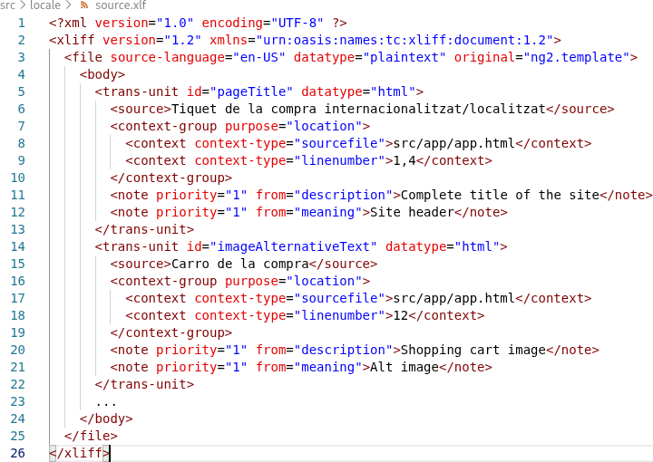
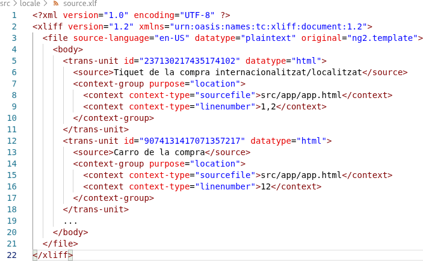
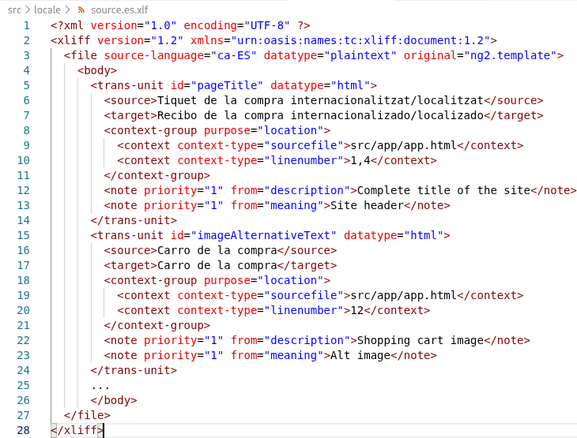

# Capítol 16. Internacionalització i Localització
Un *locale* identifica una regió en concret amb una llengua específica i consisteix a adaptar
* unitats de mesura,
* data i hora,
* xifres,
* monedes i
* textos.

La **internacionalització** (i18n) consisteix a dissenyar i preparar un projecte per tal que es pugui utilitzar amb els diferents *locales* i, en canvi, la **localització** (l10n) consisteix a crear diverses versions del projecte adaptades a cada *locale* on es vulgui posar en producció.

Per poder internacionalitzar i localitzar una aplicació Angular s'han de seguir els passos següents:
1. Instal·lació de la llibreria de localització
2. Preparar els components i els textos per tal que puguin ser traduïts
3. Definir en quin *locale* s'ha creat l'aplicació base
4. Extracció de tots els elements que han de ser traduïts
5. Crear els fitxers de traducció per als diversos idiomes

L'explicació teòrica es realitzarà sobre el projecte que es mostra a continuació, el qual només té el *component* principal `App`



```html
<h1>Tiquet de la compra internacionalitzat/localitzat</h1>
<p>{{ date() }}</p>

<p>S'han comprat {{ products().length }} productes</p>

<li>
@for(prod of products(); track prod.id) {
    <ul>{{ prod.name }} - {{prod.price}}€</ul>
}
</li>


```



```typescript
import { Component, signal, Signal } from '@angular/core';

@Component({
    selector: 'app-root',
    imports: [],
    templateUrl: './app.html',
    styleUrl: './app.css'
})
export class App {
    public readonly products: Signal<any[]> = signal([
        {name: 'Llet', price: 1.58},
        {name: 'Pernil dolç', price: 2.15}
    ]).asReadonly();

    public readonly date: Signal<Date> = signal(new Date()).asReadonly();
}
```



## Instal·lació de la llibreria de localització
Al mercat es poden trobar múltiples llibreries que permeten internacionalitzar i localitzar una aplicació Angular. No obstant això, la llibreria oficial es troba en el *package* `@angluar/localize`. Per poder-la instal·lar cal executar la comanda següent dins del projecte que es vol internacionalitzar:

```bash
$ ng add @angluar/localize
```

Un cop la llibreria està instal·lada, el projecte ja està preparat per tal de poder ser internacionalitzat i localitzat.

## Preparació dels components i dels textos que han de ser traduïts
La llibreria `@angular/localize` ofereix tres elements que permeten marcar tots aquells elements i textos que s'han d'adaptar per fer una bona internacionalització i localització de l'aplicació:

1. L'atribut `i18n` indica que el text d'una etiqueta `HTML` (o d'un *component*) s'ha de traduir (per exemple, el text d'un `<h1>`)
2. L'atribut `i18n-{attribute-name}` indica que el text associat a un atribut d'una etiqueta `HTML` (o d'un *component*) s'ha de traduir (per exemple, el text de l'atribut `alt` de l'etiqueta ``)
3. La marca `$localize` indica que el contingut d'una propietat definida dins del codi `TS` del *component* s'ha de traduir

Així doncs, podem deduir que els atributs `i18n` i `i18n-{attribute-name}` s'utilitzen dins del codi `HTML` i, en canvi, la marca `$localize` s'utilitza dins del codi `TS`

### Atribut `i18n`
Per indicar que el text d'una determinada etiqueta `HTML` o d'un *component* s'ha de traduir només cal afegir l'atribut `i18n` dins de l'etiqueta concreta. Per exemple, per marcar que el text del títol principal `<h1>` del codi bàsic presentat al principi del capítol s'ha de traduir, només fa falta fer el següent:

```html
<h1 i18n>Tiquet de la compra internacionalitzat/localitzat</h1>
<p>{{ date() }}</p>

<p>S'han comprat {{ products().length }} productes</p>

<li>
  @for(prod of products(); track prod.id) {
    <ul>{{ prod.name }} - {{prod.price}}€</ul>
  }
</li>


```

Això ens permetrà extreure el text `Tiquet de la compra internacionalitzat/localitzat` a un fitxer de traducció per tal que pugui ser adaptat a l'idioma que es desitgi. Ara però, aquesta acció és la més simple i la que dóna menys informació a l'equip de traducció de l'aplicació, ja que, tal com es veurà en l'apartat [Extracció de tots els elements que han de ser traduïts](#extracció-de-tots-els-elements-que-han-de-ser-traduïts), el fitxer de traducció només recull el text que cal traduir, sense contextualitzar-lo (en quina pàgina es troba, quin tipus d'etiqueta és, etc.). Per posar en context el text que s'ha de traduir, l'atribut `i18n` pot tenir assignat un valor optatiu que consta de 3 parts:

* el significat (*meaning*),
* una explicació (*description*) i
* l'identificador (*custom id*).

Aquestes porcions de contextualització poden aparéixer totes, només algunes d'elles o cap (tal com hem vist en l'exemple anterior), essent la més útil i important de totes elles l'idenficador. Ara però, es decideixi el que es decideixi, és important l'ordre en que és posen:

```html
    i18n="{meaning}|{description}@@{custom_id}"
    i18n="Site header|Complete title of the site@@pageTitle"
```

Tal com es pot veure, el primer que apareix és el significat (*meaning*), seguit del símbol `|`; a continuació hi apareix l'explicació (*description*) i, finalment, l'identificador decorat amb els símbols `@@`.

Així doncs, algunes de les opcions que podem aplicar al codi d'exemple són les següents:

```html
<!--Sense contextualització-->
<h1 i18n>Tiquet de la compra internacionalitzat/localitzat</h1>

<!--Amb l'identificador: aquesta contextualització és bàsica i la que s'acostuma a posar sempre, com a mínim-->
<h1 i18n="@@pageTitle">Tiquet de la compra internacionalitzat/localitzat</h1>

<!--Amb l'explicació-->
<h1 i18n="Complete title of the site">Tiquet de la compra internacionalitzat/localitzat</h1>

<!--Amb l'explicació i l'identificador: l'opció més comuna-->
<h1 i18n="Complete title of the site@@pageTitle">Tiquet de la compra  internacionalitzat/localitzat</h1>

<!--Contextualització completa-->
<h1 i18n="Site header|Complete title of the site@@pageTitle">Tiquet de la compra internacionalitzat/localitzat</h1>
```

### Atribut `i18n-{attribute-name}`
L'atribut `i18n-{attribute-name}` s'utilitza indicar que el text d'un determinat atribut `HTML` o d'un *component*. Per utilitzar-lo només cal afegir l'atribut `i18n-{attribute-name}` dins de l'etiqueta concreta. Per exemple, per marcar que el text de l'atribut `alt` de l'etiqueta `` del codi bàsic presentat al principi del capítol s'ha de traduir, només fa falta fer el següent:

```html
<h1 i18n>Tiquet de la compra internacionalitzat/localitzat</h1>
<p>{{ date() }}</p>

<p>S'han comprat {{ products().length }} productes</p>

<li>
  @for(prod of products(); track prod.id) {
    <ul>{{ prod.name }} - {{prod.price}}€</ul>
  }
</li>


```

Tal com passa amb l'atribut `i18n`, l'atribut `i18n-{attribute-name} també es pot contextualitzar per facilitar la feina a l'equip traductor, de tal manera, que les opcions són les mateixes: significat (*meaning*), explicació (*description*) i identificador (*custom id*).

```html
    i18n-{attribute-name}="{meaning}|{description}@@{custom_id}"
    i18n-{attribute-name}="Alt image|Shopping cart image@@imageAlternativeText"
```

Així doncs, algunes de les opcions que podem aplicar al codi d'exemple són les següents:

```html
<!--Sense contextualització-->


<!--Amb l'identificador: aquesta contextualització és bàsica i la que s'acostuma a posar sempre, com a mínim-->


<!--Amb l'explicació-->


<!--Amb l'explicació i l'identificador: l'opció més comuna-->


<!--Contextualització completa-->

```

### Marca `$localize`
Quan la informació que es vol adaptar i internacionalitzar no es troba directament *hardcodejada* dins de la part `HTML` del *component*, sinó que es està encapsulada en algun atribut o funció dins del codi `TS`, cal indicar la necessitat d'adaptació mitjançant la marca `$localize`. Aquesta marca funciona d'una manera molt similar a l'atribut `i18n`, tenint en compte que els components de contextualització (significat, explicació i identificador) van encapsulats entre els símbols `:`.

```typescript
    $localize`:{meaning}|{description}@@{custom_id}:string_to_translate`
    $localize`:Product name|Product name in the shopping cart@@prodName:Llet`
```

Si recuperem el codi d'exemple que estem utilitzant en aquest captíol i volem internacionalitzar el nom dels productes del carro de la compra, el codi `TS` queda de la manera següent:

```typescript
import { Component, signal, Signal } from '@angular/core';

@Component({
    selector: 'app-root',
    imports: [],
    templateUrl: './app.html',
    styleUrl: './app.css'
})
export class App {
    public readonly products: Signal<any[]> = signal([
        {name: 'Llet', price: 1.58},
        {name: 'Pernil dolç', price: 2.15}
    ]).asReadonly();

    public readonly date: Signal<Date> = signal(new Date()).asReadonly();
}
```

Si es desitja contextualitzar de manera més concreta la internacionalització, podem aplicar alguna de les opcions següents:


```typescript
//Sense contextualització
public products: Signal<any[]> = signal([
    {name: $localize`Llet`, price: 1.58},
    {name: $localize`Pernil dolç`, price: 2.15}
]).asReadonly();

//Amb l'identificador: aquesta contextualització és bàsica i la que s'acostuma a posar sempre, com a mínim
public products: Signal<any[]> = signal([
    {name: $localize`:@@prodName1:Llet`, price: 1.58},
    {name: $localize`:@@prodName2:Pernil dolç`, price: 2.15}
]).asReadonly();

//Amb l'explicació
public products: Signal<any[]> = signal([
    {name: $localize`:Product name in the shopping cart 1:Llet`, price: 1.58},
    {name: $localize`:Product name in the shopping cart 2:Pernil dolç`, price: 2.15}
]).asReadonly();

//Amb l'explicació i l'identificador: l'opció més comuna
public products: Signal<any[]> = signal([
    {name: $localize`:Product name in the shopping cart 1@@prodName1:Llet`, price: 1.58},
    {name: $localize`:Product name in the shopping cart 2@@prodName2:Pernil dolç`, price: 2.15}
]).asReadonly();

//Contextualització completa
public products: Signal<any[]> = signal([
    {name: $localize`:Product name|Product name in the shopping cart 1@@prodName1:Llet`, price: 1.58},
    {name: $localize`:Product name|Product name in the shopping cart 2@@prodName2:Pernil dolç`, price: 2.15}
]).asReadonly();
```

## Definir en quin *locale* s'ha creat l'aplicació base
Com s'ha pogut veure en els apartats anteriors, els textos de l'aplicació estan preparats per a una determinada regió (*locale*), el qual ha de ser configurat dins del fitxer `angular.json` ja que, si no es configura, per defecte s'agafa el *locale* `en-US` (anglès dels Estats Units). En aquest fitxer s'hi ha d'afegir l'objecte `i18n` tal com mostra el codi següent:

```json
{
  "$schema": "./node_modules/@angular/cli/lib/config/schema.json",
  "version": 1,
  "newProjectRoot": "projects",
  "projects": {
    "angular_i18n_example_project": {
      "projectType": "application",
      ...
      "i18n": {
        "sourceLocale": "ca-ES"
      },
      "architect": {
        ...
      }
    }
  }
}
```

Per defecte, un *locale* es codifica seguint la norma `{language-code}-{country-code}` i en podeu trobar un llistat en aquest [enllaç](https://simplelocalize.io/data/locales/).

## Extracció de tots els elements que han de ser traduïts
Un cop l'aplicació ja ha estat preparada per a ser internacionalitzada, cal extreure tots els textos que s'han d'adaptar. Els passos a seguir són els següents:

1. Obtenir el fitxer d'idioma font (*source language file*)
2. Fer una còpia del fitxer d'idioma font per a cadascun dels idiomes als quals es vulgui traduir l'aplicació. Cadascun d'aquest fitxers serà un fitxer de traducció (*translation file*)
3. Traduir cadascun dels fitxers de traducció.

### Creació del *source language file*
Per tal d'obtenir el fitxer d'idioma font (*source language file*) cal executar la comanda següent dins del directori principal del projecte:

```bash
$ ng extract-i18n
```

Això genera un fitxer anomenat `messages.xlf` dins del directori principal del projecte. Ara però, la comanda té diverses opcions que permeten canviar-ne els paràmetres de creació:

1. `--format`: estableix el format del *source language file*, que pot ser
    * ARB (`.arb`)
    * JSON (`.json`)
    * XLIFF 1.2 (`.xlf`)
    * XLIFF 2 (`.xlf`)
    * XMB (`.xmb` o `.xtb`)
2. `--out-file`: defineix el nom del *source language file*
3. `--output-path`: defineix la carpeta on es vol guardar el *source language file*

Per exemple:

```bash
$ ng extract-i18n --format=json --out-file source.json --output-path src/locale
```


**Recomanació** es recomana que, per extreure el *source language file* s'utilitzi el format per defecte, el nom `source.xlf` i la carpeta `src/locale`


Si recuperem el codi de l'aplicació preparat per a ser localitzat



```html
<h1>Tiquet de la compra internacionalitzat/localitzat</h1>
<p>{{ date() }}</p>

<p>S'han comprat {{ products().length }} productes</p>

<li>
@for(prod of products(); track prod.id) {
    <ul>{{ prod.name }} - {{prod.price}}€</ul>
}
</li>


```



```typescript
import { Component, signal, Signal } from '@angular/core';

@Component({
    selector: 'app-root',
    imports: [],
    templateUrl: './app.html',
    styleUrl: './app.css'
})
export class App {
    public products: Signal<any[]> = signal([
      {name: $localize`:Product name|Product name in the shopping cart 1@@prodName1:Llet`, price: 1.58},
      {name: $localize`:Product name|Product name in the shopping cart 2@@prodName2:Pernil dolç`, price: 2.15}
    ]).asReadonly();

    public readonly date: Signal<Date> = signal(new Date()).asReadonly();
}
```



l'execució de la comanda `ng extract-i18n` genera el fitxer XLIFF següent:



on es pot comprovar que per cada element que cal traduir es genera una etiqueta `<trans-unit>`. Aquest etiqueta conté la informació següent:

1. L'identificador de l'element a traduir (atribut `id` de l'etiqueta `<trans-unit>`)
2. El text de l'element que cal que es tradueixi (etiqueta `<source>`)
3. La localització on es troba l'element (etiqueta `<context-group>`)
4. Dades de contextualització: significat i explicació (etiquetes `<note>`)

En cas que la internacionalització del codi es faci sense cap dada de contextualització que ajudi a l'equip de traducció, el resultat del fitxer XLIFF és el següent:



Es pot comprovar que aquesta segona versió no proporciona tota l'ajuda necessària a l'equip de traducció i que els identificadors passen a ser números completament aleatoris que no aporten cap informació semàntica. És per aquesta raó que, com a mínim, es recomana definir l'identificador i l'explicació de cada element que cal internacionalitzar.

## Creació dels fitxers de traducció (*translation files*) per als diversos idiomes
Un cop s'ha obtingut el *source language file*, per poder fer la traducció a un altre idioma només fa falta seguir els passos següents:

1. Fer una còpia del *source language file* dins de la carpeta `src/locale`
2. Canviar el nom del fitxer per tal d'afegir-hi el codi de l'idioma. Per exemple, si el *source language file* s'anomena `source.xlf`, el *translation file* per a la llengua castellana s'anomenarà `source.es.xlf`
3. Traduir el *translation file*, en el cas de l'exemple, el `source.es.xlf`
4. Configurar l'aplicació per tal d'indicar que està preparada per a treballar amb el nou idioma

### Traducció del *translation file*
Tenint present que el *translation file* és una còpia directa del *source language file*, per poder-ne fer la traducció només fa falta afegir l'etiqueta `<target>` dins de cada element `<trans-unit>`. Més concretament, l'etiqueta `<target>` s'acostuma a posar just a sota de l'etiqueta `<source>`. Seguint l'exemple, a continuació es mostra com quedaria el `source.es.xfl`.



### Configuració de l'aplicació per tal de fer constar amb quins idiomes pot treballar
Aquesta configuració s'ha de fer dins del fitxer `angular.json` (cal recordar que cada cop que es modifica el fitxer `angular.json` s'ha de reactivar el servidor de desenvolupament, en cas que estigués obert) i consisteix en dues parts:

1. indicar els idiomes disponibles i en quins *translation files* es troben i
2. preparar l'aplicació per tal que, en el moment de compilació, es generi una versió per a cada idioma configurat.

A continuació es mostra l'aspecte final del fitxer `angular.json`

```json
{
  "$schema": "./node_modules/@angular/cli/lib/config/schema.json",
  "version": 1,
  "newProjectRoot": "projects",
  "projects": {
    "angular_i18n_example_project": {
      "projectType": "application",
      ...
      "i18n": {
        "sourceLocale": "ca-ES",
        "locales": {
          "es": {
            "translation": "src/locale/source.es.xlf"
          },
          "en": {
            "translation": "src/locale/source.en.xlf"
          }
        }
      },
      "architect": {
        "build": {
          "builder": "@angular/build:application",
          "options": {
            "browser": "src/main.ts",
            ...
            "polyfills": [
              "@angular/localize/init"
            ],
            "localize": true
          },
          ...
        },
        ...
      }
    }
  }
}
```

Per tal d'indicar a quins idiomes ha estat traduïda l'aplicació s'ha d'afegir l'objecte `locales` dins de l'objecte `i18n`, el qual conté un element per cada idioma creat, tot indicant on es troba el seu *translation file*.

Per configurar que, durant la compilació, es generi una versió per cadascun d'aquests idiomes, s'ha d'afegir l'atribut `localize: true` dins de l'objecte `architect.options`.

## Webgrafia del capítol
* Google (2025). [Angular](https://angular.dev/). Consultat el 15 de setembre de 2025.