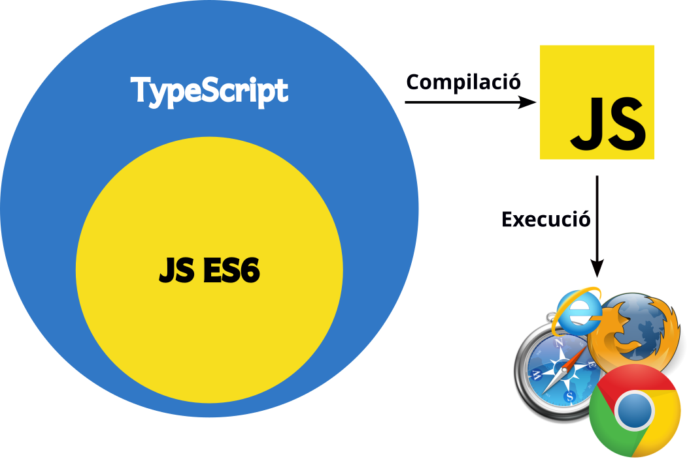

# Què és Angular. Instal·lació del l'entorn de desenvolupament

[Angular](https://angular.dev/) és un *framework* de [TypeScript](https://www.typescriptlang.org/) creat per Google que permet crear *Single Page Applications (SPA)*.

## Què és TypeScript
[TypeScript](https://www.typescriptlang.org/) creat per Microsoft i que, podríem dir, amplia JavaScript per oferir tipatge de variables i funcions.

## Què és una *Single Page Application (SPA)*

## Instal·lació de l'entorn de desenvolupament

## Webgrafia del capítol
* Google (2024). [Angular](https://angular.dev/). Consultat el 10 de juny de 2024.
* Microsoft (2024). [TypeScript](https://www.typescriptlang.org/). Consultat el 10 de juny de 2024.