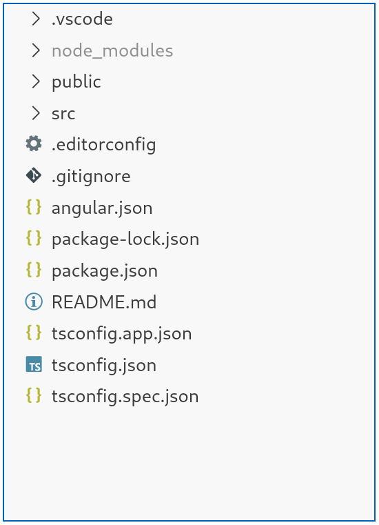
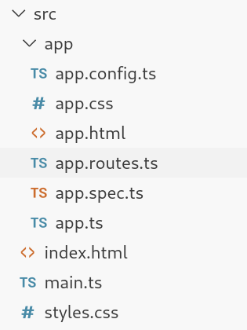
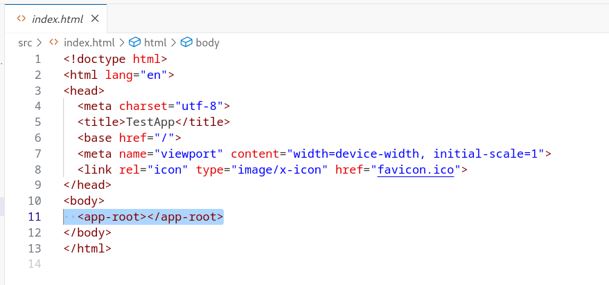
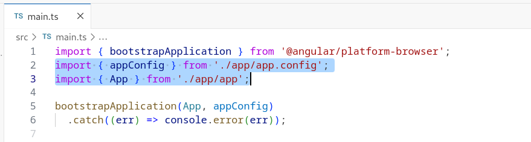
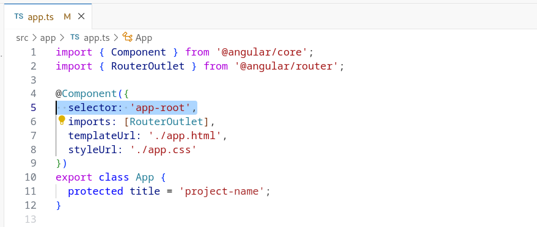
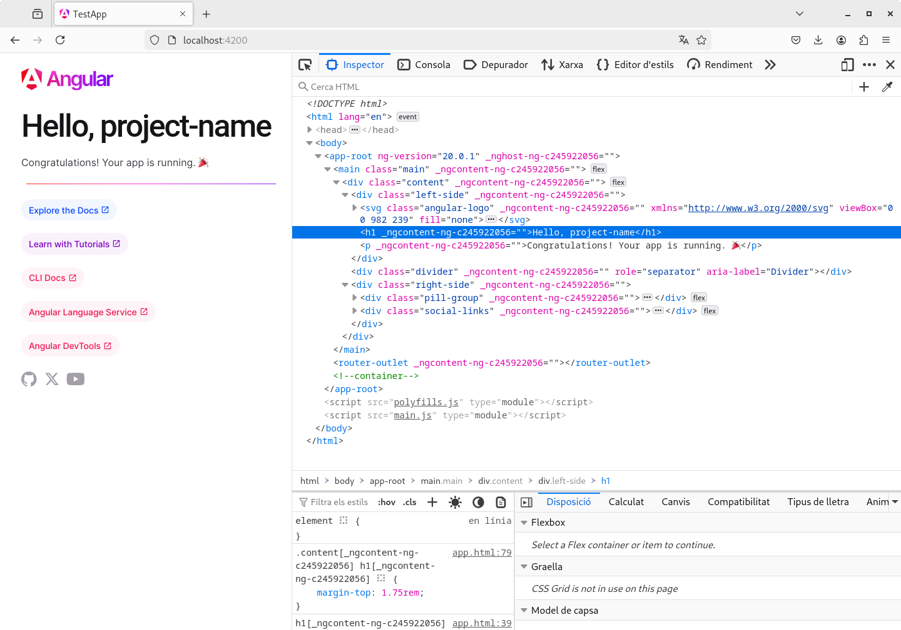
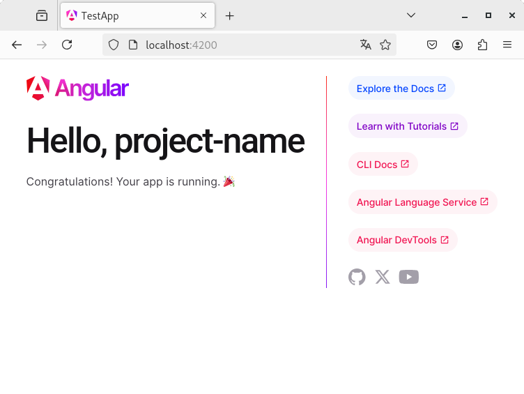

# Instal·lació i preparació de l'entorn de desenvolupament

Per poder traballar amb el framework [Angular](https://angular.dev/) cal instal·lar l'entorn de desenvolupament i tenir un bon editor que faciliti la tasca de desenvolupament.

En aquest curs es proposa utilitzar l'editor de codi [Visual Studio Code](https://code.visualstudio.com/), l'ús del qual està molt estès dins del món de desenvolupament web i que, a més a més, disposa d'un molt bon catàleg de *plugins* per adaptar l'experiència de desenvolupament de software al gust del programador.

## Instal·lació de l'entorn de desenvolupament
Per poder instal·lar el *framwork* Angular i poder començar a treballar-hi cal, primer, instal·lar [NodeJS](https://nodejs.org/), el qual ens permetrà gestionar tots els pàquets (mòduls) que s'hauran d'anar instal·lant mitjançant la seva eina `npm` (*node package manager*).

Un cop fet això, ja podem instal·lar Angular la nostre sistema.

### Instal·lació en Windows
En cas que es tingui el sistema operatiu Windows, la instal·lació de NodeJS segueix el procediment clàssic de qualsevol instal·lador.

Per comprovar que NodeJS ha estat instal·lat correctament es pot executar la comanda
```bash
$ npm -v
```
en qualsevol terminal `CMD`[^fn1] acabat d'obrir. Si tot ha anat bé, aquesta comanda mostrarà per pantalla la versió del *node package manager* instal·lada, de tal manera que, si s'ha instal·lat NodeJS v22.15.0, la versió del *node package manager* serà la 10.9.2, com a mínim. En cas que hi hagi algun problema, s'haurà d'actualitzar la variable d'entorn `PATH` per tal d'afegir-hi la ruta al directori on s'hagi instal·lat NodeJS.

Quan NodeJS estigui ben instal·lat al sistema es podrà instal·lar el *framework* Angular de forma global (opció `-g`) mitjançant la comanda següent (des d'un `CMD`[^fn1]):
```bash
$ npm install -g @angular/cli
```
Aquest paquet instal·la les eines de *command line interface*, les quals ens permetran gestionar tots els projectes Angular de manera senzilla des de línia de comanda.

Per comprovar que Angular ha estat ben instal·lat es pot executar la comanda
```bash
$ ng --version
```
la qual mostra la versió d'Angular del sistema (actualment, la 19.2.11).

[^fn1]: en cas que es vulgui utilitzar `POWERSHELL` vegeu les [següents instruccions](https://angular.dev/tools/cli/setup-local#install-the-angular-cli)

### Instal·lació en Linux
En el cas de Linux, per instal·lar NodeJS cal 
1. descarregar-se el fitxer comprimit `tar.xz`;
2. descomprimir-lo;
3. ubicar-lo segons les preferències del desenvolupador (per exemple, al directori `/opt`) i, finalment,
4. modificar la variable d'entorn `$PATH` per tal que inclogui els executables.

Per fer l'últim pas (a nivell de sistema), s'han d'afegir les següents instruccions al final del fitxer `/etc/bash.bashrc`:
```bash
NODEJS_HOME=/opt/node-v22.15.0-linux-x64
export PATH=$PATH:$NODEJS_HOME/bin
```
Un cop fet això i per comprovar que l'eina `npm` ja és accessible, es pot executar la comanda
```bash
$ npm -v
```
en qualsevol terminal acabat d'obrir. Si tot ha anat bé, aquesta comanda mostrarà per pantalla la versió del *node package manager* instal·lada, de tal manera que, si s'ha instal·lat NodeJS v22.15.0, la versió del *node package manager* serà la 10.9.2, com a mínim.

Quan NodeJS estigui ben instal·lat al sistema es podrà instal·lar el *framework* Angular de forma global (opció `-g`) mitjançant la comanda següent:
```bash
$ npm install -g @angular/cli
```
Aquest paquet instal·la les eines de *command line interface*, les quals ens permetran gestionar tots els projectes Angular de manera senzilla des de línia de comanda.

Per comprovar que Angular ha estat ben instal·lat es pot executar la comanda
```bash
$ ng --version
```
la qual mostra la versió d'Angular del sistema (actualment en el moment de preparar aquesta documentació, la 19.2.11).

### Actualització d'una instal·lació antiga
En cas que algú ja tingui una versió d'Angular antiga al seu sistema i la vulgui actualitzar a una versió més nova o, fins i tot, a l'última, pot executar una de les següents comandes:
```bash
$ npm install -g @angular/cli@XX        #Instal·larà la versió XX
$ npm install -g @angular/cli@latest    #Instal·larà la versió més nova
```

## Creació del primer projecte Angular
Quan el sistema ja està preparat amb totes les eines que permeten gestionar les versions i les llibreries d'Angular, així com també amb les eines de creació, compilació i desplegament d'aplicacions es pot procedir a crear el primer projecte implementat utilitzant aquest *framework*. Per fer-ho només fa falta obrir un terminal (un `CMD` en Windows) dins de la carpeta on es desitja ubicar la nova aplicació i executar la comanda
```bash
$ ng new project-name
```
La comanda `ng` invoca les eines de línia de comanda d'Angular i l'opció `new` indica que el que es desitja fer és crear una nova aplicació Angular amb tota la seva estructura de directoris. El nom `project-name` fa referència tant al nom de la nova aplicació com al directori on es crearà i s'instal·larà tot el *framweork* Angular per poder iniciar el desenvolupament de les seves funcionalitats. Per convenció, aquest nom s'acostuma a posar en minúscules i amb guions per separar les diverses paraules (sobretot, cal evitar posar-hi espais i caràcters especials).

Cada cop que s'executa la comanda `ng new project-name` s'inicia un pas previ de configuració del projecte on, segons la versió d'Angular amb la que estiguem treballant, es realitzen unes preguntes o unes altres. Algunes d'aquestes preguntes són les següents:
1. Activació de l'autocompletat de les comandes de terminal amb ajuda del tabulador
2. Petició de compartició de dades anònimes amb l'equip de desenvolupament d'Angular
3. Creació d'una aplicació 'zoneless', on s'apliquen diverses polítiques d'optimització del codi i de la compilació
4. Tipus de format d'estils que es destija utilitzar: `CSS`, `SCSS` o `LessCSS`
5. Activació del *pre-rendering*, també anomenat *Server-Side Rendering* (SSR) i *Static Site Generation* (SSG)

Les preguntes 1 i 2 només apareixen el primer cop que es crea un nou projecte.

### Estructura de directoris i fitxers
Un cop creada l'aplicació, si n'obrim la carpeta amb Visual Studio Code (seguint l'exemple, aquesta carpeta s'anomena `project-name`) descobrirem l'estructura que mostra la Figura 2.1.

<figure>
    
    <figcaption>Figura 2.1: estructura de directoris i fitxers d'un projecte Angular</figcaption>
</figure>

Tots aquests fitxers i directoris es poden classificar de la manera següent:
1. Fitxers de configuració de TypeScript: defineixen el procés de compilació del codi TypeScript a JavaScript
   1. tsconfig.app.json
   2. tsconfig.json
   3. tsconfig.spec.json
2. Fitxers de configuració de les dependències del projecte: especifiquen quins mòduls, paquets i llibreries necessita l'aplicació, tenint en compte quina versió de cadascun d'ells s'ha d'utilitzar 
   1. package-lock.json
   2. package.json
3. Fitxer de configuració de l'AngularCLI i de les eines del *framework*
   1. angular.json
4. Configuració de l'editor i del repositori GIT:
   1. .vscode/
   2. .editorconfig
   3. .gitignore
5. Directori de la instal·lació del *framework* i de totes les dependències que necessita l'aplicació
   1. node_modules/
6. Directori per dades públiques
   1. public/
7. Directori amb el codi de l'aplicació
   1. src/


**Important** 

En cas que la carpeta `node_modules` no existeixi, sigui perquè és una aplicació de tercers, sigui perquè és una descàrrega des d'un repositori GIT, etc., cal executar la comanda
```bash
npm install
```
dins del directori del projecte. Aquesta comanda instal·la el *framework* Angular i totes les dependències llistades en el fitxer de configuració `package.json`.



#### Directori amb el codi de l'aplicació
Com ja hem vist en les línies superiors, la carpeta `src/` conté el codi de tota l'aplicació Angular en desenvolupament, per tant, en detallarem el contingut més detingudament. La Figura 2.2 mostra la distribució d'aquest directori.
<figure>
    
    <figcaption>Figura 2.2: estructura del directori src/</figcaption>
</figure>

D'una banda, hi trobem el directori `app/`, el qual conté el *component* inicial de l'aplicació. Tot i que ho veurem més endavant, un *component* és un dels nuclis de codi bàsic d'una aplicació Angular i pot representar des de tota una pantalla o vista fins a un element reutilitzable o personalitzable d'aquesta vista (per exemple, la capçalera, una llista, etc.). Està format per 6 fitxers (5 fitxers bàsics més un de *unit testing*):
1. app.ts
2. app.html
3. app.css
4. app.config.ts
5. app.routes.ts
6. app.spec.ts (fitxer de *testing*)

A continuació, hi trobem un conjunt de fitxers que en podríem anomenar *globals*:
1. styles.css: és el fitxer `CSS` que defineix els estils globals de l'aplicació, és a dir, aquells que s'aplicaran a tots els components que s'hagin definit
2. index.html: l'únic fitxer `HTML` de l'aplicació *SPA*
3. main.ts: el primer tros codi TypeScript que s'executa cada cop que s'executa l'aplicació

#### Anàlisi dels fitxers `index.html` i `main.ts`
Tal com ja s'ha comentat en el capítol anterior, els projectes Angular són *Single Page Aplications*, és a dir, només contenen un únic fitxer `HTML` (vegeu l'apartat [Què és una *Single Page Application (SPA)*?](chapter01.md#què-és-una-single-page-application-spa))). Així doncs, el fitxer `src/index.html` serà l'únic document `HTML` que es descarregarà del servidor cada cop que s'accedeixi a l'aplicació. Ara però, el codi `HTML` d'aquest fitxer conté una etiqueta *especial*, l'`<app-root>, tal com mostra la Figure 2.3.

<figure>
    
    <figcaption>Figura 2.3: fitxer index.html</figcaption>
</figure>

Aquesta etiqueta no pertany a l'`HTML5` estàndard, sinó que indica que cal carregar el *component* Angular principal. Ara però, per poder ubicar aquest *component* principal fan falta dues coses:
1. El codi del fitxer main.ts, que indica qui és el *component* principal i on es troba (en aquest cas, el *component* `app` dins del directori `app/`, tal com mostra la Figura 2.4) i
2. El codi TypeScript del *component* principal (`app/app.ts`), el qual indica que l'etiqueta d'aquest *component* (anomenada `selector`) és, efectivament, l'etiqueta `<app-root>` (vegeu la Figura 2.5)
<figure>
    
    <figcaption>Figura 2.4: fitxer main.ts</figcaption>
</figure>

<figure>
    
    <figcaption>Figura 2.5: fitxer app/app.ts</figcaption>
</figure>

Així doncs, després del procés de compilació i durant l'execució, el fitxer `index.html` que carrega el navegador és el que mostra la Figura 2.6, on es pot veure que el contingut del *component* `app` s'ha inscrustat dins de l'etiqueta `<app-root>`.

<figure>
    
    <figcaption>Figura 2.6: Fitxer index.html durant l'execució de l'aplicació</figcaption>
</figure>


### Compilació del codi
Un cop l'aplicació Angular ja està completament desenvolupada s'ha de compilar per, posteriorment, poder-la desplegar i posar en producció. Per assolir aquest objectiu només fa falta executar la comanda
```bash
ng build
```
dins del directori de l'aplicació. Fent això s'activarà el procés de compilació, configurat al fitxer `angular.json`, i es crearà la carpeta `dist/project_name` amb tots els fitxers que cal pujar al servidor per tal de posar en funcionament l'aplicació.

Trobareu més informació sobre com desplegar l'aplicació a un servidor en aquest [enllaç a la documentació](https://angular.dev/tools/cli/deployment#manual-deployment-to-a-remote-server)

### Activació d'un servidor de desenvolupament
El propi *framework* d'Angular ofereix un servidor de desevolupament que permet executar i comprovar el funcionament de l'aplicació que estem fent *on-the-fly*, és a dir, a mesura que hi anem fent canvis. Per activar-lo només cal executar la comanda
```bash
$ ng serve
```
des de la carpeta del projecte (seguint l'exemple, des de la carpeta `project-name`). També es pot executar la comanda
```bash
$ npm start
```
que és un *script* que, al cap i a la fi, acaba executant l'`ng serve`.

Sigui quina sigui la comanda executada, el resultat final permet visualitzar l'aplicació des del navegador utilitzant l'adreça `http://localhost:4200`, tal com mostra la Figura 2.7.

<figure>
    
    <figcaption>Figura 2.7: servidor de desenvolupament del *framework* d'Angular</figcaption>
</figure>

Per tant, mentre es mantingui aquest servidor en funcionament, qualsevol canvi en el codi es podrà veure i comprovar immediatament en el navegador.

## Webgrafia del capítol
* Google (2025). [Angular](https://angular.dev/). Consultat el 12 de maig de 2025.
* Angular (2025). [GitHub Angular](https://github.com/angular/angular). Consultat de 12 de maig de 2025.
* Microsoft (2025). [Visual Studio Code](https://code.visualstudio.com/). Consultat el 3 de juny de 2025
* OpenJS Foundation (2025). [NodeJS](https://nodejs.org/). Consultat el 12 de maig de 2025.
* Udemy (2025). [Curs *Angular - The Complete Guide (2025 Edition)*](https://www.udemy.com/course/the-complete-guide-to-angular-2/). Consultat el 5 de juny de 2025.