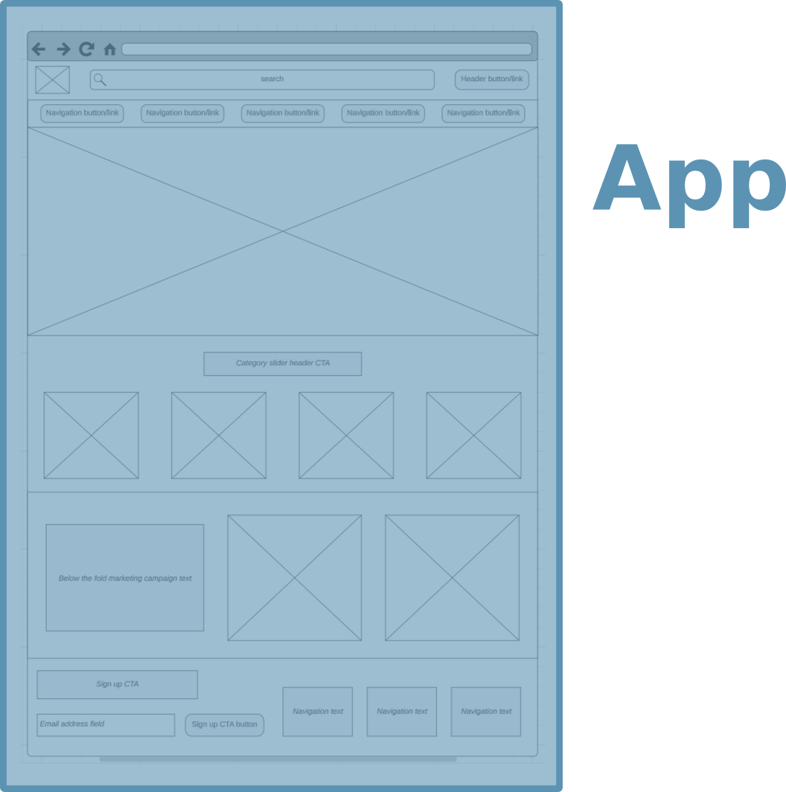
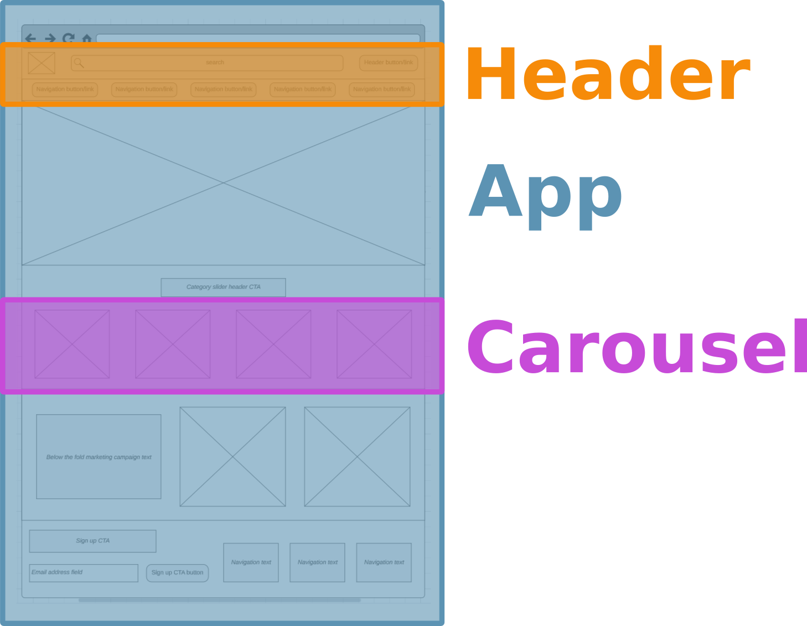
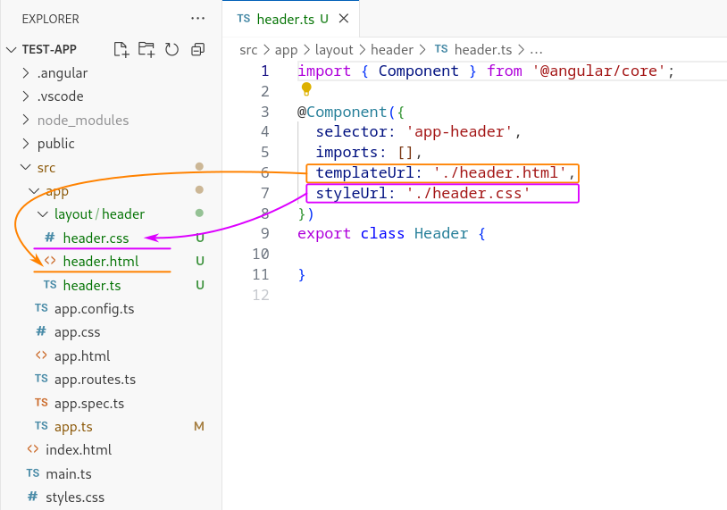
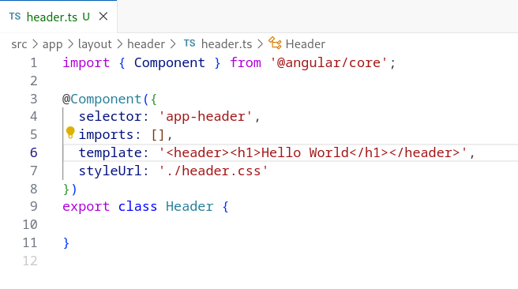
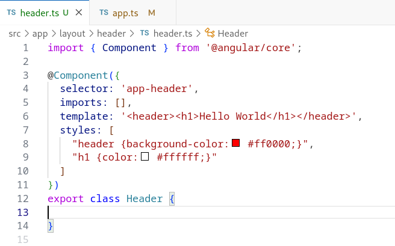

# Capítol 3. Components Angular
Com ja s'ha indicat en el capítol anterior, la creació de nou contingut en Angular (noves pàgines, una llista, una capçalera, etc.) es basa en els *components*. Per tant, un component pot ser tota una nova pàgina
<figure>
    
    <figcaption>Figura 3.1: la pàgina principal està formada per un únic component, el component App/</figcaption>
</figure>
o podem configurar una pàgina combinant múltiples components que, posteriorment, podran ser reutilitzats en altres parts de l'aplicació
<figure>
    
    <figcaption>Figura 3.2: el component App estructura tota la pàgina i, en el seu interior, conté els components Header i Carousel</figcaption>
</figure>

## Creació d'un Component Angular
La creació d'un *component* es pot fer manualment, generant tots els fitxers necessaris, o mitjançant la línia de comandes, mètode que resulta més còmode. Així doncs, per crear un nou *component* s'ha d'executar la comanda següent dins de la carpeta del projecte:
```bash
$ ng generate component [path/component_name]
```
També es pot utilitzar una versió més compacta de la mateixa comanda
```bash
$ ng g c [path/component_name]
```
i, en cas que no es desitgi generar els fitxers de *testig* s'hi pot afegir l'opció `skip-tests`
```bash
$ ng generate component [path/component_name] --skip-tests
$ ng g c [path/component_name] --skip-tests
```

Per tant, si s'executa
```console
$ ng generate component layout/header
```
es crearà el component `Header` dins de la ruta `src/app/layout` del projecte.

La comanda crea els quatre fitxers associats a un *component*:
- `header.html`: defineix els elements que apareixeran a la vista
- `header.css`: dóna estil a la vista
- `header.ts`: gestiona la funcionalitat de la vista (és el fitxer principal i, de fet, l'únic necessari)
- `header.spec`.ts: fitxer per fer *testing* (*unit testing*)

Com que durant aquest curs no es treballarà la part de *testing*, el fitxer `.spec.ts` es pot esborrar o, directament, crear el *component* amb l'opció `skip-tests` indicada anteriorment.

## Caractarístiques del fitxer TS d'un component
Com ja s'ha vist, tot *component* té associat un fitxer TS, el qual sempre ha d'establir dos elements:
1. la descripció del component en si mateix, mitjançant el decorador `@Component` i
2. la classe que gestionarà la funcionalitat de la vista i que tindrà el mateix nom que el component, per exemple:
    - `app.ts` $\rightarrow$ `App`
    - `header.ts` $\rightarrow$ `Header`

### Decorador `@Component`
El decorador descriu 4 elements bàsics:
1. El selector (`selector`): estableix el nom de l'etiqueta `html` que haurem d'utilitzar per poder insertar el *component* dins de la nostra aplicació. Cada desenvolupador pot escollir el nom que desitgi, sempre que aquest no col·lideixi amb el nom d'una etiqueta de l'estàndard `HTML`. Tot i això, per defecte s'acostuma definir el *selector* mitjançant la paraula `app` seguida d'un guió i del nom del propi *component* (per exemple `app-header`).
2. Les dependències (`imports`): llista el conjunt de dependències necessàries per tal que el *component* pugui funcionar correctament, siguin altres *components*, com es veurà en l'[apartat següent](#niament-de-components), siguin *services*, com veurem més endavant).
3. El fitxer `html` (`templateUrl`): estableix la ruta relativa al fitxer `.html` que defineix la vista del *component*.
4. Els fitxer `css` (`styleUrl`): estableix la ruta relativa del fitxer `.css` que defineix l'estil de la vista del *component*.

La Figura 3.3 mostra com queda configurat el *component* `Header` que s'utilitza en l'exemple d'aquest capítol.
<figure>
    
    <figcaption>Figura 3.3: configuració del component Header</figcaption>
</figure>

#### Propietats alternatives del decorador `@Component`
Tot i que l'estructura estàndard del decorador `@Component` és la que s'ha explicat en l'[apartat anterior](#decorador-component), les propietats `templateUrl` i `styleUrl` tenen diverses alternatives.

##### Alternativa a la propietat `templateUrl`
Tot i que no es recomana, en els casos en els quals la vista del *component* sigui extremadament senzilla, es pot substituir la propietat `templateUrl` per la propietat `template`, la qual defineix el codi `html` *inline*, tal com mostra la Figura 3.4.
<figure>
    
    <figcaption>Figura 3.4: exemple d'ús de la propietat template del decorador @Component</figcaption>
</figure>

##### Alternatives a la propietat `styleUrl`
La propietat `styleUrl` té dues alternatives:
* `styles`
* `styleUrls`

De la mateixa manera que no es recomana utilitzar la propietat `template` per definir el codi `html` *inline* del *componet*, tampoc es recomana utilitzar la propietat `styles` per definir els estils `inline`. Evidentment, però, molts desenvolupadors escolliran el seu ús en casos en què els estils siguin extremadament senzills, tal com mostra la Figura 3.5. 
<figure>
    
    <figcaption>Figura 3.5: exemple d'ús de la propietat styles del decorador @Component</figcaption>
</figure>

La propietat `stylesUrls`, en canvi, permet definir el llistat de tots els fitxers `css` necessaris per tal d'aconseguir obtenir l'estil desitjat del *component*. Cal tenir en compte que s'han d'especificar des de més general a més específic, ja que l'ordre en que es defineixen és el mateix que se segueix per aplicar-los.

Sigui quina sigui la propietat que es faci servir per establir els estils del *component* (`styleUrl`, `stuleUrls` o `styles`) cal tenir en compte que el primer fitxer `css` que s'aplicarà serà el fitxer `src/styles.css`el qual, tal com es va indicar en l'apartat [Directori amb el codi de l'aplicació](chapter02.md#directori-amb-el-codi-de-laplicació) del capítol anterior, defineix els estils generals de tota l'aplicació.

## Niament de components


Com a exemple de l'ús dels selectors dels components, les següents pestanyes mostren el codi del component `App`, dins del qual hi ha el nou component `Header` niat.



```typescript
import { Component } from '@angular/core';

@Component({
  selector: 'app-root',
  templateUrl: './app.component.html',
  styleUrls: ['./app.component.css']
})
export class AppComponent {
}
```



```typescript
import { Component } from '@angular/core';

@Component({
  selector: 'app-list',
  templateUrl: './list.component.html',
  styleUrls: ['./list.component.css']
})
export class ListComponent {
}
```



```html
<h1>AppComponent</h1>
<app-list></app-list>
```



```html
<div style="border: solid black 2px;">
    <h3>ListComponent</h3>
    <ol>
        <li>Element 1</li>
        <li>Element 2</li>
        <li>Element 3</li>
    </ol>
</div>
```








## Creació d'atributs i events: comunicació entre components niats
Quan nosaltres creem un component, en certa manera, estem ampliant el ventall d'etiquetes d'`HTML`. Per tant, també hem de ser capaços de definir nous atributs i nous events per aquestes etiquetes.

### Creació d'atributs
Per crear un nou atribut d'etiqueta és necessari utilitzar el decorador `@Input`, el qual s'ha d'importar des de la llibreria `@angular/core`.

```typescript
import { Component, Input } from '@angular/core';

@Component({
  selector: 'app-list',
  templateUrl: './list.component.html',
  styleUrls: ['./list.component.css']
})
export class ListComponent {
  @Input() nelems: number = 0;
}
```

Aquest decorador permet exposar qualsevol dels propietat del nostre component, de tal manera que es pot fer servir com a atribut a la seva etiqueta i, per tant, aplicar-hi un *property binding*.

```html
<h1>AppComponent</h1>
<app-list [nelems]="10"></app-list>
```

Si modifiquem l'exemple de l'apartat anterior, des de l'`AppComponent` podem crear la llista parametritzada que mostri tants elements com defineixi el nou atribut de `ListComponent`



```typescript
import { Component } from '@angular/core';

@Component({
  selector: 'app-list',
  templateUrl: './list.component.html',
  styleUrls: ['./list.component.css']
})
export class ListComponent {
  @Input() nelems: number = 0;

  public generateArrayElems(): number[] {
    let vals: number[] = [];
    for(let i=0; i<this.nelems; i++) {
      vals.push(i);
    }
    return vals;
  }
}
```



```html
<h1>AppComponent</h1>
<app-list [nelems]="10"></app-list>
```



```html
<div style="border: solid black 2px;">
    <h3>ListComponent</h3>
    <ol>
        <li *ngFor="let elem in generateArrayElems()">Element {{ elem+1 }}</li>
    </ol>
</div>
```







*Vídeos 067 i 068 del capítol "05 Components & Databinding Deep Dive" del curs d'Udemy*

### Creació d'events
La creació d'events és molt similar a la creació d'atributs. No obstant això, en aquest cas l'objectiu és afegir funcionalitat al nou component: a través de la detecció dels events que creem podrem donar una funcionalitat o una alra, segons el tractament que programem.
.
Per crear un nou event d'etiqueta és necessari utilitzar 
1. el decorador `@Output`, el qual també s'ha d'importar des de la llibreria `@angular/core`
2. la classe EventEmitter, per definir l'event i
3. el llençament del nou event creat (`emit`).

```typescript
import { Component, EventEmitter, Input, Output } from '@angular/core';

@Component({
  selector: 'app-list',
  templateUrl: './list.component.html',
  styleUrls: ['./list.component.css']
})
export class ListComponent {
  @Input() nelems: number = 0;
  @Output() onrandom: EventEmitter<void> = new EventEmitter();
  
  public generateArrayElems(): number[] {
    let vals: number[] = [];
    for(let i=0; i<this.nelems; i++) {
      vals.push(i);
    }
    return vals;
  }

  public emitRandomEvent(): void {
    this.onrandom.emit();
  }
}
```

El decorador `@Output` permet exposar qualsevol de les propietat del nostre component, de tal manera que es pot fer servir com a event a la seva etiqueta i, per tant, aplicar-hi un *event binding*.

```html
<h1>AppComponent</h1>
<app-list [nelems]="rndnum" (onrandom)="generateRandomNumber()"></app-list>
```

Si tornem a modificar l'exemple de l'apartat anterior, des de l'`AppComponent` podem crear la llista parametritzada aleatòriament a `ListComponent`



```typescript
import { Component, EventEmitter, Input, Output } from '@angular/core';

@Component({
  selector: 'app-list',
  templateUrl: './list.component.html',
  styleUrls: ['./list.component.css']
})
export class ListComponent {
  @Input() nelems: number = 0;
  @Output() onrandom: EventEmitter<void> = new EventEmitter();
  
  public generateArrayElems(): number[] {
    let vals: number[] = [];
    for(let i=0; i<this.nelems; i++) {
      vals.push(i);
    }
    return vals;
  }

  public emitRandomEvent(): void {
    this.onrandom.emit();
  }
}
```



```html
<div style="border: solid black 2px;">
    <h3>ListComponent</h3>
    <ol>
        <li *ngFor="let elem of generateArrayElems()">Element {{ elem+1 }}</li>
    </ol>
    <button (click)="emitRandomEvent()">Generació aleactòria</button>
</div>
```



```typescript
import { Component } from '@angular/core';

@Component({
  selector: 'app-root',
  templateUrl: './app.component.html',
  styleUrls: ['./app.component.css']
})
export class AppComponent {
  public rndnum: number = 0;

  public generateRandomNumber(): void {
    this.rndnum = Math.floor(Math.random() * 100);
  }
}
```



```html
<h1>AppComponent</h1>
<app-list [nelems]="rndnum" (onrandom)="generateRandomNumber()"></app-list>
```








*Vídeo 069 capítol "05 Components & Databinding Deep Dive" del curs d'Udemy*
