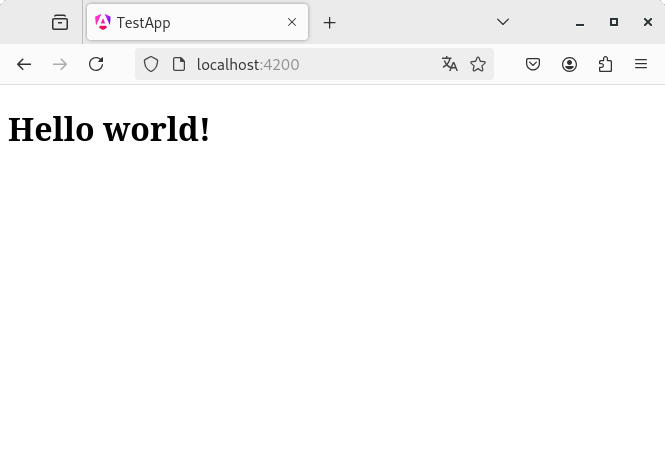

# Capítol 3. Components Angular
Com ja s'ha indicat en el capítol anterior, la creació de nou contingut en Angular (noves pàgines, una llista, una capçalera, etc.) es basa en els *components*. Per tant, un component pot ser tota una nova pàgina
<figure>
    
    <figcaption>Figura 3.1: la pàgina principal està formada per un únic component, el component App/</figcaption>
</figure>
o podem configurar una pàgina combinant múltiples components que, posteriorment, podran ser reutilitzats en altres parts de l'aplicació
<figure>
    
    <figcaption>Figura 3.2: el component App estructura tota la pàgina i, en el seu interior, conté els components Header i Carousel</figcaption>
</figure>

## Creació d'un Component Angular
La creació d'un *component* es pot fer manualment, generant tots els fitxers necessaris, o mitjançant la línia de comandes, mètode que resulta més còmode. Així doncs, per crear un nou *component* s'ha d'executar la comanda següent dins de la carpeta del projecte:
```bash
$ ng generate component [path/component_name]
```
També es pot utilitzar una versió més compacta de la mateixa comanda
```bash
$ ng g c [path/component_name]
```
i, en cas que no es desitgi generar els fitxers de *testig* s'hi pot afegir l'opció `skip-tests`
```bash
$ ng generate component [path/component_name] --skip-tests
$ ng g c [path/component_name] --skip-tests
```

Per tant, si s'executa
```bash
$ ng generate component layout/header
```
es crearà el component `Header` dins de la ruta `src/app/layout` del projecte.

La comanda crea els quatre fitxers associats a un *component*:
- `header.html`: defineix els elements que apareixeran a la vista
- `header.css`: dóna estil a la vista
- `header.ts`: gestiona la funcionalitat de la vista (és el fitxer principal i, de fet, l'únic necessari)
- `header.spec`.ts: fitxer per fer *testing* (*unit testing*)

Com que durant aquest curs no es treballarà la part de *testing*, el fitxer `.spec.ts` es pot esborrar o, directament, crear el *component* amb l'opció `skip-tests` indicada anteriorment.

## Caractarístiques del fitxer TS d'un component
Com ja s'ha vist, tot *component* té associat un fitxer TS, el qual sempre ha d'establir dos elements:
1. la descripció del component en si mateix, mitjançant el decorador `@Component` i
2. la classe que gestionarà la funcionalitat de la vista i que tindrà el mateix nom que el component, per exemple:
    - `app.ts` $\rightarrow$ `App`
    - `header.ts` $\rightarrow$ `Header`

### Decorador `@Component`
El decorador descriu 4 elements bàsics:
1. El selector (`selector`): estableix el nom de l'etiqueta `html` que haurem d'utilitzar per poder insertar el *component* dins de la nostra aplicació. Cada desenvolupador pot escollir el nom que desitgi, sempre que aquest no col·lideixi amb el nom d'una etiqueta de l'estàndard `HTML`. Tot i això, per defecte s'acostuma definir el *selector* mitjançant la paraula `app` seguida d'un guió i del nom del propi *component* (per exemple `app-header`).
2. Les dependències (`imports`): llista el conjunt de dependències necessàries per tal que el *component* pugui funcionar correctament, siguin altres *components*, com es veurà en l'[apartat següent](#niament-de-components), siguin *services*, com veurem més endavant).
3. El fitxer `html` (`templateUrl`): estableix la ruta relativa al fitxer `.html` que defineix la vista del *component*.
4. Els fitxer `css` (`styleUrl`): estableix la ruta relativa del fitxer `.css` que defineix l'estil de la vista del *component*.

La Figura 3.3 mostra com queda configurat el *component* `Header` que s'utilitza en l'exemple d'aquest capítol.
<figure>
    
    <figcaption>Figura 3.3: configuració del component Header</figcaption>
</figure>

#### Propietats alternatives del decorador `@Component`
Tot i que l'estructura estàndard del decorador `@Component` és la que s'ha explicat en l'[apartat anterior](#decorador-component), les propietats `templateUrl` i `styleUrl` tenen diverses alternatives.

##### Alternativa a la propietat `templateUrl`
Tot i que no es recomana, en els casos en els quals la vista del *component* sigui extremadament senzilla, es pot substituir la propietat `templateUrl` per la propietat `template`, la qual defineix el codi `html` *inline*, tal com mostra la Figura 3.4.
<figure>
    
    <figcaption>Figura 3.4: exemple d'ús de la propietat template del decorador @Component</figcaption>
</figure>

##### Alternatives a la propietat `styleUrl`
La propietat `styleUrl` té dues alternatives:
* `styles`
* `styleUrls`

De la mateixa manera que no es recomana utilitzar la propietat `template` per definir el codi `html` *inline* del *componet*, tampoc es recomana utilitzar la propietat `styles` per definir els estils `inline`. Evidentment, però, molts desenvolupadors escolliran el seu ús en casos en què els estils siguin extremadament senzills, tal com mostra la Figura 3.5. 
<figure>
    
    <figcaption>Figura 3.5: exemple d'ús de la propietat styles del decorador @Component</figcaption>
</figure>

La propietat `stylesUrls`, en canvi, permet definir el llistat de tots els fitxers `css` necessaris per tal d'aconseguir obtenir l'estil desitjat del *component*. Cal tenir en compte que s'han d'especificar des de més general a més específic, ja que l'ordre en que es defineixen és el mateix que se segueix per aplicar-los.

Sigui quina sigui la propietat que es faci servir per establir els estils del *component* (`styleUrl`, `stuleUrls` o `styles`) cal tenir en compte que el primer fitxer `css` que s'aplicarà serà el fitxer `src/styles.css`el qual, tal com es va indicar en l'apartat [Directori amb el codi de l'aplicació](chapter02.md#directori-amb-el-codi-de-laplicació) del capítol anterior, defineix els estils generals de tota l'aplicació.

## Niament de components
El *component* base i principal de tota aplicació Angular és el *component* `App`. En aplicacions petites serà l'única pàgina i en aplicacions grans serà el *component* que actuarà de contenidor per gestionar l'enrutament de les múltiples pàgines, tal com es veurà més endavant [^1]. Sigui com sigui, tots els components acabaran penjant d'una manera o d'una altra del *component* `App` o d'algun dels seus fills. És a dir, els components s'aniran niant els uns dins dels altres.

Aquest niament de components s'aconsegueix incrustant l'etiqueta (*selector*) d'un dels components, el qual serà el *component* fill, dins del codi `html` d'un altre, el qual passarà a ser el *component* pare.

Seguint l'exemple del capítol, on hem definit el *component* principal `App` i el *component* `Header` per definir la capçalera de l'aplicació, per poder incrustrar (niar) el `Header` dins l'`App` només cal aplicar els canvis següents:
1. Afegir l'etiqueta `<app-header></app-header>` dins del fitxer `app.html`, ubicant-la allí on volem que aparegui a la pantalla.
2. Modificar la propietat `imports` del decorador `@Component` del *component* `App` per indicar que ha de carregar el *component* `Header`



```typescript
import { Component } from '@angular/core';
import { RouterOutlet } from '@angular/router';

import { Header } from './layout/header/header';

@Component({
  selector: 'app-root',
  imports: [Header, RouterOutlet],
  templateUrl: './app.html',
  styleUrl: './app.css'
})
export class App {
}

```



```typescript
import { Component } from '@angular/core';

@Component({
  selector: 'app-header',
  imports: [],
  templateUrl: './header.html',
  styleUrl: './header.css'
})
export class Header {
}
```



```html
<app-header></app-header>
<router-outlet />
```



```html
<header>
    <h1>Hello world!</h1>
</header>
```







[^1]: aquest enrutament fa que l'usuari tingui la sensació d'estar navegant a través de múltiples pàgines d'una mateixa aplicació web, però cal recordar que una aplicació Angular és una *SPA* i, per tant, en realitat només existeix una única pàgina `HTML`.