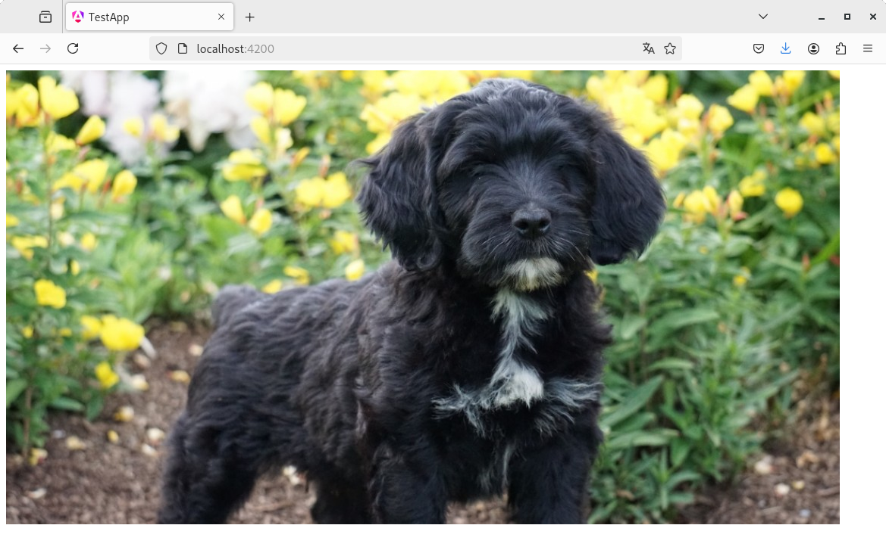
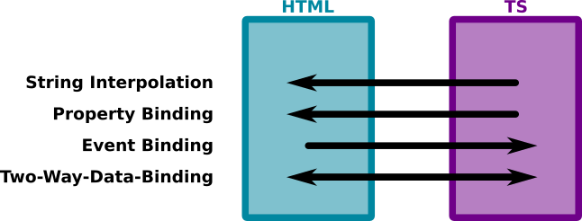

# Capítol 4. *Data Binding*
El concepte *data binding* fa referència a un dels processos que permet que els components Angular puguin mostrar contingut dinàmic dins de les seves vistes (codi `HTML`). Per tant, el *data binding* s'encarrega d'enllaçar les dades i els mètodes definits en el fitxer `TS` amb les etiquetes i els events `HTML` on s'han de mostrar o gestionar.

Existeixen 4 tipus de *data binding*:
1. *String Interpolation*
2. *Property Binding*
3. *Event Binding*
4. *Double-Way-Binding (Property & Event Binding)*

## *String Interpolation*
L'*String Interpolation* és el procés de *data binding* més bàsic i permet mostrar per pantalla les dades emmagatzemades en el fitxer `TS` d'un *component*. L'enllaç entre el codi `HTML` i les dades es pot fer de tres maneres diferents:
1. Mitjançant un atribut `public`
2. Mitjançant un atribut `private` gestionat per un mètode *getter*
3. Mitjançant un mètode que retorni dades de tipus `string`

Siguin quina sigui l'estratègia utilitzada, l'atribut o el mètode que es vol enllaçar haurà de quedar embolcallat per dobles claus: `{{ LINKED_DATA }}`

### *String Interpolation* mitjançant un atribut `public`
Per exemplificar com utilitzar *String Interpolation* es crearà l'atribut `name` dins del *component* `App`, tal com mostra el següent tros de codi:

```typescript
import { Component } from '@angular/core';
import { RouterOutlet } from '@angular/router';

@Component({
  selector: 'app-root',
  imports: [RouterOutlet],
  templateUrl: './app.html',
  styleUrl: './app.css'
})
export class App {
  public name: string = "M.Àngels";
}
```

Si ara es vol mostrar el missatge *Benvingut/da a la teva primera pàgina web, [NAME]*, on cal substituir `[NAME]` pel valor `M.Àngels`, el fitxer `app.html` ha de tenir aquesta estructura:

```html
<h1>Benvingut/da a la teva primera pàgina web, {{ name }}</h1>
<router-outlet />
```

Utilitzant la propietat `name` embolcallada amb dobles claus s'aconsegueix aplicar l'*String Interpolation* i que, per pantalla, aparegui el missatge desitjat, tal com mostra la Figura 4.1.

<figure>
    
    <figcaption>Figura 4.1: resultat d'aplicar String Interpolation sobre un atribut públic</figcaption>
</figure>

### *String Interpolation* mitjançant un atribut `private` gestionat per un mètode *getter*
Si l'atribut `name` anterior té visibilitat `private` no serà accessible des de la part `HTML` del *component*, per tant, caldrà implementar un mètode *getter* que en permeti la lectura.

En JavaScript i, per tant, en TypeScript, existeixen els *getters* i *setters* de propietat, també anomenats *accessors*. Aquests *getters* i *setters* no són altra cosa que mètodes llegir o assignar un valor als atributs d'una classe però amb la característica que, des de codi extern, es poden invocar com si fossin els mateixos atributs i no pas mètodes. Vegeu el següent codi per saber com implementar-los, tot comprovant les seves característiques bàsiques:
1. Els *accessors* no poden tenir el mateix nom que l'atribut al qual representen, per tant, una possibilitat és fer que el nom de l'atribut `private` comenci amb el caràcter *subguió* (`_`)
2. Des del codi `HTML` s'invoca el mètode *getter* talment com si fos l'atribut i el mateix passaria amb la invocació del mètode *setter* (per exemple: `name = "Miquel`)



```typescript
import { Component } from '@angular/core';
import { RouterOutlet } from '@angular/router';

@Component({
  selector: 'app-root',
  imports: [RouterOutlet],
  templateUrl: './app.html',
  styleUrl: './app.css'
})
export class App {
  private _name: string = "M.Àngels";

  get name(): string {
    return this._name;
  }

  set name(name: string) {
    this._name = name;
  }
}
```



```html
<h1>Benvingut/da a la teva primera pàgina web, {{ name }}</h1>
<router-outlet />
```



### *String Interpolation* mitjançant un mètode que retorni dades de tipus `string`
Finalment, també és pot implementar l'*String Interpolation* invocant qualsevol mètode que retorni un `string`, tal com mostra el codi següent:



```typescript
import { Component } from '@angular/core';
import { RouterOutlet } from '@angular/router';

@Component({
  selector: 'app-root',
  imports: [RouterOutlet],
  templateUrl: './app.html',
  styleUrl: './app.css'
})
export class App {
  public getUserType(): string {
    return "invitat";
  }
}
```



```html
<h1>Benvingut a la pàgina web, {{ getUserType() }}</h1>
<router-outlet />
```







## *Property Binding*
El *Property Binding* és el procés de *data binding* que permet modificar dinàmicament el valor de les propietats de les etiquetes `HTML` mitjançant les dades i els mètodes definits al `TS` d'un *component*. Tal com també passa amb l'*String Interpolation*, l'enllaç entre el codi `HTML` i les dades i mètodes es pot fer de tres maneres diferents:
1. Mitjançant atributs `public`
2. Mitjançant atributs `private` gestionats per mètodes *getter*
3. Mitjançant mètodes que retornin dades de tipus `string`

Siguin quina sigui l'estratègia utilitzada, s'ha d'embolcallar la propietat de l'etiqueta `HTML` que es vol modificar entre claudàtors i igualar-la a l'atribut o mètode desitjant, que anirà entre dobles cometes: `[ HTML_PROPERTY ] = "DATA_OR_METHOD"`

Per exemplificar el *Property Binding* enllaçarem la propietat `src` de l'etiqueta ``. Prèviament, però, haurem de crear la carpeta `img/` dins de la carpeta `public` del projecte Angular, ja que aquesta és la ubicació *de facto* dels recursos de les aplicacions web fetes amb el *framework* Angular (a partir de la versió 18). Finalment, hi guardarem una imatge, tal com mostra la Figura 4.2.

<figure>
    
    <figcaption>Figura 4.2: directori amb les imatges de l'aplicació web</figcaption>
</figure>

### *Property Binding* mitjançant un atribut `public`
Per exemplificar com utilitzar *Property Binding* es crearà l'atribut `imgFile` dins del *component* `App`, tal com mostra el següent tros de codi:

```typescript
import { Component } from '@angular/core';
import { RouterOutlet } from '@angular/router';

@Component({
  selector: 'app-root',
  imports: [RouterOutlet],
  templateUrl: './app.html',
  styleUrl: './app.css'
})
export class App {
  public imgFile: string = "img/puppy.jpg";
}
```

Per carregar aquesta imatge dins de l'`HTML` només cal embolcallar la propietat `src` amb claudàtors i assignar-li el valor de l'atribut `imgFile`:

```html

<router-outlet />
```

La Figura 4.3 mostra el resultat final.

<figure>
    
    <figcaption>Figura 4.3: resultat d'aplicar Property Binding sobre un atribut públic</figcaption>
</figure>

Tenint en compte que el directori de les imatges sempre serà el mateix (`public/img`) es pot tractar aquest valor com una constant i modificar lleugerament el *Property Binding* de la següent manera:


```typescript
import { Component } from '@angular/core';
import { RouterOutlet } from '@angular/router';

@Component({
  selector: 'app-root',
  imports: [RouterOutlet],
  templateUrl: './app.html',
  styleUrl: './app.css'
})
export class App {
  public getUserType(): string {
    return "invitat";
  }
}
```



```html

<router-outlet />
```



### *Property Binding* mitjançant un atribut `private` gestionat per un mètode *getter*
Si modifiquem la visibilitat de la constant i l'atribut de l'apartat anterior per tal que siguin `private` podem crear un *accessor* de tipus *getter* que retorni el valor concatenat per poder fer el *Property Binding* de la propietat `src` de la imatge.



```typescript
import { Component } from '@angular/core';
import { RouterOutlet } from '@angular/router';

@Component({
  selector: 'app-root',
  imports: [RouterOutlet],
  templateUrl: './app.html',
  styleUrl: './app.css'
})
export class App {
  private readonly IMG_PATH: string = "img/";
  private _imgFile: string = "puppy.jpg";

  get imgFile(): string {
    return this.IMG_PATH + this._imgFile;
  }
}
```



```html

<router-outlet />
```



Aquest codi demostra que un *accessor* no té perquè estar lligat només a un atribut (tot i que és el més habitual), sinó que pot retornar valors calculats al moment.

### *Property Binding* mitjançant un mètode que retorni dades de tipus `string`
Finalment, també és pot implementar el *Property Binding* invocant qualsevol mètode que retorni un `string`, tal com mostra el codi següent, on s'ha canviat l'*accessor* per un *getter* clàssic:



```typescript
import { Component } from '@angular/core';
import { RouterOutlet } from '@angular/router';

@Component({
  selector: 'app-root',
  imports: [RouterOutlet],
  templateUrl: './app.html',
  styleUrl: './app.css'
})
export class App {
  private readonly IMG_PATH: string = "img/";
  private _imgFile: string = "puppy.jpg";

  public getImgFile(): string {
    return this.IMG_PATH + this._imgFile;
  }
}
```



```html

<router-outlet />
```



## *Event Binding*
L' *Event Binding* és el procés de *data binding* que permet tractar els events llençats per les etiquetes `HTML` mitjançant instruccions o mètodes `TS` del *component*. L'enllaç entre el codi `HTML` i el codi `TS` es pot fer de dues maneres:
1. Mitjançant instruccions incrustrades directament a l'`HTML`
2. Mitjançant mètodes implementats al `TS`

Siguin quina sigui l'estratègia utilitzada, s'ha d'embolcallar l'event de l'etiqueta `HTML` que es vol tractar entre parèntesis i assignar-li la instrucció o mètode que cal executar, el qual anirà entre dobles cometes: `( HTML_EVENT ) = "INSTRUCTION_OR_METHOD"`

### *Event Binding* mitjançant instruccions incrustades a l'`HTML`
Per exemplificar com funciona l'*Event Binding* crearem un botó que s'encarregui de canviar el valor d'un atribut definit al `TS`. Per mostrar com funciona, també ens ajudarem de l'*String Interpolation*.

```html
<h1>Hola {{ name }}</h1>
<button (click)="name = 'Miquel';">Canvia el nom</button>
<router-outlet />
```

El codi `HTML` de les línies de sobre mostra un botó que té l'event `click` gestionat, per tant, cada cop que l'usuari el premi, l'atribut `name` (declarat `public` dins del `TS`, tal com es mostra a sota) canviarà el seu valor a `Miquel`.

```typescript
import { Component } from '@angular/core';
import { RouterOutlet } from '@angular/router';

@Component({
  selector: 'app-root',
  imports: [RouterOutlet],
  templateUrl: './app.html',
  styleUrl: './app.css'
})
export class App {
  public name: string = "M.Àngels";
}
```

La Figura 4.4 en mostra el funcionament.
<figure>
    
    <figcaption>Figura 4.4: resultat d'aplicar Event Binding. A la imatge de l'esquerra encara no s'ha fet cap click sobre el botó, en canvi, la imatge de la dreta mostra el resultat després d'haver fet un click al botó</figcaption>
</figure>

### *Event Binding* mitjançant mètodes implementats al `TS`
En aquest cas, també tractarem l'event *click* d'un botó, de tal manera que, cada cop que l'usuari el premi, es canviarà la imatge visualitzada per pantalla, escollint-ne una de nova aleatòriament. Per mostrar com funciona, en aquest cas ens ajudarem del *Property Binding*.

```html

<br/>
<button (click)="onButtonClicked($event)">Canvia la imatge</button>
<router-outlet />
```

El propi *framework* Angular defineix la variable `$event`, la qual conté la referència a l'objecte `Event` que s'està tractant. Ara però, l'ús d'aquesta variable no és obligatori i, tot i que en l'exemple s'ha volgut mostrar, només cal utilitzar-la quan es vulgui tractar o analitzar alguna de les propietats de l'event gestionat.

```typescript
import { Component } from '@angular/core';
import { RouterOutlet } from '@angular/router';

@Component({
  selector: 'app-root',
  imports: [RouterOutlet],
  templateUrl: './app.html',
  styleUrl: './app.css'
})
export class App {
  private readonly IMGS_PATH: string = "img/";
  private imgFiles: string[] = [
    "corgi_puppy.jpeg",
    "golden_retriever_puppy.jpg",
    "water_dog_puppy.jpg"
  ]
  private imgIdx: number = 0;

  get imgFile(): string {
    return this.IMGS_PATH + this.imgFiles[this.imgIdx];
  }

  public onButtonClicked(event: MouseEvent) {
    this.imgIdx = Math.floor(Math.random() * this.imgFiles.length);
  }
}
```

Per convenció, el nom dels mètodes que gestionen events acostuma a començar amb la paraula `on`.

La Figura 4.5 mostra el funcionament del codi presentat a les línies de sobre
<figure>
    
    <figcaption>Figura 4.5: resultat d'aplicar Event Binding: cada cop que es prem el botó, la imatge canvia aleatòriament</figcaption>
</figure>

## *Double-Way-Binding (Property & Event Binding)*


## Direcció de l'enllaç de dades



## Webgrafia del capítol
* Google (2025). [Angular](https://angular.dev/). Consultat el 8 de juny de 2025.
* Udemy (2025). [Curs *Angular - The Complete Guide (2025 Edition)*](https://www.udemy.com/course/the-complete-guide-to-angular-2/). Consultat el 8 de juny de 2025.

 