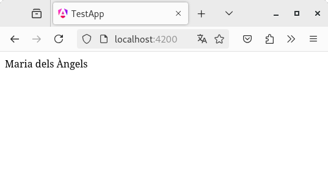
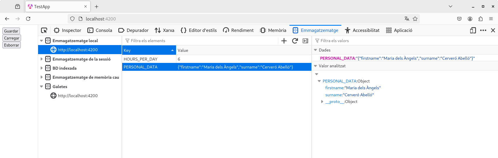

# Capítol 6. Format `JSON` i *LocalStorage*
El *framework* Angular utilitza el format `JSON` i el *LocalStorage* per crear objectes complexos, sense fer ús d'una classe, i tenir capacitat de persistència de dades.

## Format `JSON`
El format `JSON` (*JavaScript Object Notation*) és un format molt simple que permet definir objectes mitjançant un conjunt de tuples `clau-valor`. Actualment, a més a més, ha desplaçat el llenguatge de marques `XML` en l'àmbit de la transmissió de dades per internet (serveis web), ja que el `JSON` és molt més lleuger que l'`XML` (vegeu l'[estàndard de *JSON data interchange syntax* ](https://ecma-international.org/publications-and-standards/standards/ecma-404/)).

La seva sintaxi està formada, bàsicament pels següents símbols:`{`, `}`, `[`, `]`, `:`, `"`, `'` i `,`, de tal manera que, per exemple, per descriure les dades d'un alumne podem crear el següent objecte:

```json
{
    "first_name": "Ignasi",
    "last_name": "Vila Guerrero",
    "dni": "123456789A",
    "high_school": "Institut Caparrella",
    "studies": "DAW",
    "course": 2,
    "subjects": [
        {
            "code": "MP06",
            "name": "Desenvolupament en entorn client"
        }, 
        {
            "code": "MP07",
            "name": "Desenvolupament en entorn servidor"
        },
        {
            "code": "MP08",
            "name": "Desplegament d'aplicacions web"
        },
        {
            "code": "MP09",
            "name": "Disseny d'interfícies web"
        },
        {
            "code": "MP12",
            "name": "Projecte"
        },
        {
            "code": "MP13",
            "name": "FCT"
        },
    ]
}
```
Els símbols de les claus (`{` i `}`) defineixen l'inici i la finalització d'un objecte `JSON`, el qual, com ja s'ha dit, està format per un conjunt de tuples *clau* (la part de la dreta) *valor* (la part de l'esquera).

Les dades en format `JSON` es poden emmagatzemar en un fitxer amb extensió `.json` o es poden utilitzar per crear objectes dins del codi Angular, tal com mostren les pestanyes següents:



```typescript
import { Component } from '@angular/core';
import { RouterOutlet } from '@angular/router';

@Component({
  selector: 'app-root',
  imports: [RouterOutlet],
  templateUrl: './app.html',
  styleUrl: './app.css'
})
export class App {
  private _personal_data: any = {
    "firstname": "Maria dels Àngels",
    "surname": "Cerveró Abelló"
  };

  get personal_data(): any {
    return this._personal_data
  }
}
}
```



```html
<!-- Accés a una de les propietats de l'objecte personal_data -->
<div>{{ personal_data.firstname }}</div>
```







## *LocalStorage*
Tots els navegadors tenen una petita capacitat d'emmagatzematge per permetre la persistència de certes dades necessàries per al funcionament d'una aplicació web. S'anomena *LocalStorage* i permet emmagatzemar 5MB d'informació per cada aplicació que s'executi al navegador.

El *LocalStorage* guarda les dades mitjançant l'ús de tuples `clau-valor` (com si fos un diccionari o un `map`), de tal manera que té mètodes per emmagatzemar-les, esborrar-les i recuperar-les.



```typescript
import { Component } from '@angular/core';
import { RouterOutlet } from '@angular/router';

@Component({
  selector: 'app-root',
  imports: [RouterOutlet],
  templateUrl: './app.html',
  styleUrl: './app.css'
})
export class App {
  private _personal_data: any = {
    "firstname": "Maria dels Àngels",
    "surname": "Cerveró Abelló"
  };
  private _hours_per_day: number = 6;

  get personal_data(): any {
    return this._personal_data
  }

  get hours_per_day(): number {
    return this._hours_per_day;
  }

  saveData(): void {
    localStorage.setItem("PERSONAL_DATA", JSON.stringify(this._personal_data));
    localStorage.setItem("HOURS_PER_DAY", JSON.stringify(this._hours_per_day));
  }

  restoreData(): boolean {
    let pdtmp = localStorage.getItem("PERSONAL_DATA");
    let hpdtmp = localStorage.getItem("HOURS_PER_DAY");

    if(pdtmp != null && hpdtmp != null) {
      this._personal_data = JSON.parse(pdtmp);
      this._hours_per_day = JSON.parse(hpdtmp);
      return true;
    }

    return false;
  }

  deleteData(): void {
    localStorage.removeItem("PERSONAL_DATA");
    localStorage.removeItem("HOURS_PER_DAY");
  }
}
```



```html
<button (click)="saveData()">Guardar</button>
<br/>
<button (click)="restoreData()">Carregar</button>
<br/>
<button (click)="deleteData()">Esborrar</button>
```







## Webgrafia del capítol
* Google (2025). [Angular](https://angular.dev/). Consultat el 20 de juny de 2025.
* Udemy (2025). [Curs *Angular - The Complete Guide (2025 Edition)*](https://www.udemy.com/course/the-complete-guide-to-angular-2/). Consultat el 20 de juny de 2025.
* JSON (2025). [Indroducing JSON](https://www.json.org/json-en.html). Consultat el 20 de juny de 2025.
* Ecma International (2025). [ECMA-404: The JSON data interchange syntax](https://ecma-international.org/publications-and-standards/standards/ecma-404/). Consultat el 20 de juny de 2025.
* Mozilla (2025). [Window: localStorage property](https://developer.mozilla.org/en-US/docs/Web/API/Window/localStorage). Consultat el 20 de juny de 2025.
* Mozilla (2025). [Storage quotas and eviction criteria](https://developer.mozilla.org/en-US/docs/Web/API/Storage_API/Storage_quotas_and_eviction_criteria). Consultat el 20 de juny de 2025.