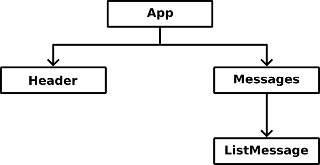
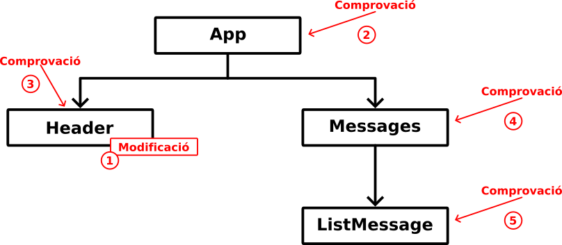
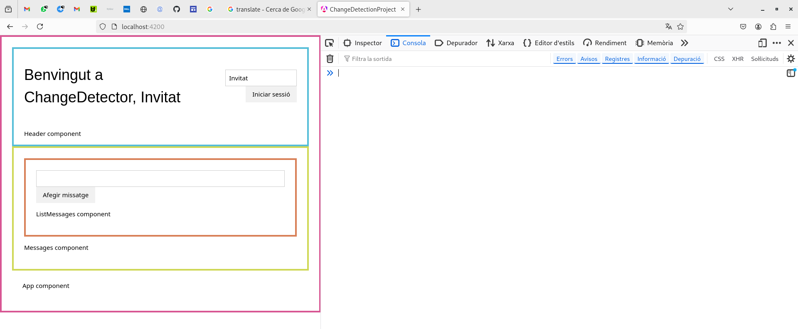
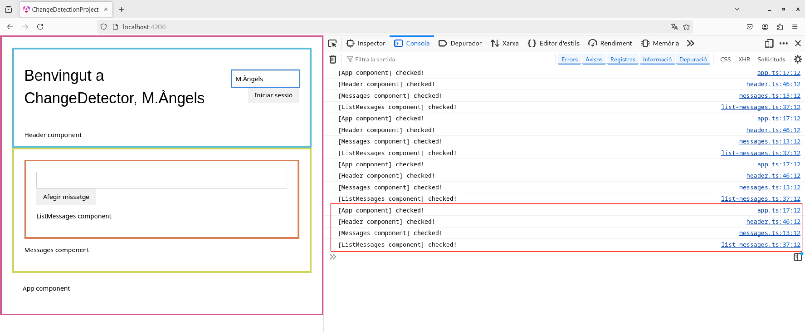
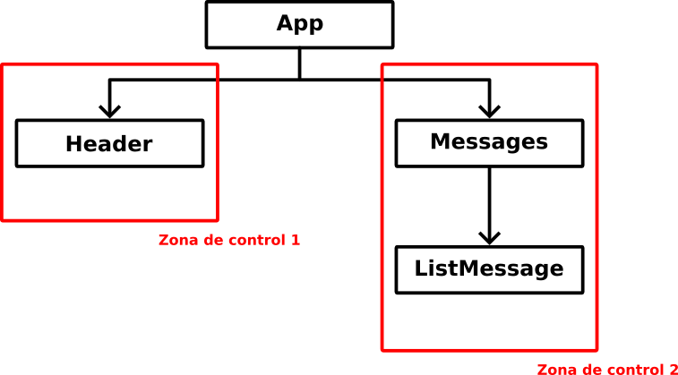

# Capítol 7. Detecció de canvis
El *framework* Angular està, constantment, analitzant els canvis d'estat que s'esdevenen de la interacció amb l'usuari (per exemple, events i *data-bindings*) per tal de poder actualitzar les pàgines i les dades que es mostren correctament. Fins a la versió 17 la seva estratègia es basava en l'ús de la llibreria [Zone.js](https://www.npmjs.com/package/zone.js), la qual fa un resseguiment de qualsevol operació asíncrona dins del codi per poder rastrejar els canvis i actualitzar la interfície d'usuari correctament. Ara però, tot i que l'ús de la llibreria Zone.js és molt còmoda de cara al desenvolupador, des de la versió 18, Angular està evolucionant cap al que es coneix com a estratègia *zoneless* per, bàsicament, motius d'eficiència.

En aquest capítol s'explicarà com funcionen totes dues estratègies i com transformar una aplicació que utilitza Zone.js en una aplicació *zoneless*. Per fer-ho, utilitzarem l'esquema d'aplicació que mostra la Figura 7.1

<figure>
    
    <figcaption>Figura 7.1: esquema dels components de l'aplicació d'exemple</figcaption>
</figure>

A continuació es mostra el codi inicial, basat en l'ús de la llibreria Zone.js.


```typescript
import { Component } from '@angular/core';
import { RouterOutlet } from '@angular/router';
import { Header } from './layout/header/header';
import { Messages } from './elements/messages/messages';

@Component({
  selector: 'app-root',
  imports: [RouterOutlet, Header, Messages],
  templateUrl: './app.html',
  styleUrl: './app.css'
})
export class App {
  protected title = 'change-detection-project';

  public onCheckUpdates() {
    let str: string = "App component";
    console.log("[" + str + "] checked!");
    return str;
  }
}
```



```html
<div>
    <app-header></app-header>
    <app-messages></app-messages>
    
    <p>{{ onCheckUpdates() }}</p>
    <router-outlet></router-outlet>
</div>
```



```typescript
import { Component } from '@angular/core';
import { FormsModule } from '@angular/forms';

@Component({
  selector: 'app-header',
  imports: [FormsModule],
  templateUrl: './header.html',
  styleUrl: './header.css'
})
export class Header {
  private _username: string;
  private _hasSession: boolean;

  constructor() {
    this._username = "Invitat";
    this._hasSession = false;
  }

  get username(): string {
    return this._username;
  }

  set username(username: string) {
    this._username = username;
  }

  get hasSession(): boolean {
    return this._hasSession;
  }

  set hasSession(hasSession: boolean) {
    this._hasSession = hasSession;
  }

  public onIniSession() {
    if(this._username.length >= 1 && this._username != "Invitat") this._hasSession = true;
  }

  public onCloseSession() {
    this._hasSession = false;
    this._username = "Invitat";
  }

  public onCheckUpdates() {
    let str: string = "Header component";
    console.log("[" + str + "] checked!");
    return str;
  }
}
```



```html
<header>
    <div class="w3-flex">
        <div class="flex-welcome">
            <h1>Benvingut a ChangeDetector, {{ username }}</h1>
        </div>
    
        <div class="flex-session w3-right-align">
            @if(!hasSession) {
                <input type="text" placeholder="Username..." [(ngModel)]="username" class="w3-margin-right w3-input w3-border"/>
                <button (click)="onIniSession();" class="w3-button w3-light-gray">Iniciar sessió</button>
            } @else {
                <button (click)="onCloseSession();" class="w3-button w3-light-gray">Tancar sessió</button>
            }
        </div>
    </div>

    <p>{{ onCheckUpdates() }}</p>
</header>
```



```typescript
import { Component } from '@angular/core';
import { ListMessages } from './list-messages/list-messages';

@Component({
  selector: 'app-messages',
  imports: [ListMessages],
  templateUrl: './messages.html',
  styleUrl: './messages.css'
})
export class Messages {
  public onCheckUpdates() {
    let str: string = "Messages component";
    console.log("[" + str + "] checked!");
    return str;
  }
}
```



```html
<div class="messages">
    <app-list-messages></app-list-messages>

    <p>{{ onCheckUpdates() }}</p>
</div>
```



```typescript
import { Component } from '@angular/core';
import { FormsModule } from '@angular/forms';

@Component({
  selector: 'app-list-messages',
  imports: [FormsModule],
  templateUrl: './list-messages.html',
  styleUrl: './list-messages.css'
})
export class ListMessages {
  private _newMsg: string;
  private _messages: string[];

  constructor() {
    this._newMsg = "";
    this._messages = [];
  }

  get newMsg(): string {
    return this._newMsg;
  }

  set newMsg(msg: string) {
    this._newMsg = msg;
  }

  get messages(): string[] {
    return this._messages;
  }

  public onAddNewMessage() {
    this._messages.push(this._newMsg);
  }

  public onCheckUpdates() {
    let str: string = "ListMessages component";
    console.log("[" + str + "] checked!");
    return str;
  }
}
```



```html
<div class="list-messages">
    <input type="text" [(ngModel)]="newMsg" class="w3-input w3-border" />
    <button (click)="onAddNewMessage()" class="w3-button w3-light-gray">Afegir missatge</button>

    <ul>
        @for(msg of messages; track msg) {
            <li>{{ msg }}</li>
        }
    </ul>

    <p>{{ onCheckUpdates() }}</p>
</div>
```



Com es pot veure, l'aplicació està formada per una capçalera, on es simula un inici de sessió, i un contenidor de missatges per poder gestionar una llista de notes. A cadascun dels *components* s'hi ha afegit el mètode `onCheckUpdates()` el qual mostra un missatge a la consola de les eines de desenvolupador del navegador on s'executa. Aquest mètode ajudarà a visualitzar les comprovacions que es realitzen utilitzant l'estratègia Zone.js o l'estratègia *zoneless*.
<!--
## Detecció de canvis clàssica: Zone.js
Quan s'utilita la llibreria Zone.js, qualsevol canvi en algun dels *components* activa la comprovació d'absolutament tots els *components* de l'arbre jeràrquic mostrat a la Figura 7.1.

Així doncs, si l'usuari intenta iniciar sessió i, per tant, modifica l'atribut `username` del *component* `Header`, s'activa la comprovació de tot l'arbre, començant pel *component* arrel `App`, tal com mostra la Figura 7.2

<figure>
    
    <figcaption>Figura 7.2: comprovacions que es disparen al llarg de tot l'arbre jeràrquic quan es produeix un canvi i s'utilitza Zone.js</figcaption>
</figure>

Totes aquestes comprovacions provoquen l'execució del mètode `onCheckUpdates()` utilitzat en l'*String Interpolation* que es fa al final de cada component, per tant, la consola de les eines de desenvolupament mostra les comprovacions en l'ordre en què es fan, tal com mostra la Figura 7.3

<figure>
    
    
    <figcaption>Figura 7.3: la primera imatge mostra la situació inicial de l'aplicació i, en canvi, la segona imatge mostra les comprovacions que ha provocat la modificació del nom d'usuari dins del component Header</figcaption>
</figure>

## Primera millora d'eficiència: *Angular Signals*
L'*Angular Signals* és un sistema que permet el resseguiment precís (granular) dels canvis d'estat de l'aplicació per fer que les actualitzacions del *renderitzat* siguin el més òptimes possible.


**Informació:** s'entèn com a estat el valor que reben les dades emmagatzemades dins de l'aplicació en un moment determinat.


Així doncs, un *signal* és un embolcall sobre les dades que permet notificar tots els canvis que pateix aquest valor a tots els consumidors que s'hi han subscrit. Si parlem des del punt de vista d'arquitectura de software, els *signals* implementen un patró *Observer* on l'*Observable* són les dades que conformen l'estat de l'aplicació i que són susceptibles d'anar canviant al llarg del temps; i els *Observers* són tots aquells elements (ara per ara *components*) que volen detectar qualsevol canvi d'estat per poder actualitzar correctament la seva part `HTML`.

Tal com passa amb les dades que embolcallen, els *signals* poden ser de lectura/escriptura (*writebles*) o només de lectura (*read-only*)

### Treballar amb *signals*
A continuació s'expliquen els mètodes que permeten crear i manipular *signals* per, a posteriori, aplicar les transformacions necessàries al codi inicial del capítol per permetre el seu funcionament mitjançant aquesta metodologia.

#### Creació de *signals*
Per poder crear un *signal* només necessitem crear un atribut de tipus `WritableSignal` (pels de lectura/escriptura) o `Signal` (pels només de lectura) i utilitzar el constructor `signal()`:
```typescript
  //Creació un WritableSignal per emmagatzemar un valor numèric aleatori
  rndvalue: WritableSignal<number> = signal(Math.floor(Math.random() * 100));

  //Creació d'un Signal per emmagatzemar un valor numèric constant (vegeu l'ús del mètode asReadonly())
  readonly myguess: Signal<number> = signal(53).asReadonly();
```

#### Lectura del valor gestionat per un *signal*
Per poder obtenir el valor que emmagatzema un *signal* només fa falta cridar al *signal* com si fos un mètode. Per exemple, en el codi `TS` podríem fer el següent:
```typescript
  //Creació un WritableSignal per emmagatzemar un valor numèric aleatori
  rndvalue: WritableSignal<number> = signal(Math.floor(Math.random() * 100));

  //Definició d'un mètode que necessita consultar el valor del signal
  public isEven(): boolean {
    if(this.rdnvalue() % 2 == 0) return true;   //Accés al valor del signal
    else return false;
  }
```

També podríem utilitzar aquest *signal* dins del codi `HTML`, per exemple, dins d'un *String Interpolation*:
```html
  <p>El número aleatori generat és el {{ rndvalue() }}</p>
```

#### Actualització del valor gestionat per un *signal*
Si hem definit un `WritableSignal` en podem modificar el seu valor mitjançant dos mètodes: el mètode `set()` i el mètode `update()`.
El mètode `set()` sobreescriu el valor anterior pel nou valor passat per paràmetre:
```typescript
  //Creació un WritableSignal per emmagatzemar un valor numèric aleatori
  rndvalue: WritableSignal<number> = signal(Math.floor(Math.random() * 100));

  //Assignació d'un nou valor al signal rndvalue mitjançant el mètode set
  rndvalue.set(3);
  rndvalue.set(Math.floor(Math.random() * 100));
  rndvalue.set(Math.pow(3, 4));
  rndvalue.set(rndvalue() * 2);   //El nou valor és el doble de l'anterior
```
En canvi, el mètode `update()` assigna un nou valor al *signal*, tenint en compte els càlculs fets per la funció *lambda* que rep per paràmetre:
```typescript
  //Creació un WritableSignal per emmagatzemar un valor numèric aleatori
  rndvalue: WritableSignal<number> = signal(Math.floor(Math.random() * 100));

  //Assignació d'un nou valor al signal rndvalue mitjançant el mètode update
  rndvalue.update((curvalue: number) => {return curvalue + 1;});
  rndvalue.update((curvalue) => {return curvalue + 1;});
  rndvalue.update(curvalue => curvalue + 1);
  rndvalue.update(curvalue => curvalue = 3);
```
Una funció [*lambda*](https://en.wikipedia.org/wiki/Anonymous_function), tal com passa amb la resta de llenguatges de programació, és una funció anònima que es defineix en el mateix punt on es crida. Com que és anòmina (no té nom), no es pot cridar en cap altre lloc. En TypeScript, la seva sintaxi és la següent:
```typescript
  (param1: type1, param2: type2) => {/*... code ...*/}
```
En concret, la funció *lambda* que que s'utilitza en el mètode `update()` d'un *signal* rep un únic paràmetre del tipus de dades que emmagatzema el *signal* i els càlculs realitzats retornen un valor també del mateix tipus. El paràmetre correspon al valor actual emmagatzemat en el *signal*.

Tots dos mètodes (`set()` i `update()`), un cop realitzades les operacions necessàries, notifiquen el canvi de valor del *signal* per tal d'activar el patró *Observer* que s'ha comentat en les línies superiors i, per tant, realitzar la detecció de canvis de manera eficient.


#### Obtenció d'un *signal* a partir d'un altre: mètode `computed()`
Hi ha vegades que pot ser interessant obtenir un *signal* a partir del valor d'un *signal* previ. D'aquesta manera, cada cop que s'actualitzi el valor del primer *signal* també es modificarà el valor del *signal* derivat de manera automàtica.

Per aconseguir donar resposta a aquesta necessitat s'ofereix el mètode `computed()`, el qual crea un *signal* `readonly` (`Signal`) derivat d'un altre mitjançant una funció *lambda*:
```typescript
  //Creació un WritableSignal per emmagatzemar un valor numèric aleatori
  rndvalue: WritableSignal<number> = signal(Math.floor(Math.random() * 100));

  //Creació d'un signal derivat de rndvalue que indicarà si rndvalue conté u valor parell o no:
  iseven: Signal<boolean> = computed(() => {return (rndvalue()%2 == 0);});
```

En cas que es vulgui evitar que qualsevol canvi sobre el *signal* inicial afecti el valor del *signal* derivat, es pot utilitzar el mètode *untracked*:
```typescript
  //Creació un WritableSignal per emmagatzemar un valor numèric aleatori
  rndvalue: WritableSignal<number> = signal(Math.floor(Math.random() * 100));

  //Creació d'un signal derivat de rndvalue que indicarà si rndvalue conté u valor parell o no:
  iseven: Signal<boolean> = computed(() => {return (untracked(rndvalue)%2 == 0);});
```
En aquest cas, el valor del *signal* `iseven` es calcularà a l'inici i no canviarà encara que el valor del *signal* `rndvalue` canviï.

#### Modificació del codi d'exemple per utilitzar *signals*
Un cop sabem com funcionen els *signals* i els sabem crear i manipular, podem modificar el codi inicial del capítol per tal de treballar amb aquesta eina.



```typescript
import { Component } from '@angular/core';
import { RouterOutlet } from '@angular/router';
import { Header } from './layout/header/header';
import { Messages } from './elements/messages/messages';

@Component({
  selector: 'app-root',
  imports: [RouterOutlet, Header, Messages],
  templateUrl: './app.html',
  styleUrl: './app.css'
})
export class App {
  protected title = 'change-detection-project';

  public onCheckUpdates() {
    let str: string = "App component";
    console.log("[" + str + "] checked!");
    return str;
  }
}
```



```html
<div>
    <app-header></app-header>
    <app-messages></app-messages>
    
    <p>{{ onCheckUpdates() }}</p>
    <router-outlet></router-outlet>
</div>
```



```typescript
import { Component, computed, Signal, signal, untracked, WritableSignal } from '@angular/core';
import { FormsModule } from '@angular/forms';

@Component({
  selector: 'app-header',
  imports: [FormsModule],
  templateUrl: './header.html',
  styleUrl: './header.css'
})
export class Header {
  public username: WritableSignal<string>;
  public hasSession: Signal<boolean>;

  constructor() {
    this.username = signal("Invitat");
    this.hasSession = computed(() => {
      return (untracked(this.username).length >= 1 && untracked(this.username) != "Invitat");
    });
  }

  public onIniSession() {
    this.hasSession = computed(() => {
      return (untracked(this.username).length >= 1 && untracked(this.username) != "Invitat");
    });
  }

  public onCloseSession() {
    this.username.set("Invitat");
    this.hasSession = computed(() => {
      return (untracked(this.username).length >= 1 && untracked(this.username) != "Invitat");
    });
  }

  public onCheckUpdates() {
    let str: string = "Header component";
    console.log("[" + str + "] checked!");
    return str;
  }
}
```



```html
<header>
    <div class="w3-flex">
        <div class="flex-welcome">
            <h1>Benvingut a ChangeDetector, {{ username() }}</h1>
        </div>
    
        <div class="flex-session w3-right-align">
            @if(!hasSession()) {
                <input type="text" placeholder="Username..." [(ngModel)]="username" class="w3-margin-right w3-input w3-border"/>
                <button (click)="onIniSession();" class="w3-button w3-light-gray">Iniciar sessió</button>
            } @else {
                <button (click)="onCloseSession();" class="w3-button w3-light-gray">Tancar sessió</button>
            }
        </div>
    </div>

    <p>{{ onCheckUpdates() }}</p>
</header>
```



```typescript
import { Component } from '@angular/core';
import { ListMessages } from './list-messages/list-messages';

@Component({
  selector: 'app-messages',
  imports: [ListMessages],
  templateUrl: './messages.html',
  styleUrl: './messages.css'
})
export class Messages {
  public onCheckUpdates() {
    let str: string = "Messages component";
    console.log("[" + str + "] checked!");
    return str;
  }
}
```



```html
<div class="messages">
    <app-list-messages></app-list-messages>

    <p>{{ onCheckUpdates() }}</p>
</div>
```



```typescript
import { Component, computed, signal, Signal, untracked, WritableSignal } from '@angular/core';
import { FormsModule } from '@angular/forms';

@Component({
  selector: 'app-list-messages',
  imports: [FormsModule],
  templateUrl: './list-messages.html',
  styleUrl: './list-messages.css'
})
export class ListMessages {
  newMsg: WritableSignal<string>;
  messages: WritableSignal<string[]>;

  constructor() {
    this.newMsg = signal("");
    this.messages = signal([]);
  }

  public onAddNewMessage() {
    this.messages.update((curmsgs) => {
      return [...curmsgs, this.newMsg()];
    });
  }

  public onCheckUpdates() {
    let str: string = "ListMessages component";
    console.log("[" + str + "] checked!");
    return str;
  }
}
```



```html
<div class="list-messages">
    <input type="text" [(ngModel)]="newMsg" class="w3-input w3-border" />
    <button (click)="onAddNewMessage()" class="w3-button w3-light-gray">Afegir missatge</button>

    <ul>
        @for(msg of messages(); track msg) {
            <li>{{ msg }}</li>
        }
    </ul>

    <p>{{ onCheckUpdates() }}</p>
</div>
```



Malauradament, tot i la millora d'eficiència pel que fa al tractament dels canvis en els *signals*, l'aplicació continua estant gestionada per la llibreria Zone.js i, per tant, es llencen les mateixes comprovacions que mostra la Figura 7.2. Així doncs, es continuen executant tots els mètodes `onCheckUpdates()`, tal com mostra la Figura 7.3.

## Segona millora d'eficiència: estratègia `OnPush`
Tal com s'ha vist en l'apartat anterior ([Primera millora d'eficiència: *Angular Signals*](#primera-millora-deficiència-angular-signals)), utilitzant només *signals* no aconseguim cap millora d'eficiència pel que fa a les comprovacions que s'han de fer per tot l'arbre jeràrquic de *components*.

Així doncs, apareix una nova eina que permet limitar les comprovacions a certes branques de l'arbre general. Aquesta eina és *l'estratègia `OnPush`*.

Quan *etiquetem* alguna de les branques de la jerarquia de *components* per tal que utilitzi l'estratègia de detecció de canvis `OnPush` el que fem és confinar totes les comprovacions només en aquella branca.

Així doncs, si ens fixem en l'exemple que estem treballant tot al llarg del projecte, podríem dir que tenim dues branques completament independents:
* la branca del *component* `Header`, que s'encarrega de simular l'inci de sessió, i
* la branca del *component* `Messages`, que s'engarrega de gestionar els missatges introduïts per l'usuari.

Ambdues branques són completament independents, és a dir, no comparteixen dades i les dades d'una no afecten al comportament de l'altra, per tant, podem *encapsular* (confinar) la detecció de canvis de manera independent en cadascuna d'elles. Per aconseguir aquest fet, hem d'afegir informació al decorador `@Component` de tots dos components; en concret, hi hem d'afegir la propietat `changeDetection`:
```typescript
...
@Component({
  ...
  changeDetection: ChangeDetectionStrategy.OnPush
})
```

Així doncs, el codi exemple de tots dos *components* quedaria de la manera següent:


```typescript
import { ChangeDetectionStrategy, Component, computed, Signal, signal, untracked, WritableSignal } from '@angular/core';
import { FormsModule } from '@angular/forms';

@Component({
  selector: 'app-header',
  imports: [FormsModule],
  templateUrl: './header.html',
  styleUrl: './header.css',
  changeDetection: ChangeDetectionStrategy.OnPush
})
export class Header {
  public username: WritableSignal<string>;
  public hasSession: Signal<boolean>;

  constructor() {
    this.username = signal("Invitat");
    this.hasSession = computed(() => {
      return (untracked(this.username).length >= 1 && untracked(this.username) != "Invitat");
    });
  }

  public onIniSession() {
    this.hasSession = computed(() => {
      return (untracked(this.username).length >= 1 && untracked(this.username) != "Invitat");
    });
  }

  public onCloseSession() {
    this.username.set("Invitat");
    this.hasSession = computed(() => {
      return (untracked(this.username).length >= 1 && untracked(this.username) != "Invitat");
    });
  }

  public onCheckUpdates() {
    let str: string = "Header component";
    console.log("[" + str + "] checked!");
    return str;
  }
}
```




```typescript
import { ChangeDetectionStrategy, Component } from '@angular/core';
import { ListMessages } from './list-messages/list-messages';

@Component({
  selector: 'app-messages',
  imports: [ListMessages],
  templateUrl: './messages.html',
  styleUrl: './messages.css',
  changeDetection: ChangeDetectionStrategy.OnPush
})
export class Messages {
  public onCheckUpdates() {
    let str: string = "Messages component";
    console.log("[" + str + "] checked!");
    return str;
  }
}
```



Aquest codi crea les dos zones de comprovació següents:
<figure>
    
    <figcaption>Figura 7.4: zones de comprovació creades mitjançant l'estratègia OnPush</figcaption>
</figure>

## Aplicacions *Zoneless*
-->

<!--
Webgrafia
1. https://www.npmjs.com/package/zone.js 23 de juny
2. https://medium.com/@sehban.alam/what-is-zone-js-in-angular-e0029c21c32f 23 de juny
3. https://blog.angular-university.io/angular-signals/ 26 de juny
4. https://en.wikipedia.org/wiki/Anonymous_function 26 de juny
-->