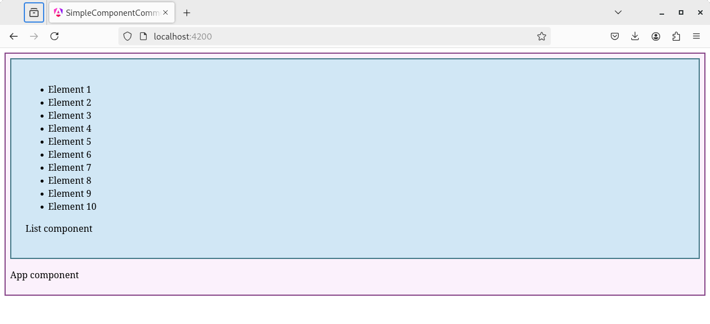

# Capítol 8. Comunicació entre components Angular
En el  [Capítol 3. Components Angular](./chapter03.md) s'ha explicat els conceptes bàsics dels *components* Angular. Ara però, una aplicació mínimament complexa acaba tenint múltiples *components*, molts niats els uns dins dels altres, que, a més a més, interactúen entre ells sigui traspassant-se dades, sigui mitjançant events.

En aquest capítol, doncs, aprendrem a ampliar la implementació bàsica dels *components* per tal de definir-los un conjunt de propietats (o atributs) que els permetin rebre dades de l'exterior i un conjunt d'events als quals puguin reaccionar.

## Creació de propietats i events: comunicació entre components niats
Quan nosaltres creem un *component*, en certa manera, estem ampliant el ventall d'etiquetes d'`HTML`. Per tant, també hem de ser capaços de definir nous atributs i nous events per aquestes etiquetes.

L'explicació d'aquest apartat es farà sobre una aplicació exemple que tindrà un *component* `List` niat dins del *component* arrel `App`. El component `App` generarà un número aleatori i, a través d'aquest número, el component `List` crearà una llista amb aquest nombre aleatori de components.

### Creació de propietats: *signal* `input()`
Per crear una nova propietat d'etiqueta és necessari definir, dins del *component* un atribut de tipus `InputSignal<T>` utilitzar el mètode `input()` (on `T` fa referència al tipus de dades que estan gestionades pel *signal*: `string`, `number`, etc.). En el moment de la creació es pot definir un valor per defecte per aquest atribut o es pot indicar que sigui obligatori, és a dir, que s'hagi de definir sí o sí dins de l'etiqueta del *component*. Per exemple:

```typescript
  public data1: InputSignal<string> = input<string>();            //Creació d'un InputSignal<string> sense cap mena de valor per defecte
  public data2: InputSignal<string> = input<string>("");          //Creació d'un InputSignal<string> amb valor per defecte
  public data3: InputSignal<string> = input.required<string>();   //Creació d'un InputSignal<string> obligatori
```

En l'aplicació exemple, el *component* `List` definirà una propietat d'etiqueta de tipus `number`, la qual indicarà quants elements haurà de tenir la llista que cal crear. Així doncs, el seu codi `TS` serà el següent:

```typescript
import { Component, input, InputSignal } from '@angular/core';

@Component({
  selector: 'app-list',
  imports: [],
  templateUrl: './list.html',
  styleUrl: './list.css'
})
export class List {
  public nelems: InputSignal<number> = input<number>(0);
}
```

El tipus `InputSignal<T>` permet exposar qualsevol dels atributs del *component*, de tal manera que es pot fer servir com a propietat a la seva etiqueta i, per tant, aplicar-hi un *property binding*.

```html
<div class="acomponent">
  <app-list [nelems]="10" />
  
  <router-outlet />

  <p class="cname">App component</p>
</div>
```

Si modifiquem el codi `TS` del *component* `List` per tal que tingui un mètode que generi una llista, des del *component* l'`App` podem crear un llistat parametritzat que mostri tants elements com defineixi el nou atribut de `List`



```typescript
import { Component, input, InputSignal } from '@angular/core';

@Component({
  selector: 'app-list',
  imports: [],
  templateUrl: './list.html',
  styleUrl: './list.css'
})
export class List {
  public nelems: InputSignal<number> = input<number>(0);

  public generateArrayElems(): number[] {
    let vals: number[] = [];
    for(let i=0; i<this.nelems(); i++) {
      vals.push(i);
    }
    return vals;
  }
}
```



```html
<div class="lcomponent">
    <ul>
        @for(elem of generateArrayElems(); track elem) {
            <li>Element {{ elem+1 }}</li>
        }
    </ul>

    <p class="cname">List component</p>
</div>
```



```css
.lcomponent {
    background-color: rgba(114, 207, 230, 0.3);
    border: #447a88 2px solid;
    padding: 25px;
}
```



```typescript
import { Component } from '@angular/core';
import { RouterOutlet } from '@angular/router';
import { List } from './elements/list/list';

@Component({
  selector: 'app-root',
  imports: [RouterOutlet, List],
  templateUrl: './app.html',
  styleUrl: './app.css'
})
export class App {}

```



```html
<div class="acomponent">
  <app-list [nelems]="10" />
  
  <router-outlet />

  <p class="cname">App component</p>
</div>
```



```css
.acomponent {
    background-color: rgba(216, 114, 230, 0.1);
    border: #864488 2px solid;
    padding: 8px;
}
```








### Creació de propietats codi *legacy*: decorador `@Input()`
Les versions d'Angular anteriors a la 16, que és on s'introdueixen els *signals* definien les propietats d'etiqueta mitjançant el decorador `@Input()`, tal com mostra el codi següent per al mateix exemple que en l'apartat anterior:

```typescript
import { Component, Input } from '@angular/core';

@Component({
  selector: 'app-list',
  imports: [],
  templateUrl: './list.html',
  styleUrl: './list.css'
})
export class List {
  @Input() nelems: number = 0;

  public generateArrayElems(): number[] {
    let vals: number[] = [];
    for(let i=0; i<this.nelems; i++) {
      vals.push(i);
    }
    return vals;
  }
}
```

Com que aquest decorador fa exactament la mateixa funció que el mètode `input()` i, per tant, permet exposar qualsevol atribut del *component* per fer-lo servir de propietat d'etiqueta, la resta de codi de l'aplicació es manté exactament igual que el mostrat en l'apartat anterior.

Addicionament, el decorador també permet definir propietats obligatòries:
```typescript
  @Input() data1: number = 0                //Creació d'una propietat d'etiqueta numèrica amb valor per defecte
  @Input({required: true}) data2!: number;  //Creació d'una propietat d'etiqueta numèrica obligatòria
```
En aquest context, l'operador `!` indica al compilador d'Angular que aquest atribut no necessita una inicialització amb un valor per defecte perquè l'@Input és obligatori i, per tant, el valor es definirà, sí o també, en el moment d'incrustar l'etiqueta del *component* dins del codi `HTML` de l'aplicació.

### Creació d'events
La creació d'events és molt similar a la creació d'atributs. No obstant això, en aquest cas l'objectiu és afegir funcionalitat al nou component: a través de la detecció dels events que creem podrem donar una funcionalitat o una alra, segons el tractament que programem.
.
Per crear un nou event d'etiqueta és necessari utilitzar 
1. el decorador `@Output`, el qual també s'ha d'importar des de la llibreria `@angular/core`
2. la classe EventEmitter, per definir l'event i
3. el llençament del nou event creat (`emit`).

```typescript
import { Component, EventEmitter, Input, Output } from '@angular/core';

@Component({
  selector: 'app-list',
  templateUrl: './list.component.html',
  styleUrls: ['./list.component.css']
})
export class ListComponent {
  @Input() nelems: number = 0;
  @Output() onrandom: EventEmitter<void> = new EventEmitter();
  
  public generateArrayElems(): number[] {
    let vals: number[] = [];
    for(let i=0; i<this.nelems; i++) {
      vals.push(i);
    }
    return vals;
  }

  public emitRandomEvent(): void {
    this.onrandom.emit();
  }
}
```

El decorador `@Output` permet exposar qualsevol de les propietat del nostre component, de tal manera que es pot fer servir com a event a la seva etiqueta i, per tant, aplicar-hi un *event binding*.

```html
<h1>AppComponent</h1>
<app-list [nelems]="rndnum" (onrandom)="generateRandomNumber()"></app-list>
```

Si tornem a modificar l'exemple de l'apartat anterior, des de l'`AppComponent` podem crear la llista parametritzada aleatòriament a `ListComponent`



```typescript
import { Component, EventEmitter, Input, Output } from '@angular/core';

@Component({
  selector: 'app-list',
  templateUrl: './list.component.html',
  styleUrls: ['./list.component.css']
})
export class ListComponent {
  @Input() nelems: number = 0;
  @Output() onrandom: EventEmitter<void> = new EventEmitter();
  
  public generateArrayElems(): number[] {
    let vals: number[] = [];
    for(let i=0; i<this.nelems; i++) {
      vals.push(i);
    }
    return vals;
  }

  public emitRandomEvent(): void {
    this.onrandom.emit();
  }
}
```



```html
<div style="border: solid black 2px;">
    <h3>ListComponent</h3>
    <ol>
        <li *ngFor="let elem of generateArrayElems()">Element {{ elem+1 }}</li>
    </ol>
    <button (click)="emitRandomEvent()">Generació aleactòria</button>
</div>
```



```typescript
import { Component } from '@angular/core';

@Component({
  selector: 'app-root',
  templateUrl: './app.component.html',
  styleUrls: ['./app.component.css']
})
export class AppComponent {
  public rndnum: number = 0;

  public generateRandomNumber(): void {
    this.rndnum = Math.floor(Math.random() * 100);
  }
}
```



```html
<h1>AppComponent</h1>
<app-list [nelems]="rndnum" (onrandom)="generateRandomNumber()"></app-list>
```








*Vídeo 069 capítol "05 Components & Databinding Deep Dive" del curs d'Udemy*
