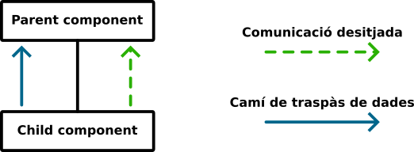
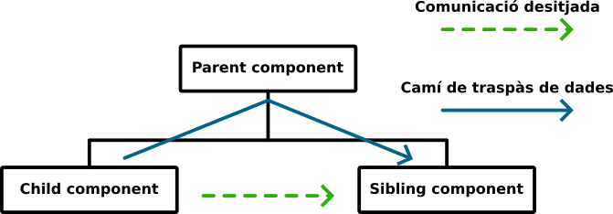
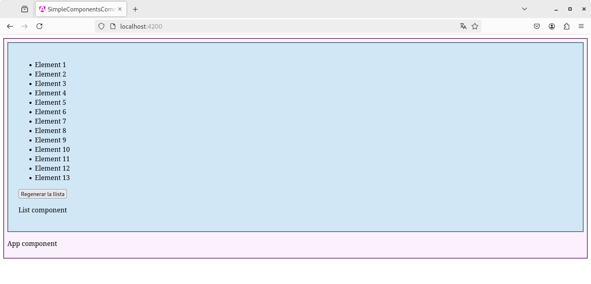

# Capítol 8. Comunicació entre components Angular
En el  [Capítol 3. Components Angular](./chapter03.md) s'ha explicat els conceptes bàsics dels *components* Angular. Ara però, una aplicació mínimament complexa acaba tenint múltiples *components*, molts niats els uns dins dels altres, que, a més a més, interactúen entre ells sigui traspassant-se dades, sigui mitjançant events.

En aquest capítol, doncs, aprendrem a ampliar la implementació bàsica dels *components* per tal de definir-los un conjunt de propietats (o atributs) que els permetin rebre dades de l'exterior i un conjunt d'events als quals puguin reaccionar.


**Informació:** la comunicació directa entre *components* només es pot donar entre *component* para i *component* fill (dins de la mateixa branca jeràrquica), tal com mostra la Figura 8.1.

<figure>
    
    <figcaption>Figura 8.1: comunicació entre component fill i component pare</figcaption>
</figure>

En cas de voler comunicar *components* que es troben en diferents branques de l'arbre, cal trobar un *component* ancestre comú a través del qual es pugui establir un camí de traspàs d'informació, tal com mostra la Figura 8.2.

<figure>
    
    <figcaption>Figura 8.2: comunicació entre components de diferents branques jeràrquiques a través d'un ancestre comú</figcaption>
</figure>


## Creació de propietats i events: comunicació entre components niats
Quan nosaltres creem un *component*, en certa manera, estem ampliant el ventall d'etiquetes d'`HTML`. Per tant, també hem de ser capaços de definir nous atributs i nous events per aquestes etiquetes.

L'explicació d'aquest apartat es farà sobre una aplicació exemple que tindrà un *component* `List` niat dins del *component* arrel `App`. El component `App` generarà un número aleatori i, a través d'aquest número, el component `List` crearà una llista amb aquest nombre aleatori de components.

### Creació de propietats: *signal* `input()`
Per crear una nova propietat d'etiqueta és necessari definir, dins del *component* un atribut de tipus `InputSignal<T>` utilitzar el mètode `input()` (on `T` fa referència al tipus de dades que estan gestionades pel *signal*: `string`, `number`, etc.). En el moment de la creació es pot definir un valor per defecte per aquest atribut o es pot indicar que sigui obligatori, és a dir, que s'hagi de definir sí o sí dins de l'etiqueta del *component*. Per exemple:

```typescript
  public data1: InputSignal<string> = input<string>();            //Creació d'un InputSignal<string> sense cap mena de valor per defecte
  public data2: InputSignal<string> = input<string>("");          //Creació d'un InputSignal<string> amb valor per defecte
  public data3: InputSignal<string> = input.required<string>();   //Creació d'un InputSignal<string> obligatori
```

En l'aplicació exemple, el *component* `List` definirà una propietat d'etiqueta de tipus `number`, la qual indicarà quants elements haurà de tenir la llista que cal crear. Així doncs, el seu codi `TS` serà el següent:

```typescript
import { Component, input, InputSignal } from '@angular/core';

@Component({
  selector: 'app-list',
  imports: [],
  templateUrl: './list.html',
  styleUrl: './list.css'
})
export class List {
  public nelems: InputSignal<number> = input<number>(0);
}
```

El tipus `InputSignal<T>` permet exposar qualsevol dels atributs del *component*, de tal manera que es pot fer servir com a propietat a la seva etiqueta i, per tant, aplicar-hi un *property binding*.

```html
<div class="acomponent">
  <app-list [nelems]="10" />
  
  <router-outlet />

  <p class="cname">App component</p>
</div>
```

Si modifiquem el codi `TS` del *component* `List` per tal que tingui un mètode que generi una llista, des del *component* l'`App` podem crear un llistat parametritzat que mostri tants elements com defineixi el nou atribut de `List`



```typescript
import { Component, input, InputSignal } from '@angular/core';

@Component({
  selector: 'app-list',
  imports: [],
  templateUrl: './list.html',
  styleUrl: './list.css'
})
export class List {
  public nelems: InputSignal<number> = input<number>(0);

  public generateArrayElems(): number[] {
    let vals: number[] = [];
    for(let i=0; i<this.nelems(); i++) {
      vals.push(i);
    }
    return vals;
  }
}
```



```html
<div class="lcomponent">
    <ul>
        @for(elem of generateArrayElems(); track elem) {
            <li>Element {{ elem+1 }}</li>
        }
    </ul>

    <p class="cname">List component</p>
</div>
```



```css
.lcomponent {
    background-color: rgba(114, 207, 230, 0.3);
    border: #447a88 2px solid;
    padding: 25px;
}
```



```typescript
import { Component } from '@angular/core';
import { RouterOutlet } from '@angular/router';
import { List } from './elements/list/list';

@Component({
  selector: 'app-root',
  imports: [RouterOutlet, List],
  templateUrl: './app.html',
  styleUrl: './app.css'
})
export class App {}
```



```html
<div class="acomponent">
  <app-list [nelems]="10" />
  
  <router-outlet />

  <p class="cname">App component</p>
</div>
```



```css
.acomponent {
    background-color: rgba(216, 114, 230, 0.1);
    border: #864488 2px solid;
    padding: 8px;
}
```








### Creació de propietats codi *legacy*: decorador `@Input()`
Les versions d'Angular anteriors a la 16, que és on s'introdueixen els *signals*, definien les propietats d'etiqueta mitjançant el decorador `@Input()`, tal com mostra el codi següent per al mateix exemple que en l'apartat anterior:

```typescript
import { Component, Input } from '@angular/core';

@Component({
  selector: 'app-list',
  imports: [],
  templateUrl: './list.html',
  styleUrl: './list.css'
})
export class List {
  @Input() nelems: number = 0;

  public generateArrayElems(): number[] {
    let vals: number[] = [];
    for(let i=0; i<this.nelems; i++) {
      vals.push(i);
    }
    return vals;
  }
}
```

Com que aquest decorador fa exactament la mateixa funció que el mètode `input()` i, per tant, permet exposar qualsevol atribut del *component* per fer-lo servir de propietat d'etiqueta, la resta de codi de l'aplicació es manté exactament igual que el mostrat en l'apartat anterior.

Addicionament, el decorador també permet definir propietats obligatòries:
```typescript
  @Input() data1: number = 0                //Creació d'una propietat d'etiqueta numèrica amb valor per defecte
  @Input({required: true}) data2!: number;  //Creació d'una propietat d'etiqueta numèrica obligatòria
```
En aquest context, l'operador `!` indica al compilador d'Angular que aquest atribut no necessita una inicialització amb un valor per defecte perquè l'`@Input()` és obligatori i, per tant, el valor es definirà, sí o també, en el moment d'incrustar l'etiqueta del *component* dins del codi `HTML` de l'aplicació.

### Creació d'events: mètode `output()`
La creació d'events és molt similar a la creació d'atributs. No obstant això, en aquest cas l'objectiu és afegir funcionalitat al nou component: a través de la detecció dels events que creem podrem donar una funcionalitat o una alra, segons el tractament que programem.

Per crear un nou event d'etiqueta és necessari utilitzar el mètode `output()`, el qual crea un objecte del tipus `OutputEmitterRef<T>`, on `T` és el tipus de dades que emetrà l'event (`void`, `number`, `string`, etc.). El mètode `emit()` d'aquesta classe `OutputEmitterRef<T>` permet llençar l'event desitjat, que haurà de ser tractat per un *component* ancestre.

En l'aplicació d'exemple, el *component* `List` tindrà un botó que emetrà un event fent que el *component* pare (`App`) generi un nou valor aleatori i, d'aquesta manera, la llista d'elements del *component* `List` canviarà la seva capacitat. Així doncs, el codi `TS` i `HTML` del *component* `List` serà el següent:



```html
<div class="lcomponent">
    <ul>
        @for(elem of generateArrayElems(); track elem) {
            <li>Element {{ elem+1 }}</li>
        }
    </ul>

    <button (click)="onRegenerateList()">Regenerar la llista</button>

    <p class="cname">List component</p>
</div>
```



```typescript
import { Component, input, InputSignal, output, OutputEmitterRef } from '@angular/core';

@Component({
  selector: 'app-list',
  imports: [],
  templateUrl: './list.html',
  styleUrl: './list.css'
})
export class List {
  public nelems: InputSignal<number> = input<number>(0);
  public regenerate: OutputEmitterRef<void> = output();

  public generateArrayElems(): number[] {
    let vals: number[] = [];
    for(let i=0; i<this.nelems(); i++) {
      vals.push(i);
    }
    return vals;
  }

  public onRegenerateList() {
    this.regenerate.emit();
  }
}
```



El metode `output()` permet exposar qualsevol dels atributs del *component*, de tal manera que es poden fer servir com a event a la seva etiqueta i, per tant, aplicar-hi un *event binding*.

```html
<div class="acomponent">
  <app-list [nelems]="nelems()" (regenerate)="onRegenerateList()" />
  
  <router-outlet />

  <p class="cname">App component</p>
</div>
```

Així doncs, si modifiquen el codi d'exemple, des del *component* `App` podem crear la llista parametritzada aleatòriament a `List`. Tot plegat s'aconsegueix afegint al *component* `App` un `WritableSignal<number>`, l'atribut `nelems` del codi mostrat, per emmagatzemar la capacitat actual de la llista parametritzada i poder-la transferir al *component* `List` a través del * property binding* de la propietat d'etiqueta `nelems`. D'aquesta manera, cada cop que el *component* `List` emeti l'event `regenerate`, el *component* `App` el recollirà mitjançant l'*event binding* que redirigeix el tractament al mètode `onRegenerateList()`. Aquest mètode només s'encarrega de crear un nou valor aleatòri i modificar el *signal* `nelems`



```typescript
import { Component, input, InputSignal, output, OutputEmitterRef } from '@angular/core';

@Component({
  selector: 'app-list',
  imports: [],
  templateUrl: './list.html',
  styleUrl: './list.css'
})
export class List {
  public nelems: InputSignal<number> = input<number>(0);
  public regenerate: OutputEmitterRef<void> = output();

  public generateArrayElems(): number[] {
    let vals: number[] = [];
    for(let i=0; i<this.nelems(); i++) {
      vals.push(i);
    }
    return vals;
  }

  public onRegenerateList() {
    this.regenerate.emit();
  }
}
```



```html
<div class="lcomponent">
    <ul>
        @for(elem of generateArrayElems(); track elem) {
            <li>Element {{ elem+1 }}</li>
        }
    </ul>

    <button (click)="onRegenerateList()">Regenerar la llista</button>

    <p class="cname">List component</p>
</div>
```



```css
.lcomponent {
    background-color: rgba(114, 207, 230, 0.3);
    border: #447a88 2px solid;
    padding: 25px;
}
```



```typescript
import { Component, signal, WritableSignal } from '@angular/core';
import { RouterOutlet } from '@angular/router';
import { List } from './elements/list/list';

@Component({
  selector: 'app-root',
  imports: [RouterOutlet, List],
  templateUrl: './app.html',
  styleUrl: './app.css'
})
export class App {
  public nelems: WritableSignal<number> = signal(10);
  
  public onRegenerateList() {
    this.nelems.set(Math.floor(Math.random() * 100));
  }
}
```



```html
<div class="acomponent">
  <app-list [nelems]="nelems()" (regenerate)="onRegenerateList()" />
  
  <router-outlet />

  <p class="cname">App component</p>
</div>
```



```css
.acomponent {
    background-color: rgba(216, 114, 230, 0.1);
    border: #864488 2px solid;
    padding: 8px;
}
```







El codi mostrat a les línies de sobre genera un event molt senzill que no té associades dades (és de tipus `void`). Ara però, es poden crear events més complexos que emetin dades per traspassar-les al *component* pare, el qual les pot recollir a través de la variable Angular `$event`. Com a exemple, imaginem que, en el moment d'emetre l'event, el *component* `List` genera un valor aleatori per indicar la mida màxima de la següent llista aleatòria. El seu codi `TS`, doncs, queda modificat de la maneta següent:

```typescript
import { Component, input, InputSignal, output, OutputEmitterRef } from '@angular/core';

@Component({
  selector: 'app-list',
  imports: [],
  templateUrl: './list.html',
  styleUrl: './list.css'
})
export class List {
  public nelems: InputSignal<number> = input<number>(0);
  public regenerate: OutputEmitterRef<number> = output();

  public generateArrayElems(): number[] {
    let vals: number[] = [];
    for(let i=0; i<this.nelems(); i++) {
      vals.push(i);
    }
    return vals;
  }

  public onRegenerateList() {
    var maxCapacity = Math.floor(Math.random()* 100);
    this.regenerate.emit(maxCapacity);
  }
}
```

Podem veure que el genèric de l'objecte `OutputEmitterRef` és de tipus `number` i que el mètode `emit()` rep com a paràmetre el valor que es vol fer arribar al *component* `App`. Per tant, per tal que el *component* `App` pugui tractar aquest valor, el seu codi `HTML` i `TS` ha de canviar tal com es mostra a continuació.

```html
<div class="acomponent">
  <app-list [nelems]="nelems()" (regenerate)="onRegenerateList($event)" />
  
  <router-outlet />

  <p class="cname">App component</p>
</div>
```
Durant l'*event binding* s'utilitza la variable `$event` per poder traspassar el valor emès durant l'event com a paràmetre del mètode `onRegenerateList()` del *component* `App`

```typescript
import { Component, signal, WritableSignal } from '@angular/core';
import { RouterOutlet } from '@angular/router';
import { List } from './elements/list/list';

@Component({
  selector: 'app-root',
  imports: [RouterOutlet, List],
  templateUrl: './app.html',
  styleUrl: './app.css'
})
export class App {
  public nelems: WritableSignal<number> = signal(10);
  
  public onRegenerateList(maxCapacity: number) {
    this.nelems.set(Math.floor(Math.random() * maxCapacity));
  }
}
```
El mètode `onRegenerateList()` rep aquest paràmetre i l'utilitza per calcular el nombre d'elements que haurà de tenir la següent llista parametritzada.

### Creació d'events codi *legacy*: decorador `@Output()`
Les versions d'Angular anteriors a la 16 definien els events d'etiqueta mitjançant el decorador `@Output()`, tal com mostra el codi següent per al mateix exemple que en l'apartat anterior:

```typescript
import { Component, EventEmitter, Input, Output } from '@angular/core';

@Component({
  selector: 'app-list',
  imports: [],
  templateUrl: './list.html',
  styleUrl: './list.css'
})
export class List {
  @Input() nelems: number = 0;
  @Output() regenerate: EventEmitter<number> = new EventEmitter<number>();

  public generateArrayElems(): number[] {
    let vals: number[] = [];
    for(let i=0; i<this.nelems; i++) {
      vals.push(i);
    }
    return vals;
  }

  public onRegenerateList() {
    var maxCapacity = Math.floor(Math.random()* 100);
    this.regenerate.emit(maxCapacity);
  }
}
```

Com que aquest decorador fa exactament la mateixa funció que el mètode `output()` i, per tant, permet exposar qualsevol atribut del *component* per fer-lo servir d'event d'etiqueta, la resta de codi de l'aplicació es manté exactament igual que el mostrat en l'apartat anterior.

## Webgrafia del capítol
* Google (2025). [Angular](https://angular.dev/). Consultat el 27 de juny de 2025.
* Udemy (2025). [Curs *Angular - The Complete Guide (2025 Edition)*](https://www.udemy.com/course/the-complete-guide-to-angular-2/). Consultat el 27 de juny de 2025.