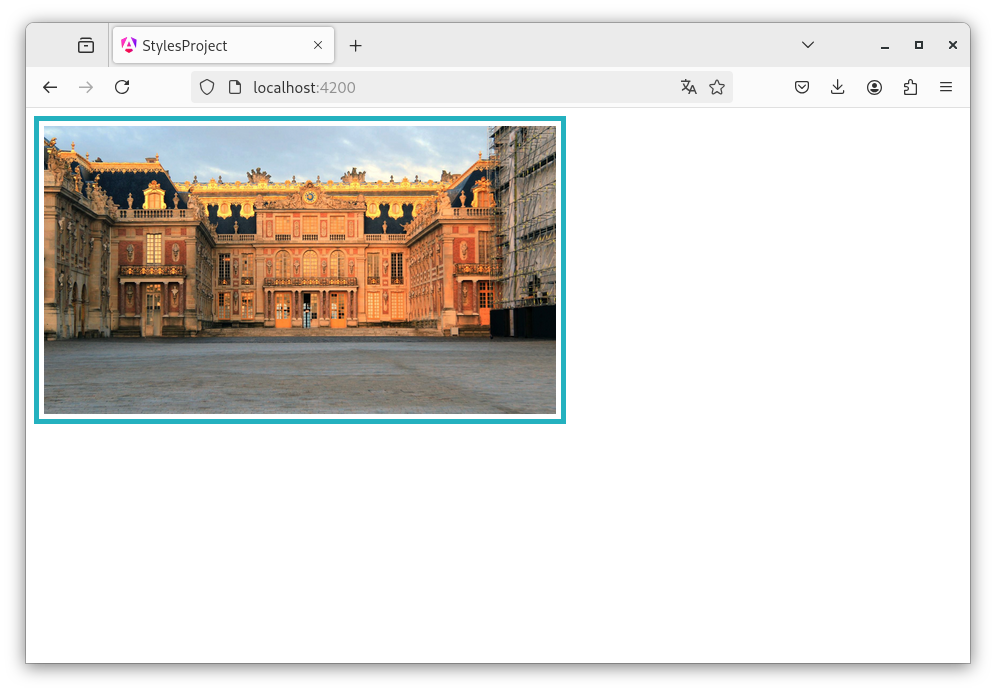

# Capítol 9. *Style Binding*, *Class Binding* i estils externs
<!-- TODO: en aquest capítol faltaria explicar les directives ngStyle i ngClass com a codi legacy -->
Angular ofereix múltiples eines per gestionar els estils dels seus *components* de manera interactiva, utilitzant els *bindings* dels atributs d'etiqueta `style`i `class` i també utilitzant les diverses llibreries CSS que existeixen al mercat per poder definir l'estil de les aplicacions. Sí que és cert, però, que no es recomana barrejar múltiples llibreries en un mateix projecte per les possibles incompatibilitats que puguin sorgir.

## *Style Binding* i *Class Binding*
Els *bindings* dels atributs d'etiqueta `style` i `class` serveixen per afegir o eliminar propietats CSS i classes CSS de manera dinàmica.

Per exemple, imaginem que tenim una aplicació molt senzilla on el component `App` mostra una imatge d'una mida determinada amb un marc, tal com mostra la Figura 9.1.

<figure>
    
    <figcaption>Figura 9.1: aplicació per exemplificar els estils, amb una imatge decorada amb CSS</figcaption>
</figure>

Per aplicar aquests estils ho podem fer de la manera clàssica (utilitzant `style` i `class` sobre l'etiqueta ``) o podem utilitzar la capacitat de l'*Style Binding* i del *Class Binding* per fer coses més elaborades.

### *Style Binding*
La implementació més senzilla de l'*Style Binding* consisteix a aplicar un *Property Binding* sobre l'atribut d'etiqueta `style` i assignar-li un `string` definit els estils que cal aplicar o un objecte de tipus `Record<string, any>` per aplicar els estils en format `JSON`.

Així doncs, tenint en compte que el codi `TS` del *component* `App` de la Figura 9.1 és el que es mostra a continuació:

```typescript
import { Component, signal, Signal } from '@angular/core';
import { RouterOutlet } from '@angular/router';

@Component({
  selector: 'app-root',
  imports: [RouterOutlet],
  templateUrl: './app.html',
  styleUrl: './app.css'
})
export class App {
  public imgSrc: Signal<string> = signal("img/versailles-94574.jpg").asReadonly();
  public simpleStyles: Signal<string> = signal('width: 512px; padding: 5px; border: #24b1bf 5px solid').asReadonly();
  public objStyles: Signal<Record<string, any>> = signal({
    'width': '512px',
    'padding': '5px',
    'border': '#24b1bf 5px solid'
  });
}
```


El codi `HTML` pot ser el següent:
1. Assignació directa del valor en format `string`:

    
      ```html
      
      <router-outlet />
      ```
    

2. Assignació del *signal* `simpleStyles`:

    
      ```html
      
      <router-outlet />
      ```
    

3. Assignació del *signal* `objStyles`:

    
      ```html
      
      <router-outlet />
      ```
    

Ara però, a part d'aquesta aplicació senzilla d'estils, es poden fer coses molt més elaborades com, per exemple, modificar la mida de la imatge de manera aleatòria o posar o treure el marc de la imatge segons si es compleix o no alguna propietat (per a més informació vegeu el següent [enllaç](https://angular.dev/guide/templates/binding#css-style-properties)).

Per exemplificar aquests estils més complexos, partim del següent codi base per al component `App`:


  ```css
  .myImage{
      width: 512px; 
      padding: 5px; 
      border: #24b1bf 5px solid;
  }
  ```



  ```html
  
  <br/>
  <button (click)="onModifySize()">Canviar la mida</button>
  <p>Mida actual de la imatge: {{ imgSize() }}</p>
  <router-outlet />
  ```



```typescript
import { Component, signal, Signal, WritableSignal } from '@angular/core';
import { RouterOutlet } from '@angular/router';

@Component({
  selector: 'app-root',
  imports: [RouterOutlet],
  templateUrl: './app.html',
  styleUrl: './app.css'
})
export class App {
  public imgSrc: Signal<string> = signal("img/versailles-94574.jpg").asReadonly();
  public imgSize: WritableSignal<number> = signal(512);

  public onModifySize() {
    this.imgSize.set(Math.floor(Math.random()*512) + 256);
  }
}
```



Per tal d'aconseguir que cada com que l'usuari premi el botó, la mida de la imatge canviï dinàmicament segons el valor gestionat pel *signal* `imgSize`, s'ha de modificar l'etiqueta `` per aplicar un *Property Binding* sobre el valor en *pixels* de la propietat *width* de l'atribut `style`:
```html
  
```

Si ara, a més a més, volem que només aparegui el marc si la mida de la imatge és parell podem aplicar un *Property Binding* **condicional** sobre la propietat *border* de l'atribut `style` (podem utilitzar, directament, l'operador ternari o utilitzar un mètode per ajudar-nos a fer els càlculs):

```html

```

### *Class Binding*
La implementació més senzilla del *Class Binding* és molt similar a l'*Style Binding* i consisteix a aplicar un *Property Binding* sobre l'atribut d'etiqueta `class` i assignar-li un `string` indicant el conjunt de classes a aplicar, un `string[]` que fa el mateix que l'anterior assignació o un objecte de tipus `Record<string, any>` per aplicar les classes en format `JSON` i de manera condicional.

Si tornem a basar l'exemple en el resultat que mostra la Figura 9.1 i sabem que el codi `CSS` i `TS` base del *component* `App` és el següent:


  ```css
  .myBasicImage {
      width: 512px;
  }

  .myHighlightedImage {
      padding: 5px; 
      border: #24b1bf 5px solid;
  }
  ```



```typescript
import { Component, signal, Signal, WritableSignal } from '@angular/core';
import { RouterOutlet } from '@angular/router';

@Component({
  selector: 'app-root',
  imports: [RouterOutlet],
  templateUrl: './app.html',
  styleUrl: './app.css'
})
export class App {
  public imgSrc: Signal<string> = signal("img/versailles-94574.jpg").asReadonly();
  public simpleClasses: Signal<string> = signal("myBasicImage myHighlightedImage").asReadonly();
  public arrayClasses: Signal<string[]> = signal(["myBasicImage", "myHighlightedImage"]).asReadonly();
  public conditionalClasses: WritableSignal<Record<string, any>> = signal({
    myBasicImage: true,
    myHighlightedImage: true
  });

  public msg: WritableSignal<string> = signal("Desactivar");
  public borderActive: WritableSignal<boolean> = signal(true);

  public onBorderActivated(): void {
    if(this.borderActive()) {
      this.msg.set("Activar");
      this.borderActive.set(false);
    } else {
      this.msg.set("Desactivar");
      this.borderActive.set(true);
    }

    this.conditionalClasses.set({
      myBasicImage: true,
      myHighlightedImage: this.borderActive()
    });
  }
}
```



El codi `HTML` pot ser el següent:
1. Assignació directa del valor en format `string` (el botó no té cap efecte sobre la imatge):

    
      ```html
      
      <br/>
      <button (click)="onBorderActivated()">{{ msg() }} el marc</button>
      <router-outlet />
      ```
    

2. Assignació del *signal* `simpleClasses` (el botó no té cap efecte sobre la imatge):

    
      ```html
      
      <br/>
      <button (click)="onBorderActivated()">{{ msg() }} el marc</button>
      <router-outlet />
      ```
    

3. Assignació del *signal* `arrayClasses` (el botó no té cap efecte sobre la imatge):

    
      ```html
      
      <br/>
      <button (click)="onBorderActivated()">{{ msg() }} el marc</button>
      <router-outlet />
      ```
    

4. Assignació del *signal* `conditionalClasses` (en aquest cas, el botó afecta la visualització de la imatge):

    
      ```html
      
      <br/>
      <button (click)="onBorderActivated()">{{ msg() }} el marc</button>
      <router-outlet />
      ```
    

El resultat de l'última opció del llistat també es pot assolir assignant un conjunt de classes inicials a l'etiqueta `` i, posteriorment, aplicar un *Property Binding* **condicional** sobre la propietat la classe *myHighlightedImage* de l'atribut `class`. En aquest cas, el codi `HTML` quedaria de la manera següent:

```html

```

Per a més informació, vegeu el següent [enllaç](https://angular.dev/guide/templates/binding#css-classes).

## Estils externs
Per poder utilitzar una llibreria CSS dins del nostre projecte cal configurar-la, pas que es pot fer de múltiples maneres.

### Llibreria CSS W3.CSS
Per utilitzar aquesta llibreria en un projecte Angular cal seguir 3 passos:
1. Descarregar el fitxer w3.css i guardar-lo localment
2. Configurar el fitxer w3.css dins del projecte Angular

#### Pas 1. Descàrrega del fitxer W3.CSS
Trobareu el fitxer w3.css a la pàgina [w3Schools](https://www.w3schools.com/), sota l'apartat [W3.CSS](https://www.w3schools.com/w3css/default.asp), dins de qualsevol requadre "*Try it yourself*".
[Enllaç directe al document](https://www.w3schools.com/w3css/4/w3.css)

Un cop descarregat el fitxer, cal guardar-lo dins del projecte, en concret, dins de la carpeta `public/css`.

#### Pas 2. Configuració del fitxer W3.CSS dins del projecte
La configuració del fitxer W3.CSS dins del projecte es pot fer de 3 maneres diferents
1. Modificant el fitxer `index.html` per tal d'afegir l'enllaç al fitxer dins de la seva capçalera (`<head>`); aquesta és l'opció menys recomanada
2. Modificant el fitxer `styles.css` per incloure el fitxer W3.CSS
3. Modificant el fitxer de configuració `angular.json` per afegir la nova dependència; aquesta és l'opció que més s'utilitza

##### Modificació del fitxer `index.html`
És la manera més fàcil d'afegir els estils W3.CSS al projecte Angular, però també la més poc ortodoxa de totes.

Per fer-ho, només cal afegit l'etiqueta `<link>` corresponent dins de la capçalera del fitxer `index.html`


```html
<!doctype html>
<html lang="en">
  <head>
    <meta charset="utf-8">
    <title>StylesProject</title>
    <base href="/">
    <meta name="viewport" content="width=device-width, initial-scale=1">
    <link rel="icon" type="image/x-icon" href="favicon.ico">
    <link rel="stylesheet" href="css/w3.css"/>
  </head>
  <body>
    <app-root></app-root>
  </body>
</html>
```


##### Modificació del fitxer `styles.css`
També és una manera molt senzilla d'afegir la llibreria W3.CSS al projecte Angular, tot i que tampoc és del tot ortodoxa.

Per fer-ho, s'utilitza la comanda CSS `@import url`


```css
/* You can add global styles to this file, and also import other style files */
@import url("../public/css/w3.css");

```


Cal tenir en compte que, en aquest cas, la ruta ha de ser relativa respecte de la ubicació del fitxer `styles.css`.

##### Modificació del fitxer `angular.json`
Aquesta metodologia és la més genuïna i autènticament Angular. Consisteix a modificar el fitxer de configuració `angular.json` per afegir la ruta al fitxer `w3.css` fins de l'apartat `architect` $\rightarrow$ `build` $\rightarrow$ `options` $\rightarrow$ `styles`

```json
{
  "$schema": "./node_modules/@angular/cli/lib/config/schema.json",
  "version": 1,
  "newProjectRoot": "projects",
  "projects": {
    "styles-project": {
      //...
      "architect": {
        "build": {
          "builder": "@angular/build:application",
          "options": {
            //...
            "styles": [
              "src/styles.css",
              "public/css/w3.css"
            ]
          },
          //...
        },
        //...
      }
    }
  }
}
```


**Atenció:** en cas que el servidor Angular `ng serve` estigués actiu, caldrà aturar-lo i tornar-lo a iniciar cada cop que es modifiqui el fitxer `angular.json`


### Llibreria CSS Bootstrap (*framework*)
El *framework* [Bootstrap](https://getbootstrap.com/) es pot instal·lar amb el gestor de paquets `npm` de `NodeJS`. Així doncs, per aplicar Bootstrap a un projecte Angular només fa falta fer 3 passos:
 1. Obrir una consola dins de la carpeta del projecte
 2. Instal·lar el *framework*
  ```bash
  $ npm install bootstrap@latest
  ```
 3. Configurar les rutes als fitxers CSS i JS dins de l'`angular.json`,
  ```json
  {
    "$schema": "./node_modules/@angular/cli/lib/config/schema.json",
    "version": 1,
    "newProjectRoot": "projects",
    "projects": {
      "styles-project": {
        //...
        "architect": {
          "build": {
            "builder": "@angular/build:application",
            "options": {
              //...
              "styles": [
                "src/styles.css",
                "node_modules/bootstrap/dist/css/bootstrap.min.css"
              ],
              "scripts": [
                "node_modules/bootstrap/dist/js/bootstrap.min.js"
              ]
            },
            //...
          },
          //...
        }
      }
    }
  }
  ```

### Llibreria FontAwesome (icones)
La llibreria [FontAwesome](https://fontawesome.com/) conté un conjunt d'icones, algunes de pagament però moltes de lliures.

Per poder-la utilitzar en qualsevol projecte Angular s'ha d'instal·lar la llibreria utilitzant l'eina `npm` de `NodeJS`:

```bash
$ npm install @fortawesome/free-solid-svg-icons
$ npm install @fortawesome/angular-fontawesome@<version>
```

Tot i que en el cas d'Angular v20 podem instal·lar l'última versió de FontAwesome (*latest*), vegeu la compatibilitat de les versions Angular i FontAwesome en aquesta [pàgina](https://www.npmjs.com/package/@fortawesome/angular-fontawesome)

Un cop instal·lada, cada cop que vulguem utilitzar una de les seves icones en algun dels nostres *components* caldrà configurar la dependència `FontAwesomeModule` fins de l'apartat `imports`. Per exemple, per utilitzar la icona *home* en el nostre *component* `App`, el codi és el següent:


  ```html
  <fa-icon [icon]="homeIcon"></fa-icon>
  <router-outlet />
  ```



```typescript
import { Component } from '@angular/core';
import { RouterOutlet } from '@angular/router';
import { FontAwesomeModule } from '@fortawesome/angular-fontawesome';
import { faHome } from '@fortawesome/free-solid-svg-icons';

@Component({
  selector: 'app-root',
  imports: [RouterOutlet, FontAwesomeModule],
  templateUrl: './app.html',
  styleUrl: './app.css'
})
export class App {
  public homeIcon = faHome;
}
```




## Webgrafia del capítol
* Google (2025). [Angular](https://angular.dev/). Consultat l'1 de juliol de 2025.
* Udemy (2025). [Curs *Angular - The Complete Guide (2025 Edition)*](https://www.udemy.com/course/the-complete-guide-to-angular-2/). Consultat l'1 de juliol de 2025.
* Refsnes Data (2025). [W3Schools](https://www.w3schools.com/). Consultat l'1 de juliol de 2025.
* Bootstrap (2025). [Bootstrap](https://getbootstrap.com/). Consultat l'1 de juliol de 2025.
* Font Icons, Inc (2025). [Font Awesome](https://fontawesome.com/). Consultat l'1 de juliol de 2025.
* npm (2025). [Package angular-fontawesome](https://www.npmjs.com/package/@fortawesome/angular-fontawesome). Consultat l'1 de juliol de 2025.