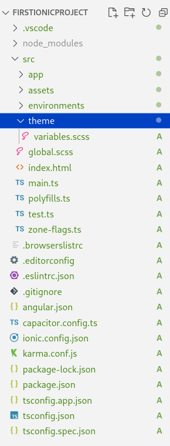

# Capítol 11. Creació d'un projecte Ionic
[Ionic](https://ionicframework.com/) és un framework que proveeix tot un conjunt d'eines per crear interfícies gràfiques per web però, sobretot, per mòbil (Android i iPhone). A més a més, la definició dels elements i de les CSS que ofereix garanteix que el *look&feel* de les aplicacions s'adapti perfectament a la plataforma on s'executen.

Ionic funciona sobre aplicacions creades amb Angular, Vue o React. Tot plegat fa que les aplicacions creades siguin completament multiplataforma.

## Instal·lació del framework al sistema
Per tal de poder crear noves aplicacions Ionic cal, prèviament, instal·lar el framework al sistema operatiu. Per fer-ho només fa falta executar la comanda següent (recordeu que l'opció `-g` serveix perquè la instal·lació es faci de forma global):
```bash
    npm install -g @ionic/cli
```

## Creació d'un projecte Ionic
Un cop el framework està instal·lat al sistema, podem crear nous projectes o afegir Ionic a projectes Angular ja existents.

### Creació d'un projecte Ionic nou
Per crear un nou projecte Ionic des de zero cal executar la comanda
```bash
    ionic start project_name 
```

Aquesta comanda iniciarà un procés de configuració bàsic on es demanarà que s'escullin les opcions següents:
1. Framework &rarr; Angular
2. Starter template &rarr; blank
3. Components &rarr; NgModules
4. Ionic account &rarr; No

### Afegir Ionic a un projecte Angular ja existent
Si el projecte Angular al qual es vol afegir el framework Ionic ja està creat, la comanda a executar és la següent:
```bash
    ng add @ionic/angular
```

Cal parar compte si el projecte Angular inicial no és independent, és a dir, pertany a un *workspace*. En aquest cas, després d'executar la comanda cal revisar que el fitxer `angular.json` conté la configuració correcta i que aquesta només afecta al projecte que ens interessa.

Per tal d'obtenir més informació en el moment de treballar amb *Worspaces*, Angular i Ionic a la vegada, vegeu el següent [enllaç](https://javascript.plainenglish.io/multi-projects-setup-for-angular-and-ionic-applications-70bc1d918758).

## Estructura d'un projecte Ionic
Un cop creat el projecte, sigui per un mètode o per un altre, l'estructura que es genera és molt similar a la d'un projecte Angular, tal com mostra la figura següent:



Les diferencies que es poden apreciar respecte d'un projecte Angular són les següents:
1. Els estils es defineixen mitjançant SCSS i el fitxer `styles.css` canvia el seu nom per `global.scss`
2. S'afegeix la carpeta `theme` amb el fitxer `variables.scss`
3. S'afegeix el fitxer ionic.config.json, que conté la configuració Ionic del projecte
4. S'afegeix el fitxer capacitor.config.ts, el qual permetrà configurar les capacitats de `Capacitor` per tal de poder crear l'instal·lador de l'aplicació mòbil i també accedir a les funcionalitats de `hardware` dels dispositius (càmera, sistema de fitxers, etc.).
5. S'afegeix el fitxer `karma.conf.js`, que permet configurar tests de les funcionalitats de l'aplicació.

## Execució del servidor *on-the-fly*
Tal com passa amb Angular, Ionic també ofereix un servidor *on-the-fly* que ens permet executar la nova aplicació al navegador a mesura que l'anem implementant. Per iniciar aquest servidor cal executar la comanda
```bash
    ionic serve
```
Fet això, el servidor per defecte s'obre sobre l'adreça `localhost:8100`

## Correspondència de comandes entre Angular i Ionic
Quan un projecte Angular també conté Ionic, les comandes de terminal que s'han d'utilitzar passen a ser les d'Ionic, de tal manera que la correspondència és la següent

|                      | Angular               | Ionic                      |
| -------------------- | --------------------- | -------------------------- |
| Crear el projecte    | `ng new project_name` | `ionic start project_name` |
| Iniciar el servidor  | `ng serve`            | `ionic serve`              |
| Compilar l'aplicació | `ng build`            | `ionic build`              |
| Generar un component | `ng generate ...`     | `ng generate ...`          |

