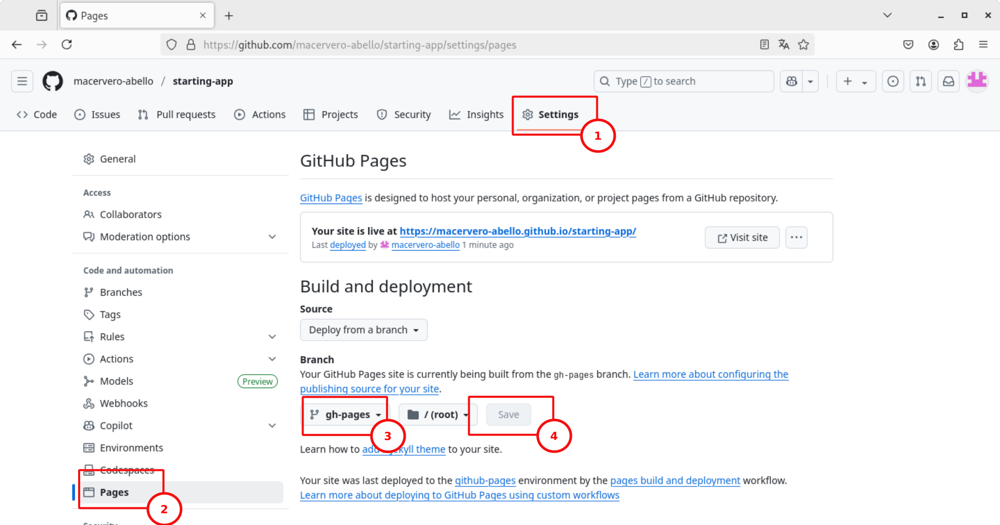

# Capítol 13. Desplegament a *GitHub Pages*
L'última versió d'Angular incorpora tot un conjunt d'instruccions de terminal (CLI) que permeten fer el desplegament de les aplicacions de manera molt fàcil. En concret, les plataformes que ofereix per fer la posada en producció automàtica són les següents:
* [Firebase Hosting](https://firebase.google.com/docs/hosting) ([instruccions](https://www.npmjs.com/package/@angular/fire))
* [Vercel](https://vercel.com/solutions/angular) ([instruccions](https://github.com/vercel/vercel/tree/main/examples/angular))
* [Netlify](https://www.netlify.com/) ([instruccions](https://www.npmjs.com/package/@netlify-builder/deploy))
* [GitHub Pages](https://pages.github.com/) ([instruccions](https://npmjs.org/package/angular-cli-ghpages))
* [Amazon Cloud S3](https://aws.amazon.com/s3/?nc2=h_ql_prod_st_s3) ([instruccions](https://www.npmjs.com/package/@jefiozie/ngx-aws-deploy))

Aquest capítol explica com fer el desplegament automàtic a GitHub Pages.

## Configuració del repositori *GIT*
Per assolir l'objectiu de posar en producció la nostra aplicació en un servei *GitHub Pages* cal seguir els passos següents:
1. Instal·lar les [eines de línia de comandes de *GIT*](https://git-scm.com/book/en/v2/Getting-Started-Installing-Git)
   1. Instruccions per a Windows: [enllaç ](https://gitforwindows.org/) i [enllaç 2](https://github.com/apps/desktop)
   2. [Instruccions per a MAC](https://git-scm.com/downloads/mac)
   3. [Instruccions per a Linux](https://git-scm.com/downloads/linux)
2. Crear un compte a GitHub
3. Crear un repositori **public** a GitHub
4. Enllaçar el repositori GitHub amb el repositori local que es genera automàticament quan es crea una aplicació Angular. Dit d'altra manera, cal afegir l'enllaç al repositori remot. Per fer-ho, cal executar la comanda següent:

```bash
$ git remote add origin https://github.com/<username>/<repositoryname>.git
```

5. Configurar l'usuari i el correu del compte de *GIT*:

```bash
$ git config --local user.name "complete_user_name"
$ git config --local user.email "user_email"
```

## Desplegament a *GitHub Pages*
Un cop configurat correctament el repositori *GIT* dins del projecte Angular ja es pot procedir a fer-ne el desplegament seguint els passos següents:
1. Executar la comanda `ng deploy`, la qual mostrarà totes les plataformes disponibles per fer el desplegament.
2. Escollir la plataforma *GitHub Pages* per tal que s'instal·li la llibreria `angular-cli-ghpages` (els passos 1 i 2 també es poden fer executant, directament, la comanda `ng add angular-cli-ghpages`)


3. Configurar la carpeta os es crearà el distribuïble dins del fitxer `angular.json`. En concret, cal modificar l'apartat `architect > build > options` per afegir-hi la propietat `outputPath`. Per exemple:

```json
{
  "$schema": "./node_modules/@angular/cli/lib/config/schema.json",
  "version": 1,
  "newProjectRoot": "projects",
  "projects": {
    "starting-app": {
      "projectType": "application",
      ...
      "architect": {
        "build": {
          "builder": "@angular/build:application",
          "options": {
            "browser": "src/main.ts",
            "polyfills": [],
            "tsConfig": "tsconfig.app.json",
            "assets": [
              {
                "glob": "**/*",
                "input": "public"
              }
            ],
            "styles": [
              "src/styles.css",
              "public/css/w3.css",
              "public/css/w3.theme.css"
            ],
            "outputPath": "dist/starting-app"
          },
          ...
        },
        ...
      }
    }
  }
}
```

4. Desplegar l'aplicació mitjançant la comanda

```bash
$ ng deploy --base-href=.
```

5. Un cop executada aquesta comanda podrem comprovar que el contingut de la carpeta `dist/starting-app` s'ha penjat a *GitHub*, en concret dins d'una branca anomenada `gh-pages`. Cal doncs, activar aquesta branca per tal que sigui la que fa *deploy* al servei *GitHub Pages*. Per fer-ho s'han de seguir els passos següents:
   1. Anar a la configuració del repositori (*Settings*)
   2. Dins de la configuració, accedir a l'apartat *Pages*
   3. Dins de l'apartat *Branch* seleccionar la branca `gh-pages` i guardar la configuració



Un cop fets tots aquests passos i després d'haver esperat uns minuts per tal que *GitHub* faci la configuració necessària per fer la publicació a *GitHub Pages*, l'aplicació es trobarà disponible a l'adreça `https://<username>.github.io/<repository>`

## Webgrafia del capítol
* Google (2025). [Angular](https://angular.dev/). Consultat el 7 de juliol de 2025.
* Udemy (2025). [Curs *Angular - The Complete Guide (2025 Edition)*](https://www.udemy.com/course/the-complete-guide-to-angular-2/). Consultat el 7 de juliol de 2025.

<!--https://gitforwindows.org/
https://git-scm.com/downloads/linux-->