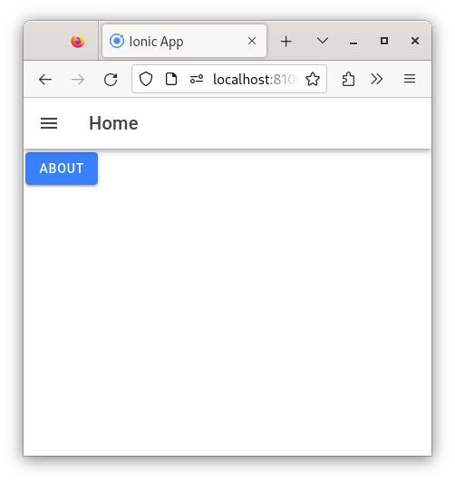

# Capítol 13. Components de navegació amb Ionic
Ionic ofereix una gran quantitat de components d'interfície gràfica i una [documentació](https://ionicframework.com/docs/components) molt similar a altres frameworks, com, per exemple, Bootstrap, que en facilita molt el seu ús. Tot i això, el primer que cal aprendre és a gestionar-ne el sistema de navegació.

En tota aplicació mòbil (i web) existeixen tres mètodes de navegació bàsics:
1. Mitjançant botons (i enllaços)
2. Mitjançant un menú
3. Mitjançant pestanyes

A continuació s'expliquen les diverses metodologies

## *Routing*
Tal com passa amb qualsevol aplicació Angular, el component `AppComponent` fa de contenidor principal de les diverses pàgines que es mostren a través del sistema d'enrutament. Ara però, aquest cop, l'etiqueta encarregada de generar aquest contenidor no és la `<router-outlet></router-outlet>`, sinó que l'estructura `HTML` és la següent:
```html
    <ion-app>
        <ion-router-outlet></ion-router-outlet>
    </ion-app>
```

L'etiqueta `<ion-app>` s'encarrega d'iniciarlitzar la part gràfica de l'aplicació i l'etiqueta `<ion-router-outlet>` actua de contenidor de rutes.

A part d'aquesta diferència, també cal tenir en compte dos aspectes addicionals que ja s'han comentat en el capítol anterior:
1. l'enrutament per defecte que defineix Ionic és el *Lazy Routing* i
2. per generar una nova pàgina no crearem un `component`, sinó una `page`. Al cap i a la fi, una `page` no és res més que un `component`, però Ionic diferencia el concepte pàgina (`page`), com tot l'`HTML` que es mostra per una ruta en concret, i element d'una pàgina (`component`), com l'`HTML` corresponent a una part de la pàgina (una llista, la capçalera, el peu de pàgina, etc.). La comanda que cal utilitzar és la de `ionic generate page path/page_name`

## Navegació amb botons (i enllaços)
La navegació mitjançant botons i enllaços es fa exactament igual que en Angular, és a dir, mitjançant
* la propietat `routerLink` o
* programaticament utilitzant el *service* `Router`.

Així doncs, si tenim dues pàgines `HomePage` i `AboutPage` amb les rutes `/home` i `/about` definides respectivament per cadascuna d'elles, podem navegar d'una pàgina a l'altra de la manera que mostra el codi següent:



```html
<ion-header [translucent]="true">
  <ion-toolbar>
    <ion-title>Home</ion-title>
  </ion-toolbar>
</ion-header>

<ion-content [fullscreen]="true">
    <ion-button [routerLink]="['/about']">About</ion-button>
</ion-content>
```



```html
<ion-header [translucent]="true">
  <ion-toolbar>
    <ion-title>About</ion-title>
  </ion-toolbar>
</ion-header>

<ion-content [fullscreen]="true">
  <ion-button (click)="goToHome()">Home</ion-button>
</ion-content>
```



```typescript
import { Component, OnInit } from '@angular/core';
import { Router } from '@angular/router';

@Component({
  selector: 'app-about',
  templateUrl: './about.page.html',
  styleUrls: ['./about.page.scss'],
})
export class AboutPage implements OnInit {

  constructor(private _router: Router) { }

  ngOnInit() { }

  goToHome(): void {
    this._router.navigate(['/home']);
  }

}
```



## Navegació amb menú
Moltes aplicacions mòbils, per no dir la majoria, estan gestionades per un menú principal que permet navegar a través de totes les pàgines. Per tant, com que aquest menú ha d'estar present (i ha de ser visible) des de qualsevol punt de l'aplicació, el component encarregat de gestionar-lo és l'`AppComponent`.

Si suposem que tenim tres pàgines, la `HomePage`, la `ListPage` i l'`AboutPage`, el fitxer `app.component.html`té l'aspecte següent:

```html
<ion-app>

  <ion-menu contentId="main-content">
    <ion-header>
      <ion-toolbar>
        <ion-title>Menú</ion-title>
      </ion-toolbar>
    </ion-header>
    <ion-content class="ion-padding">
      <ion-list>
        <ion-menu-toggle>
          <ion-item [routerLink]="['/home']" [routerLinkActive]="['activatedLink']">
            <ion-label><ion-icon name="home"></ion-icon> Home</ion-label>
          </ion-item>
        </ion-menu-toggle>
        <ion-menu-toggle>
          <ion-item [routerLink]="['/list']" [routerLinkActive]="['activatedLink']">
            <ion-label>List</ion-label>
          </ion-item>
        </ion-menu-toggle>
        <ion-menu-toggle>
          <ion-item [routerLink]="['/about']" [routerLinkActive]="['activatedLink']">
            <ion-label>About</ion-label>
          </ion-item>
        </ion-menu-toggle>
      </ion-list>
    </ion-content>
  </ion-menu>
  
  <ion-router-outlet id="main-content"></ion-router-outlet>
</ion-app>
```

Dins de l'etiqueta `<ion-app>` es defineix tant el menú `<ion-menu>` com el contenidor de rutes `<ion-router-outlet>`, de tal manera que cal entendre els següents aspectes:
1. L'etiqueta `<ion-menu>` sempre ha de definir la propietat `contentId`, el valor de la qual ha de ser igual a la propietat `id` de la l'etiqueta `<div>` o del contenidor de rutes `<ion-router-outlet>` on es vol carregar la pàgina que l'usuari vol navegar.
2. Un menú no és res més que una "mini pàgina" i, per tant, està format per les etiquetes `<ion-header>` i `<ion-content>`.
3. Normalment, dins de l'`<ion-content>` es crea un llistat amb totes les pàgines on es vol poder navegar. Aquest llistat està definit per l'etiqueta `<ion-list>`, la qual conté un conjunt d'`<ion-menu-toggle>` amb un `<ion-item>` en el seu interior. El contingut dels `<ion-item>` pot ser més o menys complex (només text, només icones, text i icones, etc.). L'etiqueta `<ion-menu-toggle>` és la que permet tancar el menú automàticament tan aviat com l'usuari a premut una de les opcions per canviar de pàgina.
4. Sempre cal tenir present que tota la navegació es farà a través de la propietat `routerLink` i mai mitjançant un `href`. A més a més, per augmentar la usabilitat i l'accessibilitat de l'aplicació es pot utilitzar la propietat `routerLinkActive` per ressaltar la pàgina on es troba, actualment, l'usuari. En el cas de l'exemple, la classe `activatedLink` està definida al fitxer `app.component.scss` de la manera següent:
```scss
.activatedLink {
    color: var(--ion-color-primary)
}
```
on `--ion-colo-primary` és una variable CSS que ofereix Ionic per definir el seu color primary (blau) i per tal de poder-ne agafar el seu valor cal utiltizar el mètode `var()`.

Aquest exemple crea el menú que es mostra en la següent imatge


Un cop fet el menú, cal modificar les capçaleres de les diverses pàgines per tal d'afegir-hi el botó que permeti obrir-lo i tancar-lo segons la necessitat de l'usuari. Així doncs, el codi `HTML` de `HomePage`, per exemple, queda de la següent manera:
```html
<ion-header [translucent]="true">
  <ion-toolbar>
    <ion-buttons slot="start">
      <ion-menu-button></ion-menu-button>
    </ion-buttons>
    <ion-title>Home</ion-title>
  </ion-toolbar>
</ion-header>

<ion-content [fullscreen]="true">
  <ion-button [routerLink]="['/about']">About</ion-button>
</ion-content>
```
Es pot veure que s'afegeix una botonera a la part esquerra de la capçalera (`slot="start"`) amb la típica icona del menú (les tres barres). Visualment queda de la manera següent:


### Múltiples menús i menús secundaris
Ionic preveu que una aplicació pugui tenir múltiples menús o que, fins i tot, en pugui tenir un de secundari, és a dir, que no gestioni la navegació principal, sinó només un petita part o un apartat de tota l'aplicació.

En cas que es vulgui crear múltiples menús per una mateixa aplicació, tot i que no és massa aconsellable, caldrà jugar amb diversos `contentId` i diversos `<ion-router-outlet>` per poder carregar les diferents vistes.

En cas que es vulgui crear un menú secundari, aquest menú, s'haurà de definir dins de l'`HTML` de la pàgina que s'encarregarà de fer-ne la gestió (ja no estarà definit a l'`app.component.html`).

## Navegació amb pestanyes

TODO