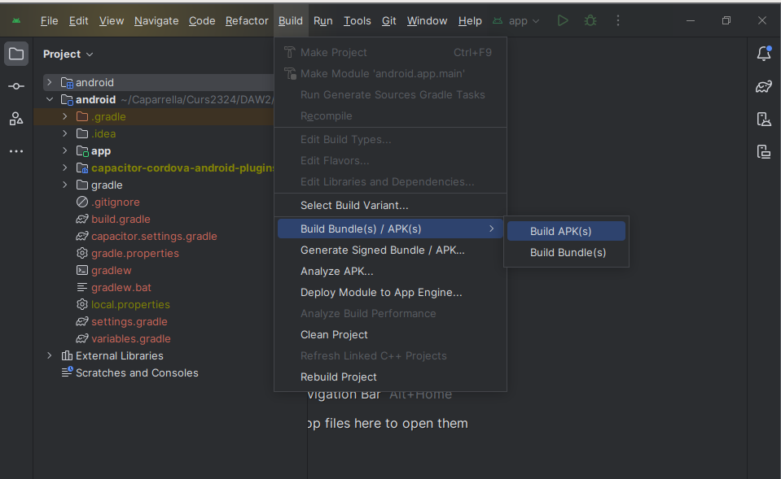
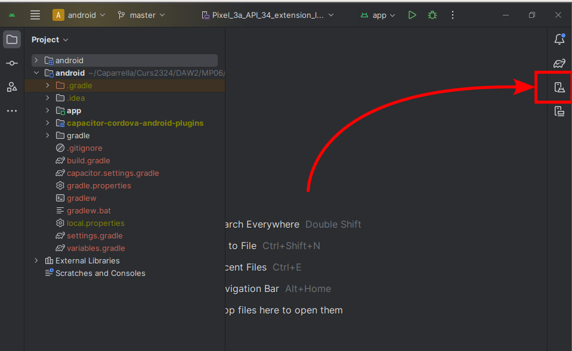
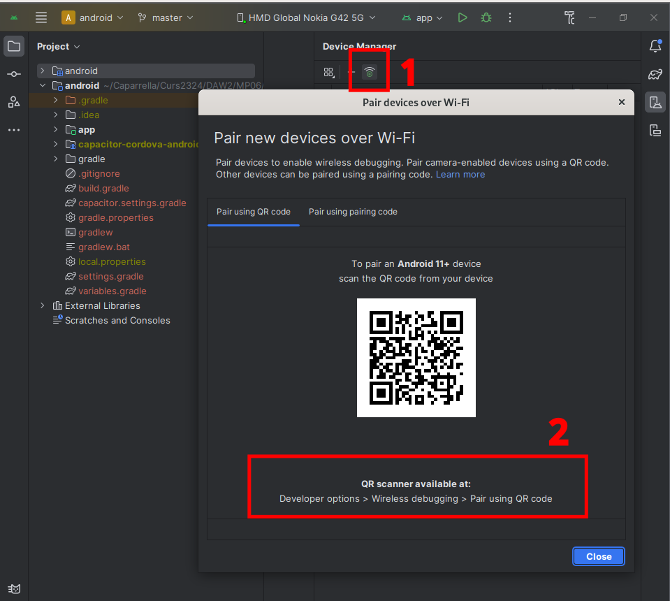
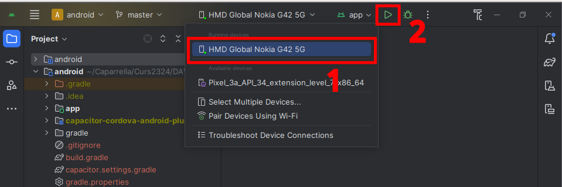
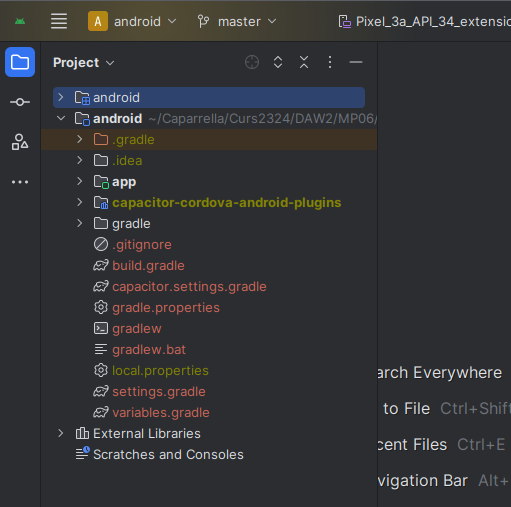
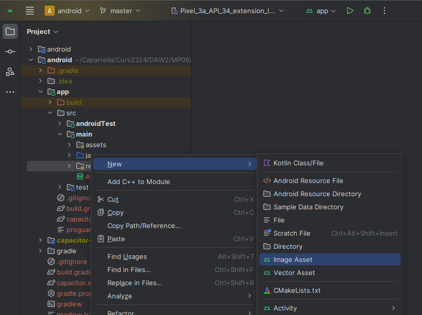

# Capítol 18. Creació i execució de l'APK (aplicació mòbil)
Per poder crear l'aplicació executable mòbil (APK) a partir del codi Angular-Ionic generat, fan falta 2 eines:
1. [Capacitor](https://capacitorjs.com/)
2. [Android Studio](https://developer.android.com/studio)

Vegeu els apartats del [Capítol 17](chapter17.md) referents a la [instal·lació](chapter17.md#installar-capacitor) i [configuració](chapter17.md#afegir-la-plataforma-android-o-ios-segons-es-desitgi) de Capacitor i a la [instal·lació](chapter17.md#installar-i-configurar-android-studio) i [configuració](chapter17.md#configurar-les-variables-dentorn-relacionades-amb-android-studio) d'Android Studio, així com també la documentació oficial de Capacitor referent a la seva [instal·lació](https://capacitorjs.com/docs/getting-started/with-ionic) i configuració per a [Android](https://capacitorjs.com/docs/android) i per a [IOS](https://capacitorjs.com/docs/android).

A més a més, per tenir una bona APK, també en caldrà dissenyar les icones i l'*Splash Screen* inicial.

## Preparació del projecte amb Capacitor
Tal com ja s'ha vist en el [Capítol 17](chapter17.md), Capacitor permet compilar el codi del nostre projecte segons la plataforma desitjada. Per tant, un cop ens hem assegurat que Capacitor està ben configurat dins del nostre projecte Ionic, cada cop que en canviem el codi caldrà efectuar els passos següents:
1. Compilació segons la plataforma

```bash
    ionic capacitor build android   #Compila el codi per a la plataforma Android
    ionic capacitor build ios       #Compila el codi per a la plataforma IOS
```

Aquest pas crea, en cas que no existeixin, les carpetes `android` i `ios` (els projectes Android i IOS que es poden obrir, directament, amb Andrid Studio i XCode, respectivament) i la carpeta `wwww`.

2. Sincronització dels fitxers de configuració

```bash
    ionic capacitor sync android    #Sincronitza la configuració de la plataforma Android
    ionic capacitor sync ios        #Sincronitza la configuració de la plataforma IOS
```

Executant aquestes instruccions s'aconsegueixen crear alguns fitxers de configuració importants com, per exemple, el fitxer `android/capacitor.settings.gradle`, en el cas de la plataforma Android.

3. Obertura del projecte amb Android Studio o XCode, segons la plataforma

```bash
    ionic capacitor open android    #Obre el projecte Android amb Android Studio
    ionic capacitor open ios        #Obre el projecte IOS amb XCode
```

Si treballeu amb Linux, la comanda per obrir el projecte Android us demanarà que tingueu la variable d'entorn `CAPACITOR_ANDROID_STUDIO_PATH` configurada.

D'altra banda, si aquestes comandes no funcionen correctament, es poden obrir els projectes de manera manual. En el cas d'Android Studio només fa falta importar el projecte `File -> Open` i obrir la carpeta `android` del projecte Ionic.

Un cop obert el projecte, cal esperar a que finalitzi la sincronització de fitxers

## Creació de l'APK (versió Android)
Un cop s'ha obert el projecte amb Androd Studio, la creació de l'APK (l'instal·lador i executable) és ben senzilla i només consta de 2 passos:
1. Fer un *build* del projecte mitjançant el menú d'Android Studio `Build -> Build bundles APKs -> Build APKs`, tal com mostra la Figura següent:



Aquest pas crea l'APK dins de la carpeta `android/app/build/outputs/apk/debug`.

2. Instal·lar i executar l'APK al mòbil a través d'Android Studio. Per poder fer aquest pas cal tenir connectat el mòbil al PC i haver-ne activat les opcions de desenvolupador, en concret, l'opció *USB debug*, tal com s'explica a l'apartat [Activar opcions de desenvolupador](chapter17.md#actiar-les-opcions-de-desenvolupador-al-mòbil-de-prova) del Capítol 17. A més a més, també cal configurar-lo com a dispositiu disponible a l'Android Studio:
    1. Obrir el *Device Manager* d'Android Studio a través del menú *Tools* o a través de la icona del mòbil que apareix a la dreta, tal com mostra la Figura següent:

    

    2. Seguir les instruccions per aconseguir connectar el mòbil al PC mitjançant un codi QR.

    

    3. Finalment, per executar l'APK només cal escollir el dispositiu dins del selector i prémer el botó *play*

    


També podem executar l'APK al mòbil a través d'Ionic i Capacitor mitjançant les comandes següents:

```bash
    ionic capacitor run android
```

o utilitzant la tècnica *Live Reload* explicada al [Capítol 17](chapter17.md).

## Disseny de les icones (versió Android)
Per dissenyar les icones de l'aplicació implementada amb Ionic es pot utilitzar l'[Asset Studio](https://developer.android.com/studio/write/create-app-icons) que porta incorporat l'Android Studio.

Passos a seguir:
1. Accedir a l'Asset Studio: 
    1. Assegurar-nos que la pestanya [*Project* mostra la vista *Android*](https://developer.android.com/studio/projects#ProjectFiles), tal com mostra la Figura següent:

    

    2. Fer *clic* dret sobre la carpeta `app/src/main/res` i seleccionar `New -> Image Asset`, tal com mostra la Figura següent:

    
    
2. Creació de les icones, tenint en compte que per versions d'Android iguals o superiors a la 8 s'han de crear del tipus *[Adaptative & legacy launcher icons*](https://developer.android.com/studio/write/create-app-icons#create-adaptive); en canvi, per versions anteriors s'han de crear del tipus "Legacy launcher icon only".


[Enllaços d'interès](https://code.tutsplus.com/tutorials/how-to-update-the-launcher-icon-for-your-android-app--cms-30624)

## Disseny de l'*Splash Screen*
Per crear la pantalla d'inici de l'aplicació (*Splash Screen*) cal seguir 4 passos:
1. Instal·lar el plugin [SplashScreen a Capacitor](https://capacitorjs.com/docs/apis/splash-screen)

```bash
	npm install @capacitor/splash-screen
    npm ionic capacitor sync
```
	
2. Generar totes les imatges (totes les mides verticals i horitzontals)
	* 480x320
	* `land-hdpi`: 800x480
	* `land-mdpi`: 480x320
	* `land-xhdpi`: 1280x720
	* `land-xxhdpi`: 1600x960
	* `land-xxxhdpi`: 1920x1280
	* `port-hdpi`: 480x800
	* `port-mdpi`: 320x480
	* `port-xhdpi`: 720x1280
	* `port-xxhdpi`: 960x1600
	* `port-xxxhdpi`: 1280x1920

Totes aquestes imatges han de tenir el nom "splash.png" i s'han d'emmagatzemar dins de la carpeta `android/app/src/main/res/drawable/drawable-RES`, on cal substituir `RES` pel nom de la resolució concreta (`land-hdpi`, `land-mdpi`, etc.)

3. Modificar la configuració de l'SplashScreen al fitxer `capacitor.config.json` o `capacitor.config.ts` (segons quin s'hagi creat al projecte). Per poder valorar quina configuració s'adapta millor a l'aplicació, vegeu l'[enllaç a la documentació del plugin de Capacitor](https://capacitorjs.com/docs/apis/splash-screen#configuration)

4. En cas que en la configuració s'hagi establert `launchAutoHide: false`, cal tancar l'SplashScreen des del codi. Per exemple, dins del mètode `ngOnInit` del fitxer `app.component.ts`:

```typescript
import { Component, OnInit } from '@angular/core';
import { SplashScreen } from '@capacitor/splash-screen';

@Component({
  selector: 'app-root',
  templateUrl: 'app.component.html',
  styleUrls: ['app.component.scss'],
})
export class AppComponent implements OnInit {
  constructor() {}

  async ngOnInit() {
    await SplashScreen.hide();
  }
}
```