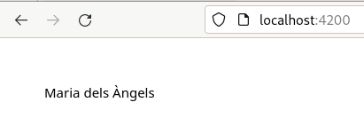
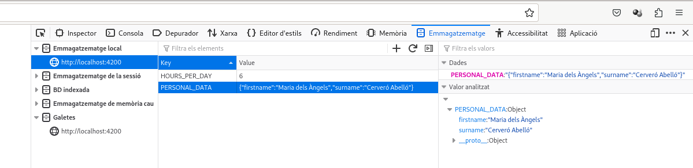

# Capítol 2. Format `JSON` i LocalStorage
Angular utilitza el format `JSON` i el LocalStorage per crear objectes complexos, sense fer ús d'una classe, i tenir capacitat de persistència de dades.

## Format `JSON`
El format `JSON` és un format molt simple que permet definir objectes mitjançant un conjunt de tuples `clau-valor`. Actualment, a més a més, ha desplaçat el llenguatge de marques `XML` en l'àmbit de la transmissió de dades per internet (serveis web), ja que el `JSON` és molt més lleuger que l'`XML`.

La seva sintaxi està formada, bàsicament pels següents símbols:`{`, `}`, `[`, `]`, `:`, `"`, `'` i `,`, de tal manera que, per exemple, per descriure les dades d'un alumne podem crear el següent objecte:

```json
{
    "first_name": "Ignasi",
    "last_name": "Vila Guerrero",
    "dni": "123456789A",
    "high_school": "Institut Caparrella",
    "studies": "DAW",
    "course": 2,
    "subjects": [
        {
            "code": "MP06",
            "name": "Desenvolupament en entorn client"
        }, 
        {
            "code": "MP07",
            "name": "Desenvolupament en entorn servidor"
        },
        {
            "code": "MP08",
            "name": "Desplegament d'aplicacions web"
        },
        {
            "code": "MP09",
            "name": "Disseny d'interfícies web"
        },
        {
            "code": "MP12",
            "name": "Projecte"
        },
        {
            "code": "MP13",
            "name": "FCT"
        },
    ]
}
```

Les dades en format `JSON` es poden emmagatzemar en un fitxer amb extensió `.json` o es poden utilitzar per crear objectes dins del codi Angular, tal com mostren les pestanyes següents:



```typescript
import { Component } from '@angular/core';

@Component({
  selector: 'app-root',
  templateUrl: './app.component.html',
  styleUrls: ['./app.component.css']
})
export class AppComponent {
  public personal_data: any = {
    "firstname": "Maria dels Àngels",
    "surname": "Cerveró Abelló"
  }

  //...
}
```



```html
<!-- Accés a una de les propietats de l'objecte personal_data -->
<div>{{ personal_data.firstname }}</div>
```







## LocalStorage
Tots els navegadors tenen una petita capacitat d'emmagatzematge per permetre la persistència de certes dades necessàries per al funcionament d'una aplicació web. S'anomena *LocalStorage* i permet emmagatzemar 5MB d'informació per cada aplicació que s'executi al navegador.

El LocalStorage guarda les dades mitjançant l'ús de tuples `clau-valor` (com si fos un diccionari o un `map`), de tal manera que té mètodes per emmagatzemar-les, esborrar-les i recuperar-les.



```typescript
//...

export class AppComponent {
  public personal_data: any = {
    "firstname": "Maria dels Àngels",
    "surname": "Cerveró Abelló"
  }
  public hours_per_day = 6;

  saveData(): void {
    localStorage.setItem("PERSONAL_DATA", JSON.stringify(this.personal_data));
    localStorage.setItem("HOURS_PER_DAY", JSON.stringify(this.hours_per_day));
  }

  restoreData(): boolean {
    let pdtmp = localStorage.getItem("PERSONAL_DATA");
    let hpdtmp = localStorage.getItem("HOURS_PER_DAY");

    if(pdtmp != null && hpdtmp != null) {
      this.personal_data = JSON.parse(pdtmp);
      this.hours_per_day = JSON.parse(hpdtmp);
      return true;
    }

    return false;
  }

  deleteData(): void {
    localStorage.removeItem("PERSONAL_DATA");
    localStorage.removeItem("HOURS_PER_DAY");
  }
}
```



```html
<button (click)="saveData()">Guardar</button>
<br/>
<button (click)="restoreData()">Carregar</button>
<br/>
<button (click)="deleteData()">Esborrar</button>
```





