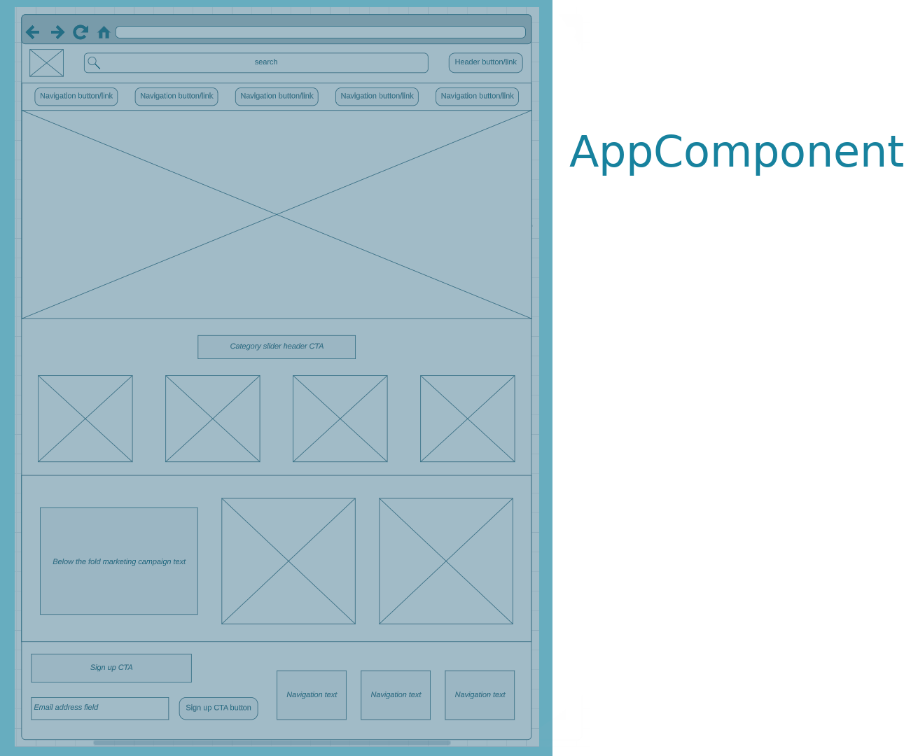
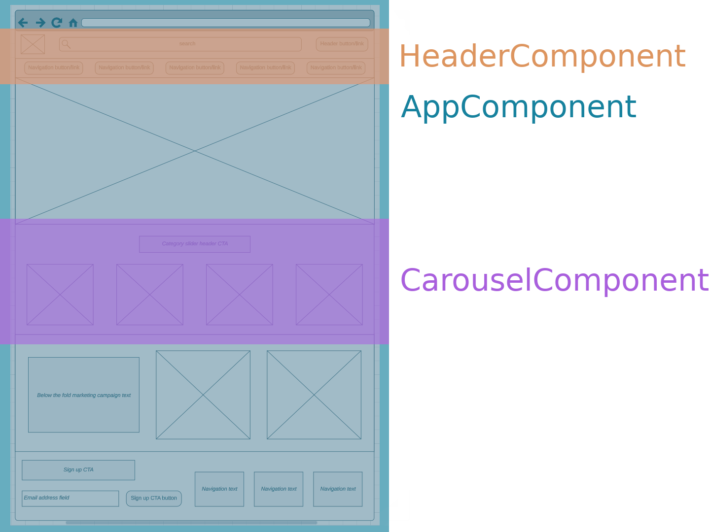
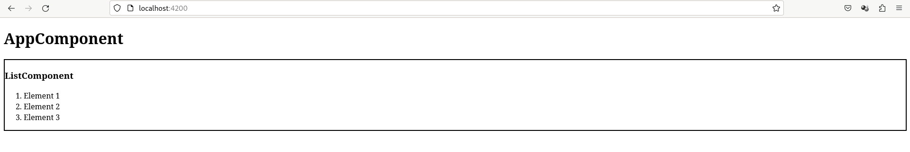
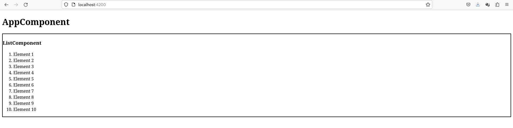
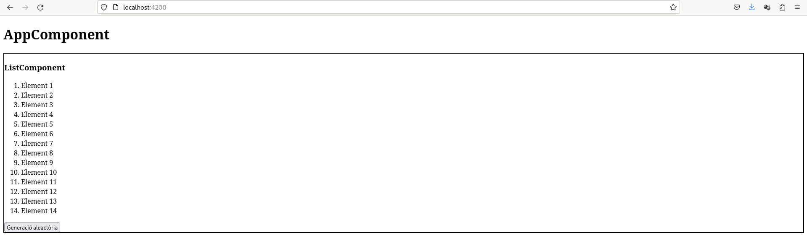

# Capítol 3. Components Angular
La creació de nou contingut en Angular (pàgines, una llista, una capçalera, etc.) es basa en els *components*. Així doncs, un component pot ser tota una nova pàgina



o podem crear una pàgina utilitzant múltiples components que podran ser reutilitzables



## Creació d'un Component Angular
Per crear un component d'Angular cal fer-ho utilitzant la comanda següent dins de la carpeta del projecte angular que, en aquest cas, suposarem que s'anomena `AngularProject`
```console
macervero@debian:~AngularProject$ ng generate component [path/component_name]
```

Així doncs, si executem
```console
macervero@debian:~AngularProject$ ng generate component pages/home
```
es crearà el component `HomeComponent` dins de la ruta `src/app/pages` del nostre projecte.

Aquesta comanda crea els quatre fitxers que estan associats a un component:
- `home.component.html`: defineix els elements que apareixeran a la vista
- `home.component.css`: dóna estil a la vista
- `home.component.ts`: *front-controller* que gestiona la funcionalitat de la vista
- `home.component.spec`.ts: fitxer per fer *testing* (*unit testing*)

Durant aquest curs no tractarem el fitxer `.spec.ts`, per tant, el podeu esborrar o crear el component sense aques fitxer utilitzant la comanda següent:
```console
macervero@debian:~AngularProject$ ng generate component --skyp-tests [path/component_name]
```

## Caractarístiques del fitxer TS d'un component
Com ja sabem, tot component té associat un fitxer TS, el seu *front-controller*, el qual sempre ha d'establir dos elements:
1. la descripció del component en sí mateix, mitjançant el decorador `@Component` i
2. la classe que gestionarà la funcionalitat de la vista i que tindrà el mateix nom que el component, per exemple:
    - `app.component.ts` $\rightarrow$ `AppComponent`
    - `home.component.ts` $\rightarrow$ `HomeComponent`

### Decorador `@Component` i niament de components
El decorador descriu 3 elements bàsics:
1. El selector (`selector`): l'etiqueta `html` que haurem d'utilitzar per poder utilitzar i insertar-lo en un fitxer `.html`
2. El fitxer `html` (`templateUrl`): defineix la ruta al fitxer `.html` associat al component i que en defineix la vista
3. Els fitxers `css` (`styleUrls`): defineix un llistat dels fitxers `.css` que definiran l'estil de la vista del component

Com a exemple de l'ús dels selectors dels components, les següents pestanyes mostren el codi del component `AppComponent`, dins del qual hi ha el nou component `ListComponent` niat.



```typescript
import { Component } from '@angular/core';

@Component({
  selector: 'app-root',
  templateUrl: './app.component.html',
  styleUrls: ['./app.component.css']
})
export class AppComponent {
}
```



```typescript
import { Component } from '@angular/core';

@Component({
  selector: 'app-list',
  templateUrl: './list.component.html',
  styleUrls: ['./list.component.css']
})
export class ListComponent {
}
```



```html
<h1>AppComponent</h1>
<app-list></app-list>
```



```html
<div style="border: solid black 2px;">
    <h3>ListComponent</h3>
    <ol>
        <li>Element 1</li>
        <li>Element 2</li>
        <li>Element 3</li>
    </ol>
</div>
```







## Creació d'atributs i events: comunicació entre components niats
Quan nosaltres creem un component, en certa manera, estem ampliant el ventall d'etiquetes d'`HTML`. Per tant, també hem de ser capaços de definir nous atributs i nous events per aquestes etiquetes.

### Creació d'atributs
Per crear un nou atribut d'etiqueta és necessari utilitzar el decorador `@Input`, el qual s'ha d'importar des de la llibreria `@angular/core`.

```typescript
import { Component, Input } from '@angular/core';

@Component({
  selector: 'app-list',
  templateUrl: './list.component.html',
  styleUrls: ['./list.component.css']
})
export class ListComponent {
  @Input() nelems: number = 0;
}
```

Aquest decorador permet exposar qualsevol dels propietat del nostre component, de tal manera que es pot fer servir com a atribut a la seva etiqueta i, per tant, aplicar-hi un *property binding*.

```html
<h1>AppComponent</h1>
<app-list [nelems]="10"></app-list>
```

Si modifiquem l'exemple de l'apartat anterior, des de l'`AppComponent` podem crear la llista parametritzada que mostri tants elements com defineixi el nou atribut de `ListComponent`



```typescript
import { Component } from '@angular/core';

@Component({
  selector: 'app-list',
  templateUrl: './list.component.html',
  styleUrls: ['./list.component.css']
})
export class ListComponent {
  @Input() nelems: number = 0;

  public generateArrayElems(): number[] {
    let vals: number[] = [];
    for(let i=0; i<this.nelems; i++) {
      vals.push(i);
    }
    return vals;
  }
}
```



```html
<h1>AppComponent</h1>
<app-list [nelems]="10"></app-list>
```



```html
<div style="border: solid black 2px;">
    <h3>ListComponent</h3>
    <ol>
        <li *ngFor="let elem in generateArrayElems()">Element {{ elem+1 }}</li>
    </ol>
</div>
```







*Vídeos 067 i 068 del capítol "05 Components & Databinding Deep Dive" del curs d'Udemy*

### Creació d'events
La creació d'events és molt similar a la creació d'atributs. No obstant això, en aquest cas l'objectiu és afegir funcionalitat al nou component: a través de la detecció dels events que creem podrem donar una funcionalitat o una alra, segons el tractament que programem.
.
Per crear un nou event d'etiqueta és necessari utilitzar 
1. el decorador `@Output`, el qual també s'ha d'importar des de la llibreria `@angular/core`
2. la classe EventEmitter, per definir l'event i
3. el llençament del nou event creat (`emit`).

```typescript
import { Component, EventEmitter, Input, Output } from '@angular/core';

@Component({
  selector: 'app-list',
  templateUrl: './list.component.html',
  styleUrls: ['./list.component.css']
})
export class ListComponent {
  @Input() nelems: number = 0;
  @Output() onrandom: EventEmitter<void> = new EventEmitter();
  
  public generateArrayElems(): number[] {
    let vals: number[] = [];
    for(let i=0; i<this.nelems; i++) {
      vals.push(i);
    }
    return vals;
  }

  public emitRandomEvent(): void {
    this.onrandom.emit();
  }
}
```

El decorador `@Output` permet exposar qualsevol de les propietat del nostre component, de tal manera que es pot fer servir com a event a la seva etiqueta i, per tant, aplicar-hi un *event binding*.

```html
<h1>AppComponent</h1>
<app-list [nelems]="rndnum" (onrandom)="generateRandomNumber()"></app-list>
```

Si tornem a modificar l'exemple de l'apartat anterior, des de l'`AppComponent` podem crear la llista parametritzada aleatòriament a `ListComponent`



```typescript
import { Component, EventEmitter, Input, Output } from '@angular/core';

@Component({
  selector: 'app-list',
  templateUrl: './list.component.html',
  styleUrls: ['./list.component.css']
})
export class ListComponent {
  @Input() nelems: number = 0;
  @Output() onrandom: EventEmitter<void> = new EventEmitter();
  
  public generateArrayElems(): number[] {
    let vals: number[] = [];
    for(let i=0; i<this.nelems; i++) {
      vals.push(i);
    }
    return vals;
  }

  public emitRandomEvent(): void {
    this.onrandom.emit();
  }
}
```



```html
<div style="border: solid black 2px;">
    <h3>ListComponent</h3>
    <ol>
        <li *ngFor="let elem of generateArrayElems()">Element {{ elem+1 }}</li>
    </ol>
    <button (click)="emitRandomEvent()">Generació aleactòria</button>
</div>
```



```typescript
import { Component } from '@angular/core';

@Component({
  selector: 'app-root',
  templateUrl: './app.component.html',
  styleUrls: ['./app.component.css']
})
export class AppComponent {
  public rndnum: number = 0;

  public generateRandomNumber(): void {
    this.rndnum = Math.floor(Math.random() * 100);
  }
}
```



```html
<h1>AppComponent</h1>
<app-list [nelems]="rndnum" (onrandom)="generateRandomNumber()"></app-list>
```








*Vídeo 069 capítol "05 Components & Databinding Deep Dive" del curs d'Udemy*
