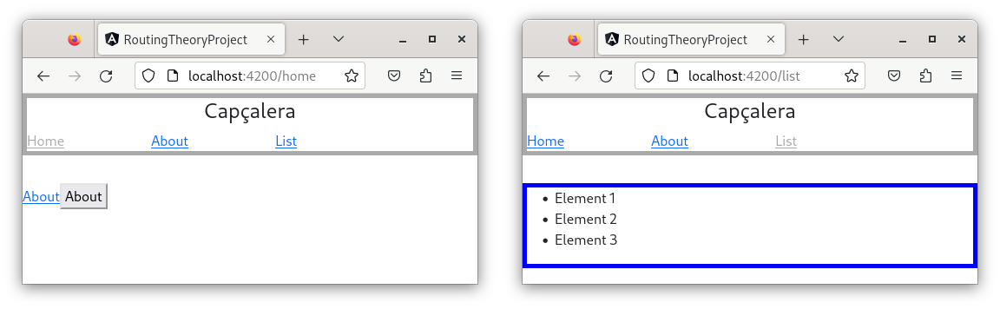

# Capítol 4. *Routing*
La configuració del *routing* a Angular permet navegar a través de les diverses pàgines de l'aplicació web, tenint en compte que es tracta d'una SPA (*Single Page Application*) i que, per tant, només existeix un únic fitxer `HTML` (l'index.html).

Així doncs, aquesta nagevació no és un canvi de fitxer `HTML` real (la `URL` base del navegador sempre serà la mateixa), sinó una càrrega i descàrrega dels `HTML` dels diversos components que constitueixen les diferents pàgines de l'aplicació. És a dir, el *routing* activa tot un mecanisme que, a través de codi `Javascript` permet modificar el `DOM` de la pàgina index.html.

Per fer tot això, es necessita afegir a la `URL` base un conjunt de fragments que, ben configurats, carreguen el component desitjat.

Angular permet dos tipus de *routing*:
* *Routing* clàssic o tradicional
* *Lazy routing*

## *Routing* clàssic o tradicional
El *routing* clàssic o tradicional es caracteritza pel fet que, quan l'usuari accedeix per primer cop a una aplicació web Angular, el mecanisme de *routing* precarrega totes les rutes disponibles.

Això significa que l'arrencada inicial de l'aplicació és més lenta i, en cas que hi hagi moltes rutes a precarregar, pot arribar a ser un petit coll d'ampolla que faci que l'usuari tingui la sensació de què l'aplicació va lenta. Ara però, un cop feta aquesta precàrrega, el canvi entre pàgines és immediat.

Aquest tipus de *routing* és addient en els casos d'aplicacions amb poques rutes configurades, ja que el temps de càrrega inicial es pot considerar inapreciable.

### Configuració bàsica
Per configurar el *routing* clàssic cal seguir els passos següents:
1. Configurar els fragments de les rutes i enllaçar-los als components corresponents
2. Activar el servei de *routing*
3. Crear els enllaços i la navegació als fitxers `HTML` i `TS` dels components

#### Contextualització d'un exemple
Per fer l'explicació, suposarem que tenim una aplicació amb dues pàgines: la pàgina `home`, definida al `HomeComponent`, i la pàgina `about`, definida a l'`AboutComponent`.

#### Configuració dels fragments de les rutes i activació del servei de *routing*
La configuració de les rutes i l'activació del servei de *routing* es realitza al fitxer de configuració de dependències `app.module.ts`.

Primer de tot cal crear un array de rutes (`Routes`), on cada ruta és un objecte `JSON` que, com a mínim, té l'atribut `path` per definir el fragment que es desitja i l'atribut `component` per establir el component que s'ha de carregar.

```typescript
const routes: Routes = [
  { path: 'home', component: HomeComponent },
  { path: 'about', component: AboutComponent }
]
```

L'ordre en què es defineixen les rutes dins d'aquest array és important, ja que l'enrutador d'Angular utilitza la política *first-mach wins*, és a dir, utilitza la primera ruta que coincideix amb el fragment de la `URL`. Per tant, les rutes s'han d'ordenar de més específiques a menys.

Un cop definides les rutes cal importar el mòdul `RouterModule` i configurar-lo amb l'array creat.

```typescript
imports: [
  BrowserModule,
  RouterModule.forRoot(routes)
]
```

El codi complet del fitxer app.module.ts seria el següent:



```typescript
import { NgModule } from '@angular/core';
import { BrowserModule } from '@angular/platform-browser';

import { AppComponent } from './app.component';
import { HomeComponent } from './pages/home/home.component';
import { AboutComponent } from './pages/about/about.component';
import { RouterModule, Routes } from '@angular/router';

const routes: Routes = [
  { path: 'home', component: HomeComponent },
  { path: 'about', component: AboutComponent },
];

@NgModule({
  declarations: [
    AppComponent,
    HomeComponent,
    AboutComponent,
    ListComponent
  ],
  imports: [
    BrowserModule,
    RouterModule.forRoot(routes)
  ],
  providers: [],
  bootstrap: [AppComponent]
})
export class AppModule { }


```



##### Configuració d'una ruta per defecte i gestió de ruta no trobada
Per configurar la ruta per defecte, el `JSON` ha de tenir tres atributs: el `path`, el `redirectTo` i el `pathMatch`.
1. `path`: serà el fragment buit (l'`URL` només tindrà la part del domini)
2. `redirectTo`: indicarà a quina ruta cal redirigir tot el trànsit per defecte que arribi a l'aplicació
3. `pathMatch`: indica quina política de coincidència s'ha d'aplicar al fragment del `path`7

Així doncs, si s'afegeix una ruta per defecte, l'array de rutes anterior queda de la manera següent:

```typescript
const routes: Routes = [
  { path: 'home', component: HomeComponent },
  { path: 'about', component: AboutComponent },
  { path: '', redirectTo: 'home', pathMatch: 'full'}
]
```

Per gestionar una ruta no trobada (o no accessible) només cal crear un component al qual redirigir l'intent d'accés erroni i configurar la ruta per al `path: '**'`

```typescript
const routes: Routes = [
  { path: 'home', component: HomeComponent },
  { path: 'about', component: AboutComponent },
  { path: '', redirectTo: 'home', pathMatch: 'full'},
  { path: '**', component: PageNotFoundComponent },
]
```

#### Navegació a través d'enllaços i botons
Un cop configurades totes les rutes desitjades només fa falta crear la navegació entre pàgines a través de botos i enllaços.

Com que tota aplicació Angular és una SPA (*Single Page Application*), es necessita un component principal que faci de contenidor de la resta de components/pàgines. Aquest paper se l'endú l'`AppComponent`, el qual, dins del seu codi `HTML`, tindrà l'etiqueta `<router-outlet>`, que és la que fa de contenidor per a la resta de components. Cal veure que l'`AppComponent` pot funcionar com a component *layout*, és a dir, aquell component que defineix els elements comuns al llarg de tota l'aplicació (capçalera, menú, etc.).

Fet això, només cal afegir enllaços i botons per saltar entre components, tenint en compte que l'ús de l'atribut `href` dels enllaços queda totalment prohibit perquè provoca una recàrrega de la pàgina i, per tant, trenca el principi bàsic de l'SPA (reinicia tota l'aplicació perquè la torna a descarregar del servidor). Aquest atribut queda substituït per l'atribut `routerLink` que ofereix Angular i que es pot aplicar a qualsevol etiqueta.

```html
<a [routerLink]="['/home']">Home</a>
```

L'atribut `routerLink` espera rebre un array amb els múltiples fragments de la nova `URL`, els quals poden ser absoluts o relatius. Per exemple:
* Si estem a la pàgina `home` (`HomeComponent`), l'enllaç
```html
<a [routerLink]="['/about']">Home</a>
```
defineix una ruta absoluta i generarà la `URL` `localhost:4200/about`. 
* Si estem a la pàgina `home` (`HomeComponent`), l'enllaç
```html
<a [routerLink]="['about']">Home</a>
```
defineix una ruta relativa i generarà la `URL` `localhost:4200/home/about`.
* L'enllaç 
```html
<a [routerLink]="['/home', gallery]">Home</a>
```
defineix múltiples fragments i crearà la ruta `localhost:4200/home/gallery`.

Pel que fa als botons, la navegació s'haurà de definir a través del seu event `click` i l'ús del *service* `Router` que ofereix Angular; per exemple, el component `AboutComponent` pot definir el botó següent:
```html
<button (click)="navigateToHome()">Home</button>
```
A partir d'aquí, per la navegació per botó haurà d'injectar el *service* `Router` dins del seu constructor, tal com mostra el codi següent:
```typescript
import { Component } from '@angular/core';
import { Router } from '@angular/router';

@Component({
  selector: 'app-about',
  templateUrl: './about.component.html',
  styleUrls: ['./about.component.css']
})
export class AboutComponent {

  constructor(private _router: Router) {}
}
```
Com es veurà en els capítols següents, tots els *services*, tant els que ofereix Angular com els que crearem nosaltres segons les necessitats de la nostra aplicació, aconstumen a seguir el patró d'instanciació `Singelton` i, per tant, només exiteix una única instància de cada *service* per a tota l'aplicació. Per poder-ne sol·licitar l'ús, els components o les classes ho han de fer a través del procés d'injecció, el qual defineix un atribut de classe dins de la zona de paràmetres del constructor.

El *service* `Router` té, entre altres, el mètode `navigate`, el qual espera rebre un array de fragments de ruta (exactament com l'atribut `routerLink`). Així doncs, per acabar de configurar la navegació a través del botó de l'exemple, només cal definir la funció `navigateToHome()`, la qual haurà de fer ús del `Router`:

```typescript
import { Component } from '@angular/core';
import { Router } from '@angular/router';

@Component({
  selector: 'app-about',
  templateUrl: './about.component.html',
  styleUrls: ['./about.component.css']
})
export class AboutComponent {

  constructor(private _router: Router) {}

  navigateToAbout(): void {
    this._router.navigate(['/home']);
  }
}
```

Exemple complet:


```typescript
import { NgModule } from '@angular/core';
import { BrowserModule } from '@angular/platform-browser';

import { AppComponent } from './app.component';
import { HomeComponent } from './pages/home/home.component';
import { AboutComponent } from './pages/about/about.component';
import { RouterModule, Routes } from '@angular/router';

const routes: Routes = [
  { path: 'home', component: HomeComponent },
  { path: 'about', component: AboutComponent },
  { path: '', redirectTo: 'home', pathMatch: 'full'},
  { path: '**', component: PageNotFoundComponent },
];

@NgModule({
  declarations: [
    AppComponent,
    HomeComponent,
    AboutComponent,
    ListComponent
  ],
  imports: [
    BrowserModule,
    RouterModule.forRoot(routes)
  ],
  providers: [],
  bootstrap: [AppComponent]
})
export class AppModule { }
```



```typescrip
<router-outlet></router-outlet>
```



```html
<a [routerLink]="['/about']">About</a>
```



```html
<button (click)="navigateToHome()">Home</button>
```



```typescript
import { Component } from '@angular/core';
import { Router } from '@angular/router';

@Component({
  selector: 'app-about',
  templateUrl: './about.component.html',
  styleUrls: ['./about.component.css']
})
export class AboutComponent {

  constructor(private _router: Router) {}

  navigateToAbout(): void {
    this._router.navigate(['/home']);
  }
}
```



### Configuració de subrutes
De subrutes n'hi ha de dos tipus, les estàtiques i les parametritzades i, tot i que la teoria bàsica és la mateixa, les subrutes es tracten a part pel petit increment de complexitat del tractament de les rutes parametritzades.

A part d'això, la càrrega d'una subruta es pot tractar com una pàgina addicional o com un element nou dins de la pàgina que ja s'estava visitant.

#### Subrutes estàtiques
Són aquelles rutes que tenen una `URL` constant (els segments estan predefinits) i, per tant, sempre carreguen el mateix contingut.

Per exemplificar-ho, suposem que a la pàgina d'inici hi posem un nou enllaç que, en preme'l, mostri un formulari de contacte. La `URL` inicial serà `localhost:4200/home` i la que mostrarà el formulari serà `localhost:4200/home/contact.` Aquest nou formulari es pot mostrar com un nou element dins de la pàgina inicial o com una pàgina individual.

##### Subrutes estàtiques que formen part d'una altra pàgina
Seguint l'exemple anterior, la configuració de les rutes al fitxer `app.module.ts` seria el següent:

```typescript
...
const routes: Routes = [
  { path: 'home', component: HomeComponent, children: [
      {path: 'contact', component: ContactComponent}
    ]
  },
  { path: 'about', component: AboutComponent },
  ...
];

@NgModule({
  ...
  imports: [
    BrowserModule,
    RouterModule.forRoot(routes)
  ],
  ...
})
export class AppModule { }
```

Aquest codi mostra una ruta principal definida pel `path: 'home'` que té una subruta especificada amb la propietat `children`. Quan l'usuari entri a l'`URL` `localhost:4200/home` es carregarà el component `HomeComponent` i, en canvi, quan entri a l'`URL` `localhost:4200/home/contact` es carregaran els components `HomeComponent` i, també, `ContactComponent`.

Per tal d'assolir aquest objectiu, el codi `HTML` del component `HomeComponent` ha de ser el següent (navegant amb enllaços, és clar):

```html
<div class="home_content">
  <a [routerLink]="['/about']">About</a><br/>
  <a [routerLink]="['contact']">Contact</a>

  <router-outlet></router-outlet>
</div>
```

Quan l'usuari premi l'enllaç *Contact*, la subruta `/home/contact` es carregarà en el contenidor de routes (etiqueta *router-outlet*) del `HomeComponent`. D'aquesta manera aconseguim visualitzar, a la vegada, el `HomeComponent` (carregat a través del *router-outlet* de l'`AppComponent`) i el `ContactComponent` (carregat a través del *router-outlet* del `HomeComponent`).

Si el contingut del component `ContentComponent` és el que es mostra a continuació:

```html
<div class="contact_content">
  <label>eMail</label>
  <input type="email" placeholder="User's email"/> <br/>
  
  <label>Message</label>
  <textarea placeholder="User's message"></textarea>
</div>
```

El resultat final en pantalla mostra el següent:


##### Subrutes estàtiques que són pàgines diferents
Seguint amb el mateix exemple, la configuració de les rutes al fitxer `app.module.ts` és lleugerament diferent a l'anterior versió:

```typescript
...
const routes: Routes = [
  { path: 'home', children: [
      {path: '', component: HomeComponent},
      {path: 'contact', component: ContactComponent}
    ]
  },
  { path: 'about', component: AboutComponent },
  ...
];

@NgModule({
  ...
  imports: [
    BrowserModule,
    RouterModule.forRoot(routes)
  ],
  ...
})
export class AppModule { }
```

En aquest cas, la ruta `home` té dues subrutes:
 - una ruta per defecte que és l'encarregada de carregar el `HomeComponent` i
 - una ruta amb el nou segment `contact` que s'encarrega de carregar el `ContactComponent`.

A més a més, per assolir l'objectiu, el document `HTML` de `HomeComponent` ja no ha de tenir l'etiqueta *router-outlet*

```html
<div class="home_content">
  <a [routerLink]="['/about']">About</a><br/>
  <a [routerLink]="['contact']">Contact</a>
</div>
```

Fent aquests petits canvis, totes les pàgines es carreguen al contenidor *router-outlet* que conté `AppComponent` i, per tant, el resultat en pantalla és el següent:


### Subrutes parametritzades
Són aquelles rutes que tenen una `URL` variable, és a dir, els segments estan parametritzats i, per tant, són capaces de canviar el contingut mostrat depenent d'aquests paràmetres.

Per exemplificar-ho, suposem que afegim una pàgina que mostra un llistat d'elements. Cada cop que l'usuari premi un d'aquests elements es mostrarà una nova ruta amb totes les seves dades detallades.La `URL` de la llista serà `localhost:4200/list` i la que mostrarà els detalls de cadascun dels elements `localhost:4200/home/0.`, on `0` és el paràmetre i serà un identificador o un valor que estigui enllaçat a l'element que volem visualitzar.

Addicionalment, i tal com passa amb les subrutes estàtiques, la pàgina amb la informació detallada dels elements es pot mostrar dins del llistat o com una pàgina individual.

##### Subrutes parametritzades que formen part d'una altra pàgina
Seguint l'exemple anterior, la configuració de les rutes al fitxer `app.module.ts` seria el següent:

```typescript
...
const routes: Routes = [
  { path: 'home', component: HomeComponent, children: [
      {path: 'contact', component: ContactComponent}
    ]
  },
  { path: 'about', component: AboutComponent },
  { path: 'list', component: ListComponent, children: [
      {path: ':id', component: DetailsComponent}
    ]
  }
  ...
];

@NgModule({
  ...
  imports: [
    BrowserModule,
    RouterModule.forRoot(routes)
  ],
  ...
})
export class AppModule { }
```

Aquest codi mostra una ruta principal definida pel `path: 'list'` que té una subruta parametritzada especificada amb la propietat `children`. Quan un `path` de ruta començar pel símbol `:` significa que el valor és un paràmetre que rep el nom especificat a continuació. En el cas de l'exemple, el paràmetre rep el nom d'`id`.

Quan l'usuari entri a l'`URL` `localhost:4200/list` es carregarà el component `ListComponent` i, en canvi, quan entri a l'`URL` `localhost:4200/list/3` es carregaran els components `ListComponent` i, també, `DetailsComponent`.

Per tal d'assolir aquest objectiu, el codi `HTML` del component `ListComponent` ha de ser el següent (navegant amb enllaços):



```html
<div class="list_content">
  <ul>
    <li *ngFor="let elem of elems; let idx=index" [routerLink]="[idx]">
      {{ elem }}
    </li>
  </ul>

  <router-outlet></router-outlet>
</div>
```



```typescript
import { Component } from '@angular/core';

@Component({
  selector: 'app-list',
  templateUrl: './list.component.html',
  styleUrls: ['./list.component.css']
})
export class ListComponent {

  public elems: string[] = ['Element 1', 'Element 2', 'Element 3'];

}
```



Quan l'usuari premi l'enllaç associat a qualsevol dels elements, la subruta `/list/:id` es carregarà en el contenidor de routes (etiqueta *router-outlet*) del `ListComponent`. D'aquesta manera aconseguim visualitzar, a la vegada, el `ListComponent` (carregat a través del *router-outlet* de l'`AppComponent`) i el `DetailsComponent` (carregat a través del *router-outlet* del `ListComponent`).

Ara cal veure com tracta el paràmetre el component `DetailsComponent` sabent que, el seu contingut `HTML` és el següent:

```html
<div class="details_content">
  Element {{ idx }}
</div>
```

Per tal d'obtenir l'identificador correcte, el codi *typescript* del component `DetailsComponent` ha de fer ús d'un nou *service* que ofereix Angular, l'`ActivatedRoute`, que s'encarrega de tractar totes i cadascuna de les rutes en el moment en què s'activen (l'usuari les escriu al navegador).

```typescript
import { Component } from '@angular/core';
import { ActivatedRoute, Params } from '@angular/router';

@Component({
  selector: 'app-details',
  templateUrl: './details.component.html',
  styleUrls: ['./details.component.css']
})
export class DetailsComponent {

  public idx: number = 0;

  constructor(private _activatedRoute: ActivatedRoute) {
    this._activatedRoute.params.subscribe({
      next: (params: Params) => {
        this.idx = params['id'] as number;
        this.idx++;
      },
      complete: () => {
        console.log("Parameterized route processed");
      },
      error: (msg: string) => {
        console.log("Error: " + msg);
      }
    });
  }
}
```

Aquest codi segueix els passos següents:
 1. Injecta el servei `Activated route` dins del constructor
 2. Un dels atributs que té aquest servei és el `params`, que és un *map* (un *diccionari* o un *array associatiu*) que compleix el patró `Observer`, és a dir, que es manté *observant* la ruta i, cada cop que els paràmetres canvien, es modifiquen el valors d'aquest atribut.
 3. Com que estem treballant amb el patró `Observer`, caldrà *subscriure'ns* (subscribe) a l'atribut `params` per tal que poder-nos assabentar de tots els seus canvis.

El resultat final en pantalla mostra el següent:


##### Subrutes parametritzades que són pàgines diferents
Tal com hem vist abans, per fer subrutes parametritzades que siguin pàgines diferents només cal canviar la configuració de l'`app.module.ts` i el fitxer `HTML` del component pare, en aquest cas, el `ListComponent`.

Per tant, el fitxer `app.module.ts` queda de la manera següent:

```typescript
...
const routes: Routes = [
  { path: 'home', component: HomeComponent, children: [
      {path: 'contact', component: ContactComponent}
    ]
  },
  { path: 'about', component: AboutComponent },
  { path: 'list', children: [
      {path: '', component: ListComponent},
      {path: ':id', component: DetailsComponent}
    ]
  }
  ...
];

@NgModule({
  ...
  imports: [
    BrowserModule,
    RouterModule.forRoot(routes)
  ],
  ...
})
export class AppModule { }
```

La ruta `list` té dues subrutes:
 - una ruta per defecte que és l'encarregada de carregar el `ListComponent` i
 - una ruta amb el nou segment parametritzat `id` que s'encarrega de carregar el `DetailComponent`.

Finalment, el codi del component `ListComponent` ha de ser el següent, tenint en compte que la navegació es fa amb enllaços i que el fitxer `TS` del component no canvia:



```html
<div class="list_content">
  <ul>
    <li *ngFor="let elem of elems; let idx=index" [routerLink]="[idx]">
      {{ elem }}
    </li>
  </ul>
</div>
```



```typescript
import { Component } from '@angular/core';

@Component({
  selector: 'app-list',
  templateUrl: './list.component.html',
  styleUrls: ['./list.component.css']
})
export class ListComponent {

  public elems: string[] = ['Element 1', 'Element 2', 'Element 3'];

}
```



Amb aquests petits canvis, el resultat final en pantalla mostra el següent:


## *Lazy routing*
El *lazy routing* es caracteritza pel fet que les rutes i, per tant, els components associats, no es carreguen fins que l'usuari hi entra per primer cop (no hi ha cap precàrrega)

Això significa que cada cop que l'usuari entra per primer cop a una pàgina, hi ha un petit lapsus de temps durant el qual el sistema de *routing* fa la càrrega de la nova ruta. Aquest temps d'espera, però, és molt ràpid i, per tant, no és apreciable per l'usuari

Aquest tipus de *routing* és el més addient, especialment en aplicacions web molt grans.

### Passos inicials per poder configurar el *lazy routing*
Per tal de poder configurar el *lazy routing*, cada pàgina de la nostra aplicació, és a dir, cada component que pugui ser enrutat, ha de tenir associats dos fitxers:
1. `component_name-routing.module.ts` i 
2. `component_name.module.ts`.

En el cas dep component inicial (`AppComponent`), aquests dos fitxers són l'`app-routing.module.ts` i l'`app.module.ts`.

Si en el moment de crear el nou projecte Angular ja indiquem que volem gestionar el routing mitjançant la comanda
```bash
  ng new project_name --routing true
```
ja es creen els dos fitxers. En canvi, si volem afegir *lazy routing* a un projecte Angular ja existent, el primer que caldrà fer és crear el fitxer `app-routing.module.ts`. Per fer-ho, només cal executar la següent comanda:
```bash
  ng generate module app-routing --module app --flat
```
Això és crearà el fitxer que falta i actualitzarà els `imports` de l'`app.module.ts` correctament:
```typescript:highlight={5,13}:title="Actualització app.module.ts"
import { NgModule } from '@angular/core';
import { BrowserModule } from '@angular/platform-browser';

import { AppComponent } from './app.component';
import { AppRoutingModule } from './app-routing.module';

@NgModule({
  declarations: [
    AppComponent
  ],
  imports: [
    BrowserModule,
    AppRoutingModule
  ],
  providers: [],
  bootstrap: [AppComponent]
})
export class AppModule { }
```

## Remarcar l'enllaç del menú corresponent a la ruta activa
En els menús de les nostres pàgines i aplicacions web és molt útil deixar remarcat el botó o l'enllaç corresponent a la ruta que hi ha activa en cada moment. Per fer-ho podem utilitzar l'atribut `routerLinkActive`, proporcionat per Angular. Aplicant un *property binding* a aquest atribut es pot definir l'estil que cal aplicar quan es detecti que la `URL` conté la ruta a la qual fa referència.

Seguint amb l'exemple d'aquest capítol, afegim el `HeaderComponent` per fer un menú comú a totes les pàgines (quedarà incrustat a l'`HTML` de l'`AppComponent`), de tal manera que en definim el seu codi `HTML` i `CSS` de la manera següent:



```html
<header>
    <h3>Capçalera</h3>

    <a [routerLink]="['/home']" [routerLinkActive]="['activatedLink']">Home</a>
    <a [routerLink]="['/about']" [routerLinkActive]="['activatedLink']">About</a>
    <a [routerLink]="['/list']" [routerLinkActive]="['activatedLink']">List</a>
</header>
```



```css
header {
    border: #AAAAAA 5px solid;
    margin-bottom: 32px;
}

h3 {
    text-align: center;
}

a{
    margin-right: 100px;
}

.activatedLink {
    color: #AAAAAA;
}
```



A la següent imatge podem veure com, cada cop que es canvia de pàgina, l'enllaç del menú ressaltat en gris correspon a la ruta activada.

