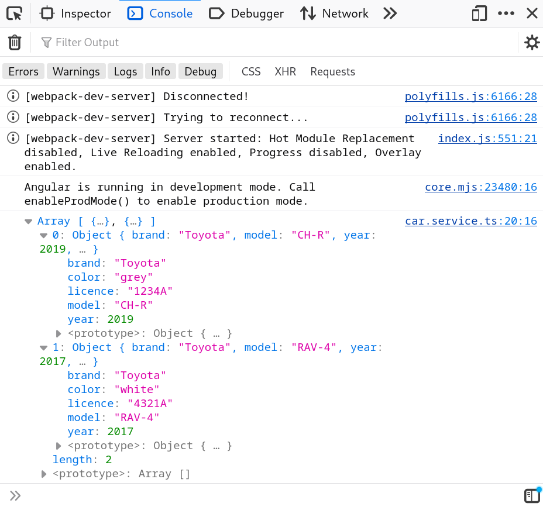

# Capítol 6. Lectura d'un fitxer JSON
Tot i que hi ha diverses maneres de llegir un fitxer JSON des del codi Angular, en aquests apunts s'explica com es fa a través del *service* `HttpClient`, el servei que permet fer crides `http` i, per tant, té les funcions que equivalen als diversos verbs del protocol
 * `get`
 * `post`
 * `put`
 * `delete`
 * `options`

entre altres.

Així doncs, la lectura del fitxer JSON s'haurà de fer seguint els passos següents:
 1. Crear un *model*, sigui `interface` sigui `class` que pugui encapsular els atributs dels objectes definits dins del JSON
 2. Crear un *service* que s'encarregui de gestionar les dades i, per tant, de llegir el fitxer
 3. Injectar el *service* `HttpClient` al nostre servei
 4. Fer la lectura del fitxer mitjançant el mètode `get` implementant correctament el tractament del patró `Observer` a través de la funció `subscription`.

Per contextualitzar l'explicació, imaginem que tenim el fitxer `assets/data/garage.json` que ens defineix un conjunt de cotxes de la següent manera:

```json
[
    {
        "brand": "Toyota",
        "model": "CH-R",
        "year": 2019,
        "color": "grey",
        "licence": "1234A"
    },
    {
        "brand": "Toyota",
        "model": "RAV-4",
        "year": 2017,
        "color": "white",
        "licence": "4321A"
    }
]
```

Els següents apartats exemplifiquen els passos que s'han llistat a les línies de sobre per poder llegir el fitxer.

## Creació del *model* `Car`
Per crear el model `Car` en forma d'`interface`, tal com es va explicar al captíol 5, cal executar la comanda

```
ng generate interface models/car
```

i crear els atributs corresponents

```typescript
export interface Car {
    brand: string;
    model: string;
    year: number;
    color: string;
    licence: string;
}
```

## Creació del *service* `GarageService`
Els *services* es creen utilitzant la comanda

```
ng generate service --skip-tests services/car
```

la qual dóna, com a resultat, el següent fitxer

```typescript
import { Injectable } from '@angular/core';

@Injectable({
  providedIn: 'root'
})
export class CarService {

  constructor() { }
}

```

## Insecció del *service* `HttpClient`
Aquest service està inclòs al mòdul (llibreria) `HttpClientModule`, per tant, per poder-lo injectar al nostre codi cal, prèviament, configurar aquesta dependència dins del fitxer `angular.module.json`, tal com mostra el fragment de codi següent:

```typescript
import { NgModule } from '@angular/core';
import { BrowserModule } from '@angular/platform-browser';
import { HttpClientModule } from '@angular/common/http';

@NgModule({
  declarations: [
    AppComponent
  ],
  imports: [
    BrowserModule,
    HttpClientModule
  ],
  providers: [],
  bootstrap: [AppComponent]
})
export class AppModule { }
```

Fet això, ja es pot injectar dins del *service* `CarService`

```typescript
import { HttpClient } from '@angular/common/http';
import { Injectable } from '@angular/core';

@Injectable({
  providedIn: 'root'
})
export class CarService {

  constructor(private _http: HttpClient) { }
}
```

## Lectura del document JSON amb el mètode `get`
Tal com hem explicat al principi del capítol, la lectura del fitxer JSON es tractarà com una crida `http`, per tant, utilitzarem el mètode `get` del *service* `HttpClient`.

Qualsevol mètode del *service* `HttpClient` s'executa en segon pla i, d'aquesta manera, s'evita bloquejar l'aplicació durant l'estona que triga en arribar la resposta (cal pensar que les crides `http` acostumen a ser crides a servidors externs). Així doncs, aquests *service* i els seus mètodes implementen al patró `Observer`, de tal manera que, quan obtenen el resultat de la crida llencen un avís a tots els objectes que n'estaven pendents (l'estaven observant). Per poder gestionar aquesta arribada de la informació i, per tant, el seu tractament, cal aplicar el mètode `subscription`, el qual defineix 3 accions:
 1. `next`: acció a realitzar si tot ha anat bé i la informació ha arribat correctament
 2. `complete`: acció a realitzar quan s'ha acabat el tractament de la informació
 3. `error`: acció a realitzar si s'ha produït algun error i la informació no ha arribat correctament.

Així doncs, el tractament de la crida `http` té aquesta estructura bàsica

```typescript
this._http.get("path_to_file or url").subscribe({
    next: (param) => {code},
    complete: () => (code),
    error: (param) => (code)
});
```

on `next`, `complete` i `error` es defineixen com a 3 funcions *lambda* (anònimes).

Si es realitza el codi per l'exemple d'aquest capítol, el codi del `CarService` quedaria de la següent manera:

```typescript
import { HttpClient } from '@angular/common/http';
import { Injectable } from '@angular/core';
import { Car } from '../models/car.model';

@Injectable({
  providedIn: 'root'
})
export class CarService {

  private _garage: Car[] = [];

  constructor(private _http: HttpClient) {}

  retrieveData(): void {
    this._http.get("../assets/data/garage.json").subscribe({
      next: (cars: any) => {
        this._garage = cars;
      },
      complete: () => {
        console.log(this._garage);
      },
      error: (msg: string) => {
        console.log("Error: " + msg);
      },
    });
  }
}
```

Si ara s'utilitza aquest *service* dins de l'`AppComponent` (injectant-lo al constructor)

```typescript
import { Component } from '@angular/core';
import { CarService } from './services/car.service';

@Component({
  selector: 'app-root',
  templateUrl: './app.component.html',
  styleUrls: ['./app.component.css']
})
export class AppComponent {
  constructor(private _carService: CarService) {
    this._carService.retrieveData();
  }
}
```

el resultat a consola és el següent


