# Capítol 7. Firebase
Firebase és una *suit* de Google que ofereix tot un conjunt d'eines per ajudar als desenvolupadors d'aplicacions mòbils a crear i posar al mercat els seus projectes.

En el nostre cas utilitzarem la seva base de dades NoSQL (*Firestore*) i el seu servei d'autenticació per tal de tenir un petit servidor de dades per a les nostres aplicacions.

Ara però, per qüestions de compatibilitat de vesions, el primer que cal fer és assegurar que la versió d'Angular del projecte és, com a mínim, la 16. En cas que no sigui així, caldrà actualitzar el projecte on s vulgui incorporar la *suit* Firebase seguint els passos indicats en el següent [enllaç](https://update.angular.io/?v=15.0-16.0):

```bash
   ng update @angular/core@16 @angular/cli@16
```

Un cop seguit aquest procés, cal comprovar que, efectivament, el fitxer `package.json` ha registrat la versió 16 d'Angular, tal com mostra la figura següent:


A continuació, s'ha d'esborrar la carpeta `node_modules` i el fitxer `package-lock.json` i tornar-ho a instal·lat tot amb la comanda `npm install` per tal de finalitzar completament l'actualització.

## Configuració dels serveis de Firebase
Per configurar qualsevol dels serveus de Firebase cal fer dos grans passos:
 1. Enllaçar la vostra aplicació Angular a la *suit* Firebase
 2. Enllaçar l'SDK de la suit de Firebase a la vostra aplicació Angular

A continuació s'explica com s'han de fer tots dos passos.

### Enllaç de l'aplicació Angular a la *suit* Firebase
Per crear aquest vincle cal que inicieu sessió a la pàgina web de la [suit](https://firebase.google.com) i accediu a la consola (*dashboard*)

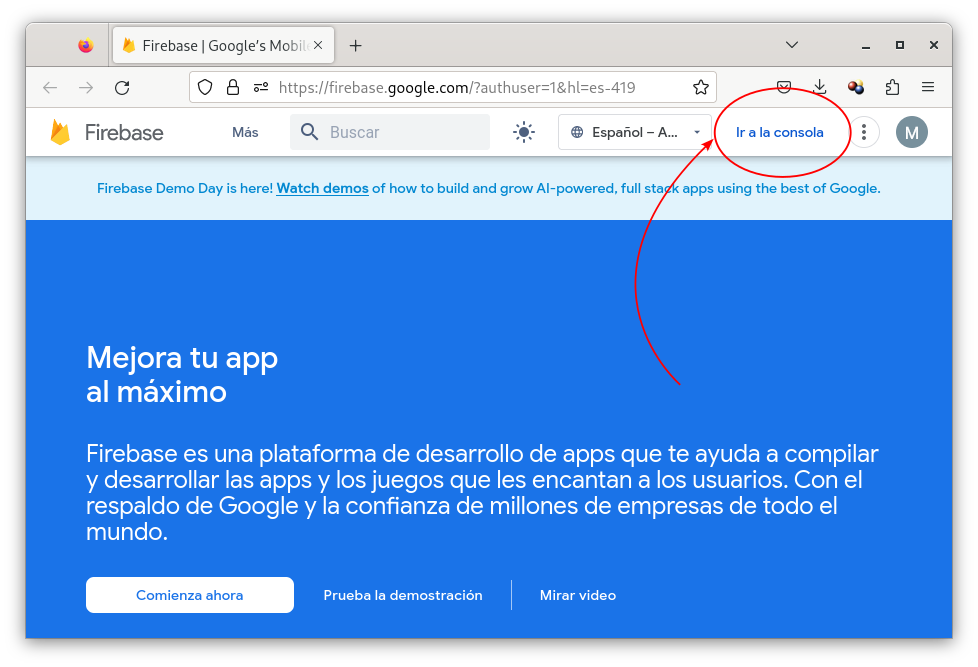

Un cop dins, per cada aplicació que hagi d'utilitzar Firebase cal crear un nou projecte, seguint les instruccions que va indicant el propi procés.

Quan el procés de creació finalitzi es carregarà el *dashboard* del projecte per tal que el pugueu configurar amb les característiques necessàries per a l'aplicació mòbil (o web) que s'estigui desenvolupant.

El primer que cal fer és afegir una nova aplicació web, que pot ser amb codi nadiu (iOS o Android), codi mutiplataforma (HTML, JS, Angular, React, etc.), codi Unity (per a jocs) o codi Flutter. En el nostre cas afegirem una nova aplicació Angular, tal com mostra la següent imatge i seguirem els passos que va indicant el procés de configuració.

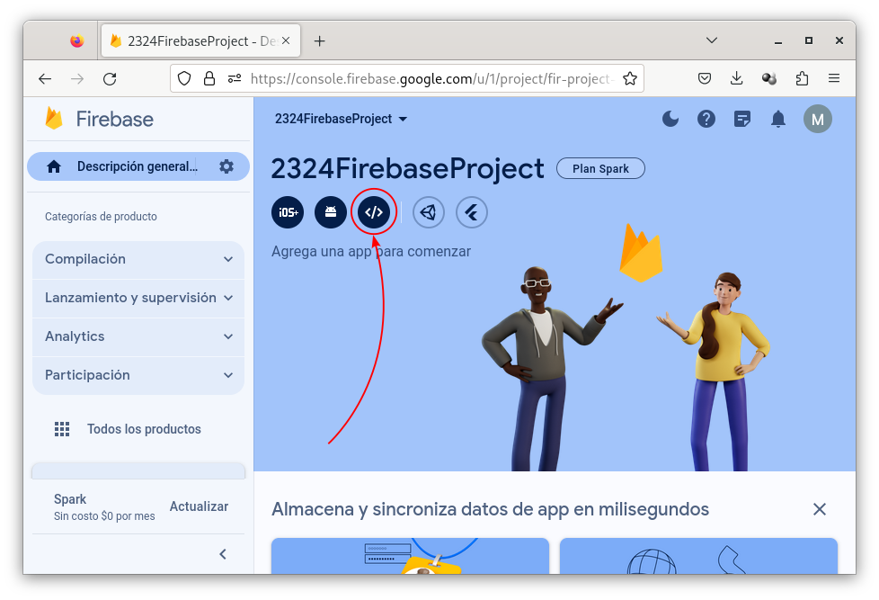

Un cop la nova aplicació quedi registrada es mostrarà el codi que es necessita incloure al codi Angular per fer el vincle amb el projecte de Firebase. Tot i això, de moment, aquest codi no s'utiltizarà perquè està pensat per ser aplicat a una aplicació Javascript i, en canvi, nosaltres, el necessitem aplicar dins del *framework* d'Angular

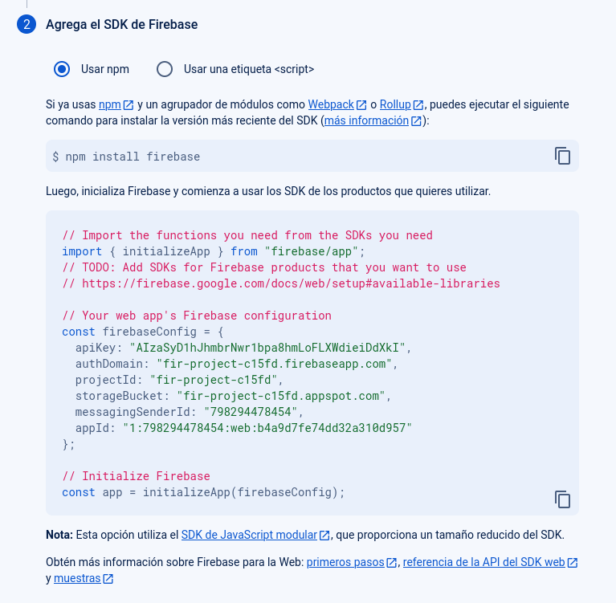

Així doncs, en aquest punt cal accedir a la nostra aplicació Angular i afegir-hi la llibreria `@angular/fire` (s'instal·larà la versió 16 de la llibreria, que és la compatible amb la versió d'Angular definida).
 ```bash
   ng add @angular/fire
 ```
Durant la instal·lació no heu de configurar cap servei de Firebase

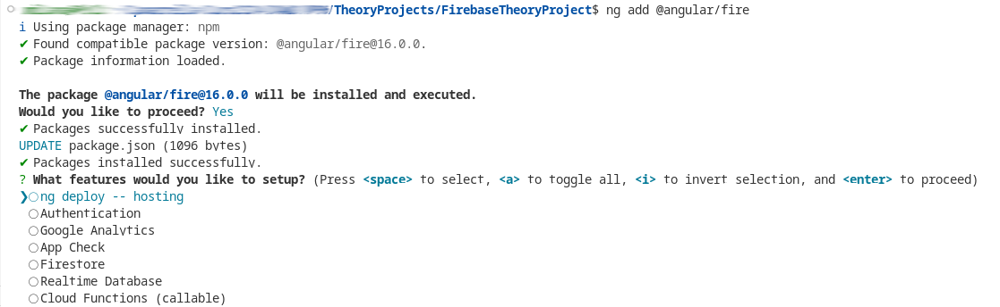

Fet això, tornarem al *dashboard* del nostre projecte de Firebase per crear i configurar la base de dades, servei que s'anomena *Firestore*.
1. Activar Firestore dins del *dashboard*

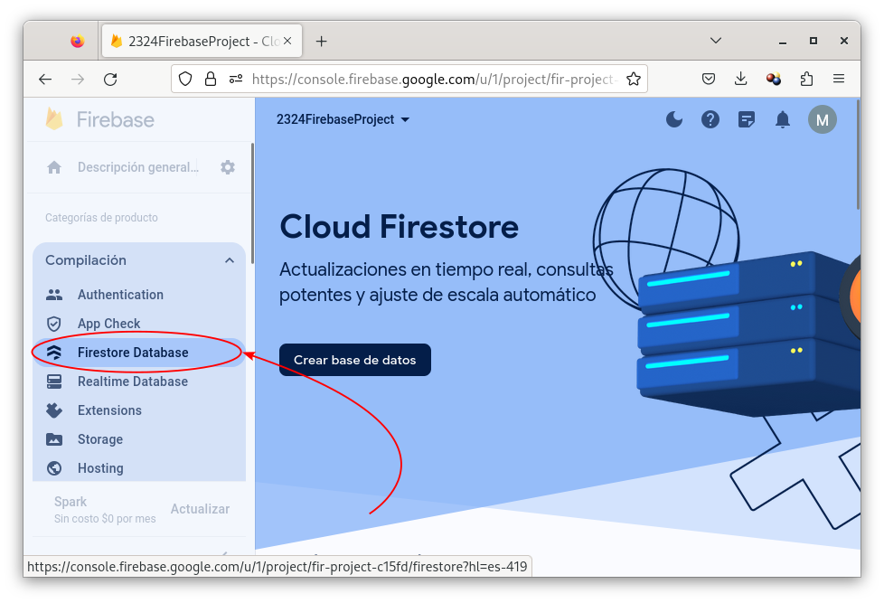
 
2. Crear la nova base de dades
 
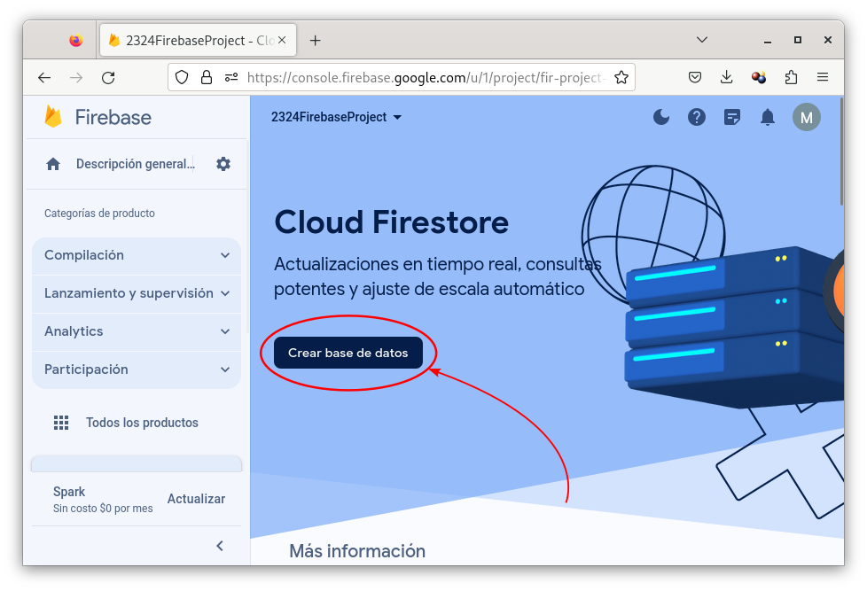
 
 1. Configurar el servidor on s'allotjarà la base de dades (busqueu un que sigui europeu)
 
 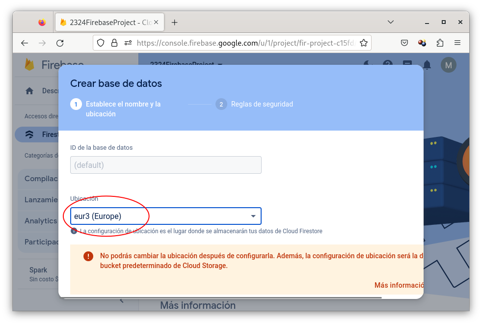
 
 2. Configuració del mode *producció* o *desenvolupador* (proves). Per defecte, admetrem el mode de *producció*, el qual haurà de ser modificat posteriorment per permetre les operacions de lectura i escriptura a la base de dades
 
 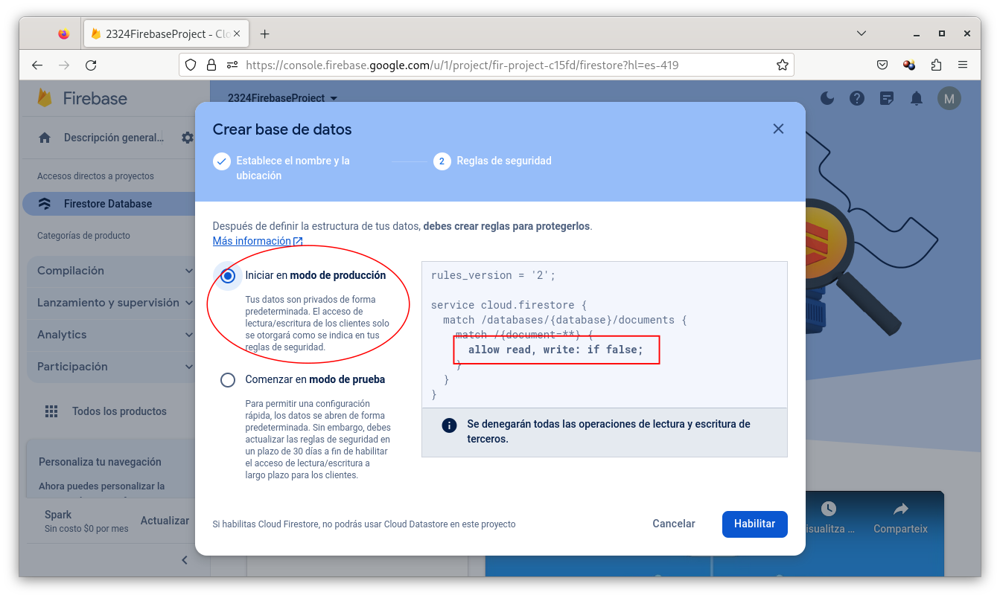
 
3. Un cop creada la base de dades, l'aplicatiu fa una redirecció a la pàgina inicial del gestor de dades on, el primer que cal fer, és els permisos (regles) d'accés per tal que tots els usuaris de l'aplicació puguin escriure i llegir dades.
 
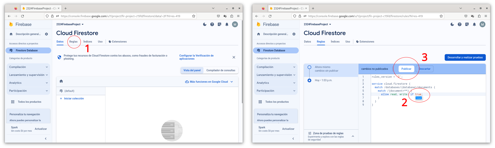

Un cop finalitzats tots aquests passos, ja es pot començar a poblar la base de dades. Prèviament, però, encara cal enllaçar l'SDK de Firebase a l'aplicació Angular.

### Enllaç de l'SDK de la *suit* de Firebase a l'aplicació Angular

Per enllaçar l'SDK de Firebase a l'aplicació Angular al crear els arxius d'*environment*. Aquests arxius han passat a ser opcionals a les aplicacions d'Angular (abans eren obligatoris i es creaven al mateix moment en què es creava el projecte) i la seva funció és la de declarar variables globals segons l'entorn de desenvolupament que es desitgi: *producció* o *desenvolupament*.

Per crear aquests arxius cal executar la comanda
```bash
   ng generate environments
```
Fet això apareixen els dos fitxers següents:
 - `src/environments/environment.development.ts`: entorn de *desenvolupament*
 - `src/environments/environment.ts`: entorn de *producció*

En aquest punt cal recuperar la configuració de les variables de la *suit* Firebase entrant al *dashboard* per accedir a la configuració del nou projecte creat, tal com indica la següent imatge:

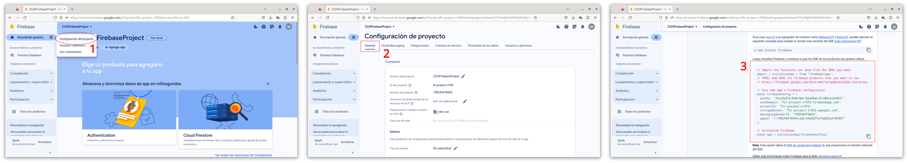

De totes aquestes dades només ens interessa la constant `firebaseConfig`, la qual s'ha de traspassar als fitxers `src/environments/environment.ts` i `src/environments/environment.development.ts` de la següent manera:
```typescript
export const environment = {
    production: false,
    firebaseConfig: {
        apiKey: "xxxxxxxxxxxxxxxxxxxxxxxxxxxxxx",
        authDomain: "xxxxxxxxxxxxxxxxxxxxxxxxxxxxxx",
        projectId: "xxxxxxxxxxxxxxxxxxxxxxxxxxxxxx",
        storageBucket: "xxxxxxxxxxxxxxxxxxxxxxxxxxxxxx",
        messagingSenderId: "xxxxxxxxxxxxxxxxxxxxxxxxxxxxxx",
        appId: "xxxxxxxxxxxxxxxxxxxxxxxxxxxxxx"
      }
};
```
Finalment, ja només cal activar les dependències dels mòduls de Firebase i dels fitxers `environment` al fitxer `app.module.ts`:
```typescript
...
import { environment } from 'src/environments/environment';
import { provideFirebaseApp, initializeApp } from '@angular/fire/app';
import { provideFirestore, getFirestore } from '@angular/fire/firestore';

@NgModule({
  declarations: [AppComponent],
  imports: [
    ...
    provideFirebaseApp(() => initializeApp(environment.firebaseConfig)),
    provideFirestore(() => getFirestore())
  ],
  providers: [],
  bootstrap: [AppComponent]
})
export class AppModule { }
```

La línia `provideFirebaseApp(() => initializeApp(environment.firebaseConfig))` inicialitza l'aplicació Firebase i l'enllaça al servidor a través de la configuració anotada als fitxers `environment`. La línia `provideFirestore(() => getFirestore())` activa una instància del servei *Firestore* per tal que pugui ser injectat i utilitzat dins del codi Angular.

Seguint tots aquests passos s'aconsegueix tenir preparat tant la *suit* Firebase com l'aplicació Angular per a poder utilitzar la base de dades *Firestore*.

## Base de dades *Firestore*
Tal com ja s'ha dit al principi del capítol, aquesta base de dades és del tipus NoSQL, per tant, la manera d'emmagatzemar les dades i de fer-hi consultes canvia significativament.

Per una banda, les dades s'emmagatzemen com a objectes JSON dins de col·leccions. Així doncs, per tal que us feu una idea, i sabent que **no són el mateix**, podeu fer les següents associacions:
 * Col·lecció &rarr; Taula SQL
 * Document JSON &rarr; Registre dins d'una taula SQL

Accedint de nou al *dasboard* de *Firestore* podeu crear una nova col·lecció (per exemple `dishes`) i plenar-la de dades per tenir un exemple de base.

 1. Creació de la nova col·lecció

 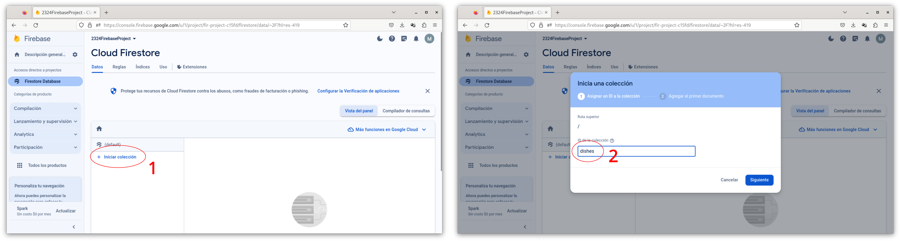

 2. Creació d'un nou document dins de la col·lecció

 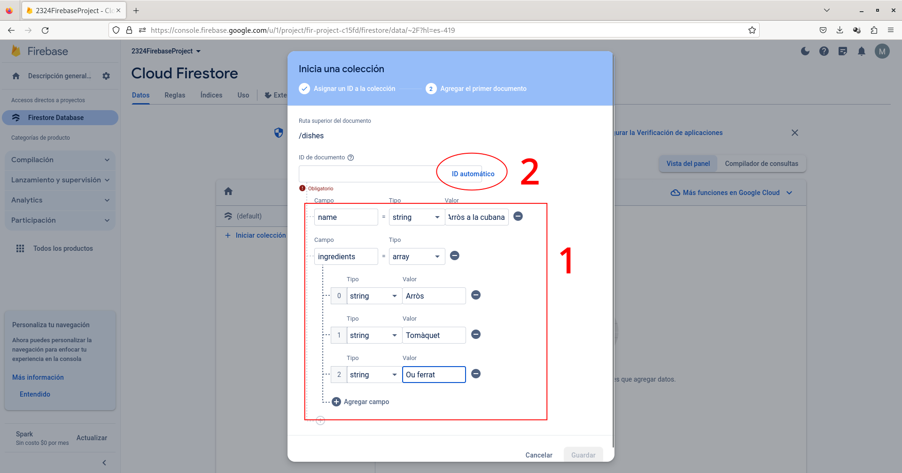
 
 3. Resultat final

 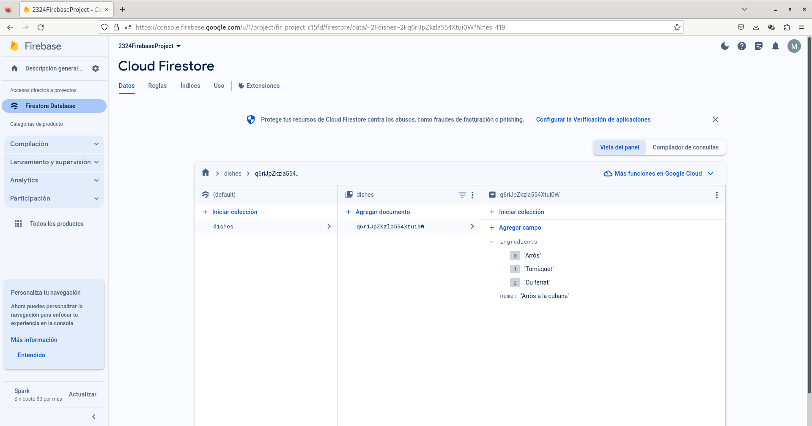

### Aplicació CRUD bàsica
Una aplicació CRUD és tot aquell programari que permet treballar amb bases de dades (siguin fitxers, SQL, NoSQL, etc.) per
 * **C**: crear noves dades (*create*),
 * **R**: consultar dades (*read*),
 * **U**: modificar dades (*update*) i
 * **D**: esborrar dades (*delete*).

El servei *Firestore* de Firebase permet treballar amb una base de dades NoSQL per fer-ne una gestió senzilla. A continuació s'explica com integrar l'API de *Firestore* a Angular.

#### Primers passos
Suposarem que estem creant una aplicació de plats de cuina i, per tant, la nostra base de dades emmagatzemarà documents que tenen dos atributs: `name` (nom del plat) i `ingredients` (els ingredients que fan falta per cuinar-lo), tal com mostren les imatges de creació de la col·lecció (vegeu apartat anterior).

El primer que cal fer és dissenyar l'aplicació modularment, aplicant el patró MVC. Per tant, s'haurà de crear un *model* (`Dish`) que repliqui el contingut dels documents de la base de dades, és a dir, que tingui els mateixos atributs que els camps del document i un *service* (`DishesService`) que gestioni l'accés a la base de dades i totes les consultes que s'hi poden fer.

Per a definir el model, com que és molt simple, crearem la *interface* `Dish`, la qual tindrà els mateixos 2 atributs que tenen els documents de la base de dades: `name` i `ingredients`:
```typescript
export interface Dish {
   id?: string;   //Emmagatzemarà l'ID de la base de dades que actua de clau primària. El símbol '?' indica que aquest camp no sempre serà necessari.
   name: string;
   ingredients: string[];
}
```

A continuació caldrà generar el *service* `FirestoreDBService` que serà l'encarregat de gestionar totes les instruccions **CRUD** contra la base de dades *Firestore*.

Abans de fer aquest pas, però, cal explicar una mica les funcions bàsiques de l'API de *Firestore*, la qual es pot trobar en aquest [enllaç](https://firebase.google.com/docs/reference).

##### Mètodes bàsics de l'API de *Firestore*
Per tal de poder connectar amb una col·lecció de la base de dades, l'API de *Firestore* defineix el *service* `Firestore`, la classe `CollectionReference<T>`, i un conjunt de mètodes que permeten llegir i modificar els registres (els documents) de la col·lecció.

El codi necessari per crear una instància d'aquesta classe i enllaçar-la a la col·lecció que es desitja consultar és el següent:
```typescript
import { CollectionReference, Firestore, collection } from '@angular/fire/firestore';

class ManageFirestore {
   private _collection: CollectionReference<MyType>;

   construct(private _firestore: Firestore) {
      this._collection = collection(this._firestore, 'collection_name') as CollectionReference<MyType>;
   }
}

```
Així doncs, cal demanar al *service* `Firestore` la collecció `collection_name` mitjançant el mètode `collection()`, el qual retorna, justament, una instància de la classe `CollectionReference`.

Vegeu que la classe `CollectionReference` és genèrica i s'ha de declarar utilitzant el tipus correcte, és a dir, la *interface* o la classe que s'hagi definit per tal de representar els documents de la col·lecció dins de la nostra aplicació.

Un cop obtinguta la instància que representa la col·lecció de la base de dades ja s'hi pot començar a operar.

###### Consulta de dades (*query*)
Per poder consultar els documents d'una col·lecció hi ha diversos mètodes, depenent del tipus de *query* que es desitja realitzar. El més senzill d'aplicar, però, és el mètode `collectionData()`.

**Mètode `collectionData()`**
Aquest mètode permet fer consultes equivalents a la sentència `SELECT * FROM` SQL, és a dir, retorna tots els documents d'una col·lecció. A més a més, implementa el patró `Observer` i, per tant, per obtenir les dades caldrà fer la subscripció a la crida:
```typescript
   collectionData(this._collection).subscribe({
      next: (data: MyType[]) => {
         //Tractament de les dades
      },
      complete: () => {}
      error: (msg: string) => {
         console.log(msg);
      }
   });
```
Mentre es mantingui la subscripció activa, cada cop que hi hagi un canvi a la col·lecció de la base de dades, aquesta funció el captarà i el retornarà per tal que pugui ser tractat, mostrat per pantalla, etc.

Vegeu que el mètode `next` rep, com a paràmetre, un *array* del tipus amb què s'ha declarat l'objecte col·lecció `CollectionReference`, és a dir, `MyType`.

En cas que es desitgi recuperar l'identificador (equivalent a la *primary key* SQL) dels documents, el mètode `collectionData()` ha de rebre un paràmetre de tipus `JSON` on s'especifiqui el nom de l'atribut identificador al tipus `MyType`. Així doncs, si `MyType` té un atribut `id: string`, la crida al mètode `collectionData()` és la següent:
```typescript
   collectionData(this._collection, {'idField': 'id'}).subscribe({
      next: (data: MyType[]) => {
         //Tractament de les dades
      },
      complete: () => {}
      error: (msg: string) => {
         console.log(msg);
      }
   });
```

Per a consultes més complexes també s'utilitza el mètode `collectionData()` però, aquest cop, combinat amb el mètode `query()` que permet executar les sentències:
* `where`
* `orderBy`
* `limit`
* `startAt`
* `startAfter`
* `endAt`
* `endBefore`

Per exemple, imaginem que tenim un document que representa el conjunt de Xefs de la província de Lleida i només volem consultar aquells que són menors de 25 anys. Per fer-ho, la crida seria similar a la següent:
```typescript
   let queryCode: Query<Chef> = query(this._chefCollection, where('age', '<', 25));
    collectionData(queryCode, {'idField': 'id'}).subscribe({
      next: (chefsdb: Chef[]) => {
        this._chefs = chefsdb;
      },
      complete: () => {},
      error: (msg) => {
        console.log(msg);
      }
    });
```
Ara però, les consultes complexes de *Firestore* tenen força limitacions i una d'elles és que no és poden concatenar dues condicions de desigualtat sobre camps diferents. Per tant, la consulta que ens permetria trobar tots xefs els menors de 25 anys que no són de Lleida no es pot fer directament amb la sentència `WHERE` i l'estratègia per aconseguir els resultats és aplicar un filtre:
```typescript
   let queryCode: Query<Chef> = query(this._chefCollection, where('age', '<', 25));
   collectionData(queryCode, {'idField': 'id'}).subscribe({
      next: (chefsdb: Chef[]) => {
         this._chefs = chefsdb.filter(
            (chef: Chef) => {
               return chef.city != "Lleida";
            }
         );
      },
      complete: () => {},
      error: (msg) => {
         console.log(msg);
      }
   });
```

Per analitzar totes les possibilitats de les diverses sentències es pot consultar la documentació de [Firebase](https://firebase.google.com/docs/firestore/query-data/queries)

###### Inserció de dades
Per fer la inserció d'un nou document en una col·lecció s'utilitza el mètode `addDoc`, el qual retorna una `Promise<DocumentData<MyType>`. Així doncs, donada la instància de la col·lecció (`this._collection`) i l'objecte amb les dades que es volen inserir (`my_data: MyType`), el codi complet per fer la inserció és el següent:
```typescript
   addDoc(this._chefCollection, chef).then(
      (doc: DocumentReference<Chef>) => {
         console.log(doc);
      }
   ).catch(
      (error: any) => {
         console.log(error);
      }
   ).finally(() => {});
```

###### Eliminació de dades
Per fer l'eliminació d'un document d'una col·lecció s'utilitzen els mètodes `doc` i `deleteDoc`. El primer mètode permet seleccionar el document a través del seu identificador (equivalent a la `primary key` en el cas d'SQL) i, un cop seleccionat, el mètode `deleteDoc` l'esborra. Així doncs, el servei Firestore (`this._firestore`), el nom de la col·lecció a la qual pertany l'element que volem eliminar (`collection_name`) i l'identificador de l'objecte que volem esborrar (`my_data.id`, on `my_data` és del tipus `MyType`), el codi per fer l'eliminació és el següent:
```typescript
   let documentRef: DocumentReference<MyType> = doc(this._firestore, 'collection_name', my_data.id) as DocumentReference<CMyTypehef>;
   deleteDoc(documentRef).then(
      () => {console.log("Doc deleted!");}
   ).catch(
      (error: any) => {console.log(error);}
   ).finally(
      () => {}
   );
```

En cas que es vulgui eliminar més d'un document, es pot utilitzar el mètode `getDocs()` per seleccionar-los prèviament. Per exemple, en el codi que es mostra a continuació, s'elimina tots els xefs que tinguin més de 25 anys.
```typescript
   let queryCode: Query<Chef> = query(this._chefCollection, where('age', '>', 25));
   getDocs(queryCode).then(
      (chefsdb: QuerySnapshot<Chef>) => {
         chefsdb.docs.forEach(
            (doc: QueryDocumentSnapshot<Chef>) => {
              deleteDoc(doc.ref);
            }
         );
      }
   ).catch(
      (error: any) => {console.log(error);}
   ).finally(
      () => {}
   );
```

###### Actualització de dades
Per fer l'actualització d'un document d'una col·lecció s'utilitzen els mètodes `doc` i `update` o `setDoc`. Així doncs, en aquest cas tenim diverses opcions:
 1. Utilitzar el mètode `setDoc` amb l'objecte sencer que es vol actualitzar (encara que hi hagi camps que no faci falta canviar)
 2. Utilitzar el mètode `setDoc` amb només els camps que es volen actualitzar
 3. Utilitzar el mètode `update`, el qual només treballa amb els camps que es volen actualitzar (equival al `setDoc` del 2n punt).

Suposant que tenim la instància de la col·lecció de xefs (`this._chefCollection`), l'identificador de l'objecte que volem actualitzar (`chef.id`) i sabent que aquest objecte té 3 camps (`name`, `age` i `city`), els següents apartats mostren el codi de cadascuna de les opcions indicades a sobre.

**Mètode `setDoc` complet**
```typescript
   let updatedChefData: Chef = {"name": "Íngrid", "age": 23, "city": "La Seu d'Urgell"};
   let documentRef: DocumentReference<Chef> = doc(this._firestore, 'chefs', chef.id) as DocumentReference<Chef>;
   setDoc(documentRef, updatedChefData).then(
      () => {console.log("Updated done");}
   ).catch(
      (error: any) => {console.log(error);}
   ).finally(
      () => {}
   );
```
El mètode `set` utilitzat d'aquesta manera actualitza el document, si aquest ja existia a la col·lecció, o el crea de nou, si no existia, és a dir, si el document amb identificador `chef.id` no existeix, el mètode `set` equival al mètode `addDoc`.

**Mètode `setDoc` que actualitza camps de manera independent**
```typescript
   let documentRef: DocumentReference<Chef> = doc(this._firestore, 'chefs', chef.id) as DocumentReference<Chef>;
   setDoc(documentRef, {"age": 21}, {"merge": true}).then(
      () => {console.log("Updated done");}
   ).catch(
      (error: any) => {console.log(error);}
   ).finally(
      () => {}
   );
```

**Mètode `updateDoc` (actualitza camps de manera independent)**
```typescript
   let documentRef: DocumentReference<Chef> = doc(this._firestore, 'chefs', chef.id) as DocumentReference<Chef>;
   updateDoc(documentRef, {"age":19}).then(
      () => {console.log("Updated done");}
   ).catch(
      (error: any) => {console.log(error);}
   ).finally(
      () => {}
   );
```

En cas que, prèviament a l'actualització de les dades, no es tingui l'identificador de l'objecte que es vol modificar, es pot realitzar una selecció inicial mitjançant el mètode `query`.

## Autenticació
El primer que cal fer és configurar el servei d'autenticació des del *dashboard* de *Firebase* seguint els passos següents:

 1. Activació del servei d'autenticació

 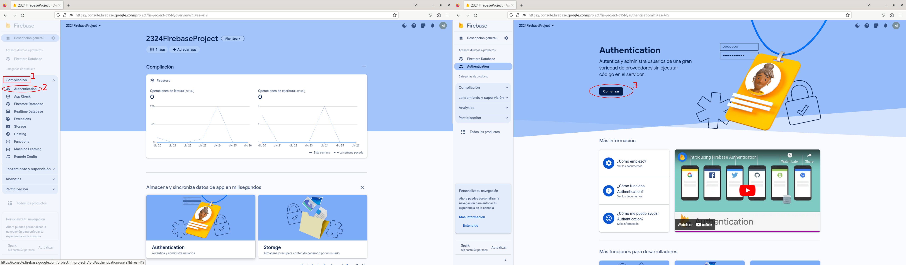

 2. Configuració dels mètodes d'accés (serveis d'autenticació)

 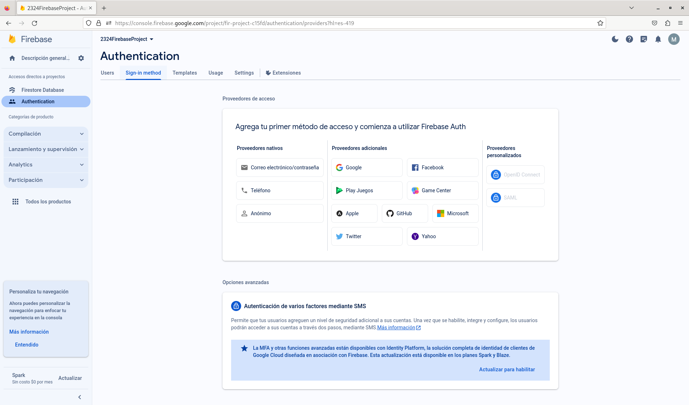
 
 3. Configuració del servei d'autenticació de Google: cal indicar el nom de l'aplicació per la qual es permet l'autenticació de Goole i un correu d'assistència (el correu de l'administrador, normalment).

 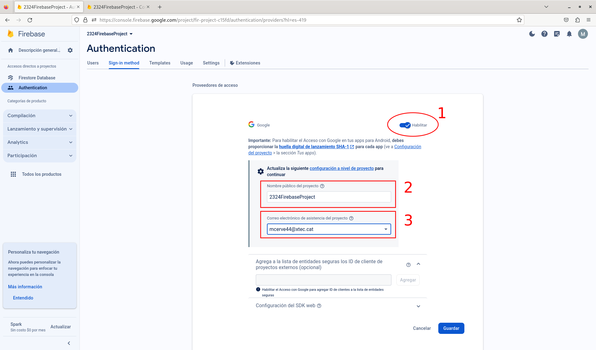

 4. Configuració de l'autentiació amb correu i contrasenya

 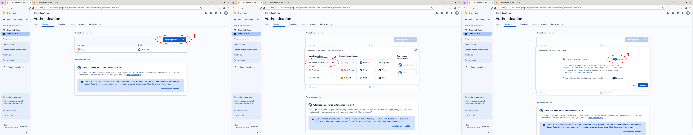

Un cop seguits tots aquests passos, el *dashboard* del servei d'autenticació mostrarà la següent informació:

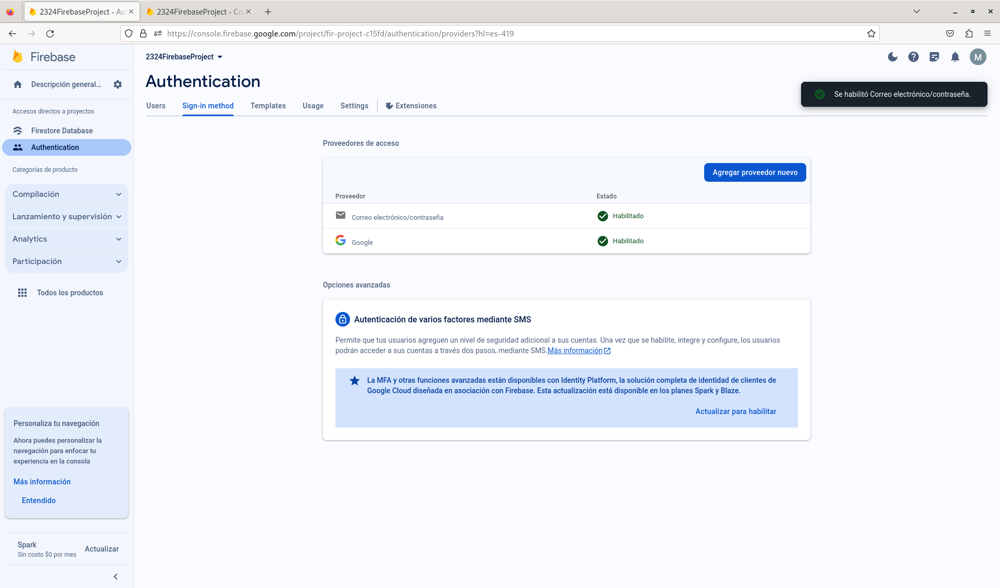

### Aplicació amb gestió de sessió bàsica
Tota aplicació que hagi d'autenticar usuaris ha de fer una gestió de la sessió bàsica que permeti
 1. registrar nous usuaris,
 2. iniciar sessió amb comptes ja existents,
 3. tancar sessió i
 4. obtenir la informació de l'estat de la sessió.

Per aconseguir-ho, el primer que cal fer és activar la dependència del servei d'autenticació dins del fitxer `app.module.ts`.

```typescript
...
import { environment } from 'src/environments/environment';
import { provideFirebaseApp, initializeApp } from '@angular/fire/app';
import { provideFirestore, getFirestore } from '@angular/fire/firestore';
import { getAuth, provideAuth } from '@angular/fire/auth';

@NgModule({
  declarations: [AppComponent],
  imports: [
    ...
    provideFirebaseApp(() => initializeApp(environment.firebaseConfig)),
    provideFirestore(() => getFirestore()),
    provideAuth(() => getAuth())
  ],
  providers: [],
  bootstrap: [AppComponent]
})
export class AppModule { }
```

A continuació també cal crear el servei `AuthSessionService` (el nom del servei és a gust del desenvolupador) que permeti fer tota la gestió de la sessió. Aquest servei hauria d'injectar el serveu l'`Auth`, que és el servei que proporciona la llibreria `@angular/fire` per gestionar l'autenticació d'usuaris.

```typescript
import { Injectable } from '@angular/core';
import { Auth } from '@angular/fire/auth';

@Injectable({
  providedIn: 'root'
})
export class AuthSessionService {
  constructor(private _auth: Auth) {}
}
```

#### Creació de nous usuaris (registre)
Si l'aplicació que es desitja crear permet l'inici de sessió utilitzant un correu electrònic i una contrasenya, el primer que cal fer és crear els comptes d'usuaris, és a dir, fer-ne el registre.

El servei `Auth` ofereix el mètode `createUserWithEmailAndPassword()` per tal d'aconseguir-ho, el qual retorna un objecte de tipus `Promise<UserCredential>` si el procés de registre ha anat bé. Així doncs, el codi bàsic per poder crear un nou compte és el que es mostra a continuació.

```typescript
import { Injectable } from '@angular/core';
import { Auth, UserCredential, createUserWithEmailAndPassword } from '@angular/fire/auth';

@Injectable({
  providedIn: 'root'
})
export class AuthSessionService {
  constructor(private _auth: Auth) {}

  register(email: string, passwd: string): void {
    createUserWithEmailAndPassword(this._auth, email, passwd).then(
      (userCredential: UserCredential) => {console.log(userCredential);}
    ).catch(
      (error: any) => {console.log(error);}
    ).finally(
      () => {console.log("Registre finalitzat");}
    );
  }
}
```

Com es pot comprovar en aquest codi, un objecte `Promise<UserCredential>` implica que el mètode que es llença en segon pla, en aquest cas `createUserWithEmailAndPassword`, promet retornar un objecte de tipus `UserCredential`. El tractament d'una `Promise` és força similar al d'un `Observer`, però, en aquest cas, les funcions anònimes que cal implementar són les següents:
* `then`: codi que s'executa quan tot ha anat bé
* `catch`: codi que s'executa quan s'ha produït un error
* `finally`: codi que s'executa sempre, és a dir, després de `then` i de `catch`.

Si s'executa el mètode `register()` del service `AuthSessionService` amb l'usuari `mcerve44@xtec.cat` i la contrasenya `123456` es pot comprovar la creació del nou compte al *dashboard* d'autenticació de *Firebase*.

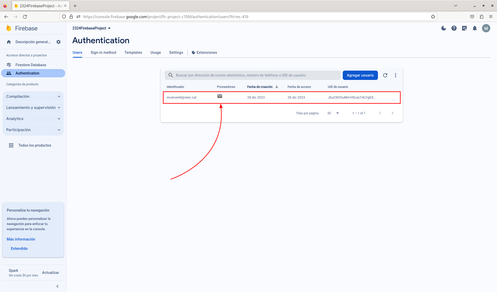

Ara però, en el cas de la gestió de sessió, potser interessa que els mètodes siguin bloquejants, és a dir, que no s'executin en 2n pla i, per tant, l'aplicació s'esperi fins a rebre'n el resultat. En cas que es vulgui fer això, el tractament de la `Promise<UserCredentials>` s'ha de fer amb les instruccions `async/await` de la manera següent:

```typescript
import { Injectable } from '@angular/core';
import { Auth, UserCredential, createUserWithEmailAndPassword } from '@angular/fire/auth';

@Injectable({
  providedIn: 'root'
})
export class AuthSessionService {
  constructor(private _auth: Auth) {}

  async register(email: string, passwd: string): Promise<boolean> {
    try {
      let userCredential: UserCredential = await createUserWithEmailAndPassword(this._auth, email, passwd);
      return true;
    } catch(error: any) {
      console.log(error);
      return false;
    }
  }
}
```

La crida d'aquesta funció (en el component d'inici de sessió) es farà com mostra el codi que trobareu a continuació:

```typescript
  async register(email: string, passwd: string): Promise<void> {
    let logged = await this._authSessionService.loginWithEmail(email, passwd);
  }
```


#### Inici de sessió (login)
L'inici de sessió difereix força depenent de si es vol fer a través de correu electrònic i contrasenya o a través d'un servei d'autenticació com, per exemple, el propi de Google.

##### Inici de sessió amb correu electrònic i contrasenya
Per assolir aquet tipus d'autenticació el servei `Auth` ofereix el mètode `signInWithEmailAndPassword()`, el qual també retorna un objecte de tipus `Promise<UserCredential>`. Per tant, el codi bàsic per fer l'inici de sessió és molt similar a l'anterior.
```typescript
import { Injectable } from '@angular/core';
import { Auth, UserCredential, createUserWithEmailAndPassword, signInWithEmailAndPassword } from '@angular/fire/auth';

@Injectable({
  providedIn: 'root'
})
export class AuthSessionService {
  constructor(private _auth: Auth) {}
  register(email: string, passwd: string): void {...}

  loginWithEmail(email: string, passwd: string): void {
    signInWithEmailAndPassword(this._auth, email, passwd).then(
      (userCredential: UserCredential) => {console.log(userCredential);}
    ).catch(
      (error: any) => {console.log(error);}
    ).finally(
      () => {console.log("Inici de sessió finalitzat");}
    );
  }
}
```

La versió bloquejant del codi és la següent:
```typescript
import { Injectable } from '@angular/core';
import { Auth, UserCredential, createUserWithEmailAndPassword, signInWithEmailAndPassword } from '@angular/fire/auth';

@Injectable({
  providedIn: 'root'
})
export class AuthSessionService {
  constructor(private _auth: Auth) {}
  async register(email: string, passwd: string): Promise<boolean> {...}

  async loginWithEmail(email: string, passwd: string): Promise<boolean> {
    try {
      let userCredential: UserCredential = await signInWithEmailAndPassword(this._auth, email, passwd);
      return true;
    } catch(error: any) {
      console.log(error);
      return false;
    }
  }
}
```


##### Inici de sessió amb el servei d'autenticació de Google
En cas que es vulgui utilitzar el servei (o proveïdor) d'autenticació de Google, el servei `Auth` proporciona el mètode `signInWithPopup()`, el qual necessita rebre un objecte del proveïdor desitjat, en aquest cas Google, i retorna, altre cop, un objecte de tipus `Promise<UserCredential>`.
```typescript
import { Injectable } from '@angular/core';
import { Auth, GoogleAuthProvider, UserCredential, createUserWithEmailAndPassword, signInWithEmailAndPassword, signInWithPopup } from '@angular/fire/auth';

@Injectable({
  providedIn: 'root'
})
export class AuthSessionService {
  constructor(private _auth: Auth) {}
  register(email: string, passwd: string): void {...}
  loginWithEmail(email: string, passwd: string): void {...}

  loginWithGoogle(): void {
    signInWithPopup(this._auth, new GoogleAuthProvider()).then(
      (userCredential: UserCredential) => {console.log(userCredential);}
    ).catch(
      (error: any) => {console.log(error);}
    ).finally(
      () => {console.log("Inici de sessió finalitzat");}
    );
  }
}
```
<!--
La versió bloquejant del codi és la següent:
```typescript
import { Injectable } from '@angular/core';
import { Auth, GoogleAuthProvider, UserCredential, createUserWithEmailAndPassword, signInWithEmailAndPassword, signInWithPopup } from '@angular/fire/auth';

@Injectable({
  providedIn: 'root'
})
export class AuthSessionService {
  constructor(private _auth: Auth) {}
  async register(email: string, passwd: string): Promise<boolean> {...}
  async loginWithEmail(email: string, passwd: string): Promise<boolean> {...}

  async loginWithGoogle(): Promise<boolean> {
   try {
      signInWithPopup(this._auth, new GoogleAuthProvider()).then(
        (userCredential: UserCredential) => {console.log(userCredential);}
      ).catch(
        (error: any) => {console.log(error);}
      ).finally(
        () => {console.log("Inici de sessió finalitzat");}
      );
   }
  }
}
```
-->


#### Tancament de sessió (logout)
El tancament de sessió, s'hagi iniciat aquesta com s'hagi iniciat, és molt senzill i només necessita utilitzar el mètode `signOut()` que ofereix el servei `Auth`.
```typescript
import { Injectable } from '@angular/core';
import { Auth, GoogleAuthProvider, UserCredential, createUserWithEmailAndPassword, signInWithEmailAndPassword, signInWithPopup } from '@angular/fire/auth';

@Injectable({
  providedIn: 'root'
})
export class AuthSessionService {
  constructor(private _auth: Auth) {}
  register(email: string, passwd: string): void {...}
  loginWithEmail(email: string, passwd: string): void {...}
  loginWithGoogle(): void {...}

  logout(): void {
    signOut(this._auth).then(
      () => {}
    ).catch(
      (error: any) => {console.log(error);}
    ).finally(
      () => {console.log("Sessió tancada")}
    );
  }
}
```

#### Obtenció de l'usuari autenticat
Per tal d'obtenir les dades de l'usuari autenticat, el servei `Auth` té l'atribut `currentUser`, de tipus `User`.
```typescript
import { Injectable } from '@angular/core';
import { Auth, GoogleAuthProvider, User, UserCredential, createUserWithEmailAndPassword, signInWithEmailAndPassword, signInWithPopup, signOut } from '@angular/fire/auth';

@Injectable({
  providedIn: 'root'
})
export class AuthSessionService {
   constructor(private _auth: Auth) {}
   register(email: string, passwd: string): void {...}
   loginWithEmail(email: string, passwd: string): void {...}
   loginWithGoogle(): void {...}
   logout(): void {...}

   get currentUser(): User | null {
      return this._auth.currentUser;
   }
}
```

#### Consulta per saber si la sessió s'ha iniciat o no
Hi ha diverses maneres de saber si l'usuari ha iniciat sessió o no, però una de les més senzilles és aprofitar el valor de la propietat `currentUser`: si l'objecte és `null`, la sessió no s'ha iniciat; si l'objecte té valor, la sessió s'ha iniciat.
```typescript
import { Injectable } from '@angular/core';
import { Auth, GoogleAuthProvider, User, UserCredential, createUserWithEmailAndPassword, signInWithEmailAndPassword, signInWithPopup, signOut } from '@angular/fire/auth';

@Injectable({
  providedIn: 'root'
})
export class AuthSessionService {
   constructor(private _auth: Auth) {}
   register(email: string, passwd: string): void {...}
   loginWithEmail(email: string, passwd: string): void {...}
   loginWithGoogle(): void {...}
   logout(): void {...}
   get currentUser(): User | null {...}

   isSessionActive(): boolean {
    return this.currentUser != null;
  }
}
```