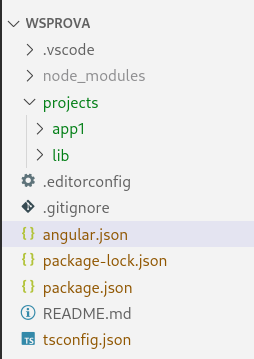

# Capítol 9. Workspace: una aplicació, multiples GUI
Moltes vegades ens trobarem amb la necessitat d'adaptar una mateixa aplicació a diferents interfícies gràfiques per fer-ne, per exemple, la versió web i la versió mòbil. Si aquesta adaptació la volem fer mitjançant `CSS` personalitzades o, si menys no, utilitzant el mateix *framework* `CSS` per a totes les versions, no tindrem cap altre problema fent-ho com ho hem fet fins ara. Malauradament, si volem utilitzar un *framework* `CSS` per cada versió, els nostres *components* seran totalment diferents i, per tant, haurem de fer, sí o sí, dues aplicacions.

Podem veure, però, que fer dues aplicacions que tenen la mateixa lògica (la mateixa funcionalitat, el mateix nucli - *core*) només perquè la interfície gràfica canvia, no té massa sentit, ja que qualsevol canvi en les funcionalitats s'haurà d'implementar 2 vegades. Per evitar aquesta duplicació de codi podem utilitzar els [*Workspaces*](https://angular.io/guide/file-structure) d'Angular.

Un *workspace* permet gestionar múltiples aplicacions de manera simultània, així com també llibreries. Per tant, si volem crear una mateixa aplicació per a web i per a mòbil, podem crear un *workspace* que contingui
 1. una lliberia Angular amb el *core* de l'aplicació (tot el codi de la lògica, és a dir, els *services* i els *models*),
 2. una aplicació per a la versió web i
 3. una aplicació per a la versió mòbil.

Les aplicacions web i mòbil només hauran d'implementar la part de la interfície gràfica (GUI) i utilitzar la llibreria per tenir la lògica de programa. D'aquesta manera, si canvia alguna de les funcionalitats o se n'afegeixen de noves, només cal que modifiquem el codi de la llibreria una única vegada i totes les aplicacions se'n veuran beneficiades directament.

## Creació d'un *Workspace*
Per crear un *workspace* cal executar la comanda següent
```bash
   ng new worskspace_name --no-create-application
```
Aquesta comanda crearà una estructura idèntica a la d'un projecte Angular a excepció de la carpeta `src`, que no hi és. Aquesta carpeta serà substituïda pel directori `projects`, que és on es definirà el codi de cadascuna de les aplicacions i llibreries del *workspace*.

Un cop creat el *workspace* podem afegir-hi aplicacions amb la comanda
```bash
   ng generate application application_name
```
i llibreries amb la comanda
```bash
   ng generate library lib_name
```

Això crearà les carpetes `application_name` i `lib_name` dins del directori `projects` i hi instal·larà tots els fitxers de configuració necessaris.

Si suposem que hem creat el *workspace* `WSProva` amb l'aplicació `App1` i la llibreria `Lib`, l'estructura de fitxers serà la següent:



Cal adonar-se que la carpeta `node_modules` i el fitxer `package.json` pertanyen al *workspace* i, per tant, totes les aplicacions s'alimenten de les mateixes dependències. Les llibreries també tenen un fitxer propi `package.json` per tal que puguin afegir dependències que només necessiten elles i no la resta d'aplicacions del *workspace*.

La carpeta `app1`, corresponent a l'aplicació `App1` té el següent contingut:


El nostre codi, com fins ara, anirà dins del directori `src`.

La carpeta `lib`, corresponent a la llibreria `Lib` té el següent contingut:


El nostre codi anirà dins del directori `src/lib`. A més a més, el fitxer `public-api.ts` ens permetrà indicar els fitxers als quals es podrà accedir des de les aplicacions externes.